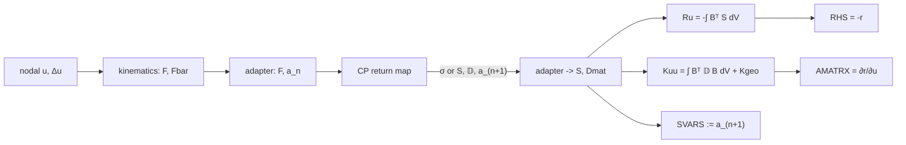

# Design Note — Residual Assembler for Crystal Plasticity

**Goal.** Build a component that exposes the **element residual** `r(u, a)` for a
crystal-plasticity solid, where

- `u` = nodal displacement degrees of freedom of a hexahedral element,
- `a` = internal/state variables of the crystal-plasticity model (slip resistances,
  plastic deformation gradient `Fp`, accumulated slip, hardening state, …),

and its consistent Jacobian `∂r/∂u`. This is deliberately **more than a stress update**:
a UMAT alone returns `σ` and `DDSDDE` at a material point and lets Abaqus hide the element
assembly. We want `r` and `∂r/∂u` in the open, at the element level, so the object can be
driven by an external solver, differentiated, or embedded in a reduced-order / residual-based
method later.

> Scope of this note: architecture and open questions only. **No Fortran is written yet.**

---

## 1. What "residual" means here

For a displacement-based finite element in a quasi-static setting, the element residual is
the out-of-balance internal force

$$
r(u,a) \;=\; f^{\text{int}}(u,a) - f^{\text{ext}}
\;=\; \int_{\Omega_e} B^{\mathsf T}\,S(u,a)\, \mathrm{d}V \;-\; f^{\text{ext}},
$$

with consistent tangent

$$
\frac{\partial r}{\partial u} \;=\; K_{uu}
\;=\; \int_{\Omega_e} B^{\mathsf T}\, \mathbb{D}(u,a)\, B \,\mathrm{d}V \;+\; K_{\text{geo}},
$$

where `S` is the (work-conjugate) stress, `𝔻` the material tangent, and `K_geo` the
geometric/initial-stress term for finite strain. The state `a` is updated **locally** at each
integration point by the crystal-plasticity return map before `r` and `K_uu` are formed.

### Mapping onto Abaqus UEL conventions
Abaqus `UEL` already speaks this language:

| Abaqus symbol | Meaning | Relation to `r` |
|---------------|---------|-----------------|
| `RHS`    | element right-hand side | `RHS = -r` |
| `AMATRX` | element Jacobian        | `AMATRX = ∂r/∂u = K_uu` |
| `SVARS`  | element state variables | storage for `a` at each integration point |
| `U`, `DU`| nodal solution + increment | `u` |

So a UEL that already assembles `RHS`/`AMATRX` **is** a residual assembler; we only need to
change *which* constitutive law fills the integration-point stress and tangent.

---

## 2. Chosen skeleton

**`sources/permissive/bibekanandadatta_Abaqus-UEL-Hyperelasticity` (BSD-3-Clause).**

Why this one:

- Finite-strain, **total Lagrangian**, PK-II (and PK-I) formulation — the natural home for a
  multiplicative crystal-plasticity kinematics `F = Fe · Fp`.
- Already supports **Hex8** and **Hex20** (plus Tet/Tri/Quad), full and reduced Gauss
  integration, and F-bar for Hex8/Quad4 to fight volumetric locking near incompressibility —
  relevant because crystal plasticity is nearly isochoric.
- Clean module separation:
  `lagrange_element` (shape functions), `gauss_quadrature`, `solid_mechanics`,
  `linear_algebra`, `hyperelastic_material` (the swappable constitutive module).
- The element driver `elem_nlmech` **already builds the residual and tangent explicitly**:
  local variables `Ru(nDOFEL,1)` and `Kuu(nDOFEL,nDOFEL)` are accumulated over integration
  points and returned as `RHS`/`AMATRX`. The residual is literally named in the code.
- Permissive license → the wrapper can be redistributed with attribution.

### The single swap point
Inside `elem_nlmech`, per integration point (≈ lines 950–1011 of `uel_nlmech_pk2.for`):

```text
  ... compute F (and Fbar) at the integration point ...
  call mat_NeoHookean / mat_ArrudaBoyce (...)   ->  stressPK2, Dmat      <-- REPLACE THIS
  ... voigt/reshape ...
  Ru  = Ru  - w*detJ*resFac  * (Bmat^T · stressPK2)     ! residual accumulation
  Kuu = Kuu + w*detJ*tanFac1 * (Bmat^T · Dmat · Bmat) + geometric term
```

The entire crystal-plasticity change is confined to replacing the `mat_*` call with a
crystal-plasticity stress update that consumes `F` (and the previous state `a_n`) and returns:

1. a work-conjugate stress (`S = PK-II`, or Cauchy for the PK-I/updated-Lagrangian path),
2. the consistent material tangent `𝔻` (`Dmat`), and
3. the updated state `a_{n+1}` (written back to `SVARS`).

Everything downstream (`Ru`, `Kuu`, `RHS`, `AMATRX`) is reused unchanged. **`r` is therefore
exposed by construction: `r = -RHS`, `∂r/∂u = AMATRX`.**

---

## 3. The crystal-plasticity stress update (the UMAT-inside-UEL pattern)

The Oxford (`TarletonGroup`, `ngrilli`), ICAMS, and Huang/Kysar codes all implement exactly
the material-point map we need: given `F` (or `dstran`/`dfgrd`) they perform a slip-system
return map (`Fp`, slip rates, hardening) and return `σ` + `DDSDDE`. This is the
**UMAT-inside-UEL** pattern: the UEL owns the kinematics + assembly, the UMAT owns the
constitutive return map.

### License-driven sourcing of the stress update
Per [sources/LICENSING.md](sources/LICENSING.md), the redistributable core may only combine
permissive code:

- **Preferred permissive CP stress update:** `sources/permissive/ngrilli_Oxford_Crystal_Plasticity`
  (MIT). Its `umat.for` / `kmat.f` implement the slip-system solve and consistent tangent and
  can be called from the UEL as an internal subroutine.
- **Reference-only (do NOT link into the redistributable core):**
  - `copyleft/ICAMS_Crystal_Plasticity_UMAT` — AGPL-3.0 (viral copyleft).
  - `license-unknown/TarletonGroup_CrystalPlasticity` — no license (all rights reserved).
  - `license-unknown/Huang_Kysar_Single_Crystal_UMAT` — courtesy-ware, no redistribution grant.
  These are excellent for *validation and cross-checking* (especially Huang/Kysar as the
  canonical FCC single-crystal benchmark), but any algorithm needed in the shipped wrapper
  must be **re-implemented from the published equations**, not copied.

### Interface impedance to resolve
The skeleton is total-Lagrangian PK-II; classic CP UMATs (Huang/Kysar, Oxford) are written
against the Abaqus UMAT interface (Cauchy stress + `DDSDDE`, deformation gradients `DFGRD0`,
`DFGRD1`, Jaumann/Green-Naghdi tangent conventions). A thin adapter layer must reconcile:

- **Stress measure:** convert between the UMAT's Cauchy `σ` and the element's PK-II `S`
  (`S = J F⁻¹ σ F⁻ᵀ`), or route through the PK-I element path `uel_nlmech_pk1.for` which is
  closer to a deformation-gradient / Cauchy interface.
- **Tangent measure:** map the UMAT `DDSDDE` (rate form, objective rate) to the material
  tangent `𝔻` expected in the total-Lagrangian `Kuu` term. This is the most error-prone
  interface and is the first thing to verify numerically (see §5).
- **State packing:** lay out `a` (Fp 3×3, slip resistances per system, accumulated slip,
  orientation) contiguously in `SVARS` per integration point.

---

## 4. Proposed architecture

```
residual_assembler (Abaqus UEL, Hex8/Hex20)
│
├── element layer      (from BSD-3 hyperelastic skeleton, reused as-is)
│     ├── shape functions / Gauss quadrature      (lagrange_element, gauss_quadrature)
│     ├── B / G operators, F, Fbar                (solid_mechanics)
│     ├── residual assembly   Ru  = -∫ Bᵀ S dV     ->  RHS = -r
│     └── tangent  assembly    Kuu =  ∫ Bᵀ 𝔻 B dV + Kgeo  ->  AMATRX = ∂r/∂u
│
├── constitutive adapter  (NEW, thin)  <-- the swap point
│     ├── kinematics bridge:  F  ->  (dstran/dfgrd | Fe,Fp)
│     ├── stress bridge:      Cauchy σ  <->  PK-II S
│     ├── tangent bridge:     DDSDDE     ->  𝔻 (Dmat)
│     └── state pack/unpack:  a  <->  SVARS slice
│
└── crystal-plasticity return map  (permissive: ngrilli/Oxford MIT)
      └── slip-system solve, Fp update, hardening, consistent tangent
```

Data flow per Newton iteration, per element, per integration point:



**Integration scheme:** implicit (Newton). The element returns residual + consistent tangent;
the crystal-plasticity return map itself is a local implicit (backward-Euler) solve. This keeps
the whole object differentiable and lets `r(u,a)` be evaluated for arbitrary `u` without an
external time stepper.

---

## 5. Validation ladder

1. **Zero-plasticity sanity.** Set slip rates to zero (elastic single crystal). The UEL must
   reproduce the anisotropic-elastic response and match the BSD elastic UEL
   (`permissive/bibekanandadatta_Abaqus-UEL-Elasticity`) and an Abaqus built-in C3D8 with the
   same cubic elastic constants. Confirms element plumbing and `r = -RHS`.
2. **Consistent-tangent check.** Verify `AMATRX ≈ ∂r/∂u` by finite differences on `u`
   (perturb each DOF, re-evaluate `r`). A correct consistent tangent is the single most
   important correctness signal and catches DDSDDE→𝔻 mapping errors.
3. **Single material point, single FCC crystal pulled along [100].** One Hex8 element (or one
   integration point), uniaxial tension along the crystal `[100]`. Cross-check the stress–strain
   curve and the activated slip systems against the **Huang/Kysar** UMAT run as a reference
   (reference-only, not linked). This is the canonical FCC verification case.
4. **Single crystal, off-axis loading.** Pull along `[111]`/`[123]` to exercise multi-slip and
   latent hardening; check Schmid-factor-consistent system activation and lattice rotation.
5. **Small polycrystal mesh.** A handful of grains (Neper/Dream3D mesh; both Oxford repos ship
   converters) to confirm inter-element assembly, state storage per grain, and convergence.
6. **Objectivity / rigid-rotation test.** Superpose a rigid body rotation; `r` (material part)
   must be frame-indifferent.

---

## 6. Open questions

1. **Stress/tangent path.** Adapt the PK-II (`uel_nlmech_pk2.for`) skeleton with a
   Cauchy↔PK-II bridge, or start from PK-I (`uel_nlmech_pk1.for`) which sits closer to a
   deformation-gradient/Cauchy UMAT interface? PK-I likely reduces impedance mismatch.
2. **Consistent vs. algorithmic tangent.** Use the CP code's analytical consistent tangent, or
   compute `𝔻` by perturbation of the return map? Perturbation is robust for bring-up but slow;
   the analytical tangent is needed for performance and for a smooth `∂r/∂u`.
3. **State-variable contract.** Fix the exact `a` layout in `SVARS` (Fp, per-system slip
   resistance, accumulated slip, orientation) and how many state slots per integration point —
   this is a hard interface once meshes exist.
4. **Which permissive CP kernel.** `ngrilli` MIT is the primary candidate. Does its `umat.for`
   factor cleanly into a callable subroutine with an explicit tangent, or is it entangled with
   `mycommon.f` globals and GND/twin machinery that we must strip for a minimal FCC core?
5. **Volumetric locking.** Hex8 + near-isochoric plasticity: rely on the skeleton's F-bar, use
   Hex20/reduced integration, or a mixed/B-bar formulation? Affects both `r` and tangent.
6. **`f^ext` and boundary terms.** The skeleton omits body force/traction in the UEL (applied via
   overlay elements). For a self-contained `r(u,a)`, decide whether external load enters `r`
   explicitly or stays a separate term `r = f_int - f_ext`.
7. **Line search / return-map robustness.** How to surface local non-convergence of the slip
   solve (`PNEWDT`) when the assembler is driven by an *external* solver that may not honor
   Abaqus cutback semantics.
8. **Visualization.** Reuse the skeleton's UVARM overlay-element trick for post-processing, or
   emit `r`/state directly for the external consumer?

---

## 7. Summary

- The residual assembler is a **Hex8/Hex20 UEL** whose only crystal-plasticity-specific part is
  a **swapped stress update** at the integration point; the residual `Ru`/`RHS` and tangent
  `Kuu`/`AMATRX` machinery is inherited from the BSD-3 hyperelastic skeleton.
- `r(u,a) = -RHS` and `∂r/∂u = AMATRX` are therefore exposed explicitly — the target object,
  not merely a stress update.
- Redistributable core = **BSD-3 skeleton + MIT (ngrilli) CP stress update**; AGPL (ICAMS) and
  unlicensed (Tarleton, Huang/Kysar) codes are **validation references only**, kept isolated.
- Bring-up follows a validation ladder from a single FCC crystal along `[100]` (checked against
  Huang/Kysar) up to a polycrystal mesh, with the finite-difference tangent check as the key
  correctness gate.
