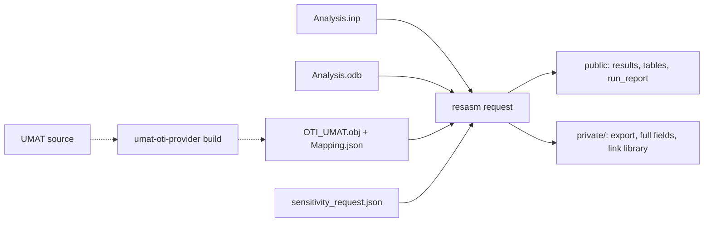

# Residual Assembler

*Course handbook · Program 2 of 2*

Residual Assembler takes a finished finite-element analysis and computes how its results change when you change a material parameter. It works from the saved results, so the analysis is not run again, and it never needs the material's source code.

- **Version** residual-assembler 0.1.0
- **Interface** the `resasm` command (18 subcommands) and a Streamlit GUI
- **Tested** Linux (Ubuntu 20.04), Python 3.11.7, gfortran 9.4.0
- **Abaqus** 2021.HF5, only to run analyses and read `.odb` files
- **Companion** UMAT-OTI (Program 1 of 2)
- **Measured** 2026-09-18 and 2026-09-19
- **Licence** GPL-3.0-only

## Chapters

1. [Start here](#1-start-here)
2. [What Residual Assembler does](#2-what-residual-assembler-does)
3. [Key ideas and vocabulary](#3-key-ideas-and-vocabulary)
4. [Installing](#4-installing)
5. [What goes in](#5-what-goes-in)
6. [What comes out](#6-what-comes-out)
7. [Which path to use](#7-which-path-to-use)
8. [The command line, command by command](#8-the-command-line-command-by-command)
9. [The GUI, screen by screen](#9-the-gui-screen-by-screen)
10. [Five worked examples](#10-five-worked-examples)
11. [Verification and reports](#11-verification-and-reports)
12. [Working with UMAT-OTI](#12-working-with-umat-oti)
13. [Troubleshooting](#13-troubleshooting)
14. [Limits](#14-limits)
15. [Quick reference and glossary](#15-quick-reference-and-glossary)

## 1. Start here

This handbook teaches you to use Residual Assembler from the first installation to a full-size analysis. You will run every command yourself, see what it prints and learn what each file means. You will also learn how to tell whether a number is right. Each chapter builds on the one before it, but the command reference ([chapter 8](#8-the-command-line-command-by-command)), the troubleshooting tables ([chapter 13](#13-troubleshooting)) and the quick reference ([chapter 15](#15-quick-reference-and-glossary)) also work on their own.

### Who this handbook is for

It is written for engineers and graduate students who know some finite-element mechanics and have used Abaqus. You should know what an input deck (`.inp`) and an output database (`.odb`) are, what an increment of a static step is, and roughly what a user material (UMAT) does: it receives a strain increment and returns the new stress, the updated state variables and the material tangent `DDSDDE`. You do not need to know anything about this program, about hypercomplex numbers or about sensitivity analysis. Those ideas are explained where they first appear.

Two people take part in a typical sensitivity study, and the handbook addresses both:

-   The **analysis owner** ran the Abaqus analysis. They hold `Analysis.inp` and `Analysis.odb` and want to know how the results depend on the material constants. Residual Assembler is their program, and most of this handbook is written for them.
-   The **material owner** wrote the UMAT. They use the companion program UMAT-OTI to compile the material into a *provider* that computes derivatives, and they hand over only the compiled object and a small description file. [Chapter 12](#12-working-with-umat-oti) explains that hand-over from Residual Assembler's side. The UMAT-OTI handbook covers the material owner's side.

The two roles can be the same person. In a class, you will usually play both.

### What you need

| Item                                                  | Needed for                                                                                                       | Notes                                                                                                               |
|-------------------------------------------------------|------------------------------------------------------------------------------------------------------------------|---------------------------------------------------------------------------------------------------------------------|
| Linux, x86-64                                         | everything                                                                                                       | verified on Ubuntu 20.04. On Windows use WSL 2 ([chapter 4](#4-installing)). macOS is not established.              |
| Python 3.10 or newer, with `venv`, `ctypes` and `ssl` | everything                                                                                                       | Residual Assembler alone accepts 3.9, but UMAT-OTI needs 3.10. Verified with 3.11.7.                                |
| `gfortran`                                            | building a material provider and linking it at run time                                                          | verified with GNU Fortran 9.4.0                                                                                     |
| `git`                                                 | cloning; the pipeline script of Example 6 records commits                                                        |                                                                                                                     |
| Abaqus (tested 2021.HF5)                              | running analyses, and reading an `.odb` through Abaqus Python                                                    | The sensitivity computation itself never calls Abaqus. An exported ODB can be replayed on a machine without Abaqus. |
| OTILib (external, GPLv3)                              | only the direct-residual routes: Example 1, Example 7, `resasm sensitivity`, `resasm run` with `backend: otilib` | built from source in about ten minutes ([chapter 4](#4-installing)). The Abaqus workflow does not need it.          |

### How the handbook is organised

1.  **Start here**: this chapter, with a ten-minute first run.
2.  **What Residual Assembler does**: the problem, the residual method on a one-spring example, and why the material source stays private.
3.  **Key ideas and vocabulary**: one table of the terms used everywhere else.
4.  **Installing**: both packages, OTILib, the checks, the clean-install gate and common installation errors.
5.  **What goes in**: the four-file request, field by field; `resasm.yml`; what an Abaqus deck may contain.
6.  **What comes out**: every output file, with a real `run_report.txt` read line by line.
7.  **Which path to use**: the five ways of using the program, and a decision table.
8.  **The command line**: every subcommand with its options, a real run and its exit codes.
9.  **The GUI**: every screen, with the two screenshots from the repository.
10. **Five worked examples**, each run from the command line and from the GUI, plus a summary of the other three.
11. **Verification and reports**: how a result is checked, what the verdict lines mean and what to quote.
12. **Working with UMAT-OTI**: how the material provider is made and checked on arrival.
13. **Troubleshooting**: symptoms, causes and fixes, grouped by where they occur.
14. **Limits**: what is refused, and why.
15. **Quick reference and glossary**.

Suggested reading routes:

-   **You have an Abaqus analysis with a UMAT** and want its sensitivities: chapters 2, 5 and 6, then Examples 4, 3 and 5, then chapter 11.
-   **You can write your own residual** (a prototype, a small model): Example 1, the `resasm.yml` part of chapter 5, and the black-box summary at the end of chapter 10.
-   **You only want to see it work**: the first run below, then Example 4, which needs neither Abaqus nor OTILib.

### Conventions used in this handbook

-   **Where to run.** Every command runs from the root of the Residual Assembler checkout, with the virtual environment active. The companion checkout, UMAT-OTI, sits beside it as `../UMAT_source_transformation`. When a command must run elsewhere (for example an Abaqus job), the text says so.

-   **Where outputs go.** Outputs go to a work folder outside the repository, named by the variable `WORK`, as in the repository's own walkthroughs. Set it once per shell:

    ```bash
export WORK="$HOME/resasm_work"; mkdir -p "$WORK"
```

-   **Quoted output** is real. It was either measured in the repository's documentation on 2026-09-18 or 2026-09-19, or re-run for this handbook on 2026-09-19. Long outputs are shortened with `...`, and absolute paths that the program prints are shortened to `.../`. Each measured number carries its date.

-   **The command name.** The package installs one program, `resasm`. `python -m residual_core.ui.cli` is the same program, which is useful when you work from a source checkout without installing it.

-   **Example numbers** are the repository's own (Example 1 to Example 8), so that you can open the matching `WALKTHROUGH.md` at any time.

### A ten-minute first run

This run installs both packages and computes your first sensitivity: the derivative of a spring's displacement with respect to its stiffness and its load. It is the smallest complete use of the program. [Example 1](#example-1--the-smallest-sensitivity-a-residual-you-write-yourself) in chapter 10 explains every line of it.

1.  **Get both repositories, side by side.** Several scripts find the companion beside the main checkout, so keep them in one parent folder.

    ```bash
mkdir -p ~/resasm && cd ~/resasm
git clone https://github.com/AMMS-Lab-UTSA/Residual_Assembler.git
git clone https://github.com/AMMS-Lab-UTSA/UMAT_source_transformation.git
```

2.  **Create a virtual environment and install both packages.** `-e` installs them in editable mode, so the commands use the code in your checkouts. The extras add the GUI (`gui`), YAML support (`yaml`) and the test tools (`test`).

    ```bash
python3 -m venv .venv
. .venv/bin/activate
pip install -e "./Residual_Assembler[gui,yaml,test]" -e "./UMAT_source_transformation[test]"
pip check
```

    Measured on 2026-09-18 in a new environment made from Python 3.11.7: the install took 40 s, and `pip check` printed `No broken requirements found.`

3.  **Ask the program what it can do.** From now on, work in the Residual Assembler folder.

    ```bash
cd Residual_Assembler
resasm --help
```

    ```text
usage: resasm [-h] [--config CONFIG]
              {replay,request,history,inspect,requirements,assemble,verify,doctor,template,backends,sensitivity,modes,init,inspect-model,init-assembly,check,run,report}
              ...

Model-agnostic residual assembly framework

positional arguments:
  {replay,request,history,inspect,requirements,assemble,verify,doctor,template,backends,sensitivity,modes,init,inspect-model,init-assembly,check,run,report}
    replay              compiled J2 C3D8 replay with total-history
                        sensitivities
    request             sensitivities from Analysis.inp, Analysis.odb,
                        OTI_UMAT.obj and sensitivity_request.json
    history             history replay for any provider: sensitivities from
                        Analysis.inp + Analysis.odb + OTI_UMAT.obj +
                        sensitivity_request.json
    ...
    init                start a job: copy a template (--template) or run the
                        interactive wizard
    ...
    report              summarize a completed run's output dir

options:
  -h, --help            show this help message and exit
  --config CONFIG       optional config file (.yml/.json)
```

    Eighteen subcommands are listed. You have not learned any of them yet; chapter 8 covers each one.

4.  **Copy the spring job and run it.** Example 1 needs OTILib. If you have already built it ([chapter 4](#4-installing)), point the two variables at its build folder first; otherwise read the callout after this list.

    ```bash
export WORK="$HOME/resasm_work"; mkdir -p "$WORK"
resasm init --template python --out "$WORK/spring"
resasm check  "$WORK/spring/resasm.yml"
resasm run    "$WORK/spring/resasm.yml"
resasm report "$WORK/spring/resasm_output"
```

    `init` copies a ready-made job into a new folder. `check` tests every requirement and prints one line each:

    ```text
[ok] config parsed: spring_demo (order 2, backend otilib)
[ok] loaded solution vector: shape (1,)
[ok] loaded parameter map: 2 parameters (k, f)
[ok] residual evaluated: shape (1,)
[ok] tangent loaded (python): shape (1, 1)
[ok] OTILib available: order 2, basis 2
[ok] residual norm on free DOFs is 0.000e+00
[ok] RHS order 1 generated: shape (1, 2)
[ok] sensitivity solve completed
```

    `run` computes the derivatives and `report` summarises the finished job:

    ```text
run complete: {'parameters': ['k', 'f'], 'order': 2, 'tangent_source': 'python', 'residual_free_norm': 0.0, 'orders_solved': [1, 2]}
  private outputs -> .../spring/resasm_output/private
  public  outputs -> .../spring/resasm_output/public
  read: .../spring/resasm_output/public/summary.md
```

5.  **Read the answer.**

    ```bash
cat "$WORK/spring/resasm_output/public/sensitivity_norms.csv"
```

    ```text
order,direction,oti_direction,recovery_factor,solution_sensitivity_norm,rhs_norm
1,d/dk,e1,1,3.333333e-01,8.000000e+00
1,d/df,e2,1,4.166667e-02,1.000000e+00
2,d2/dk2,e1^2,2,2.222222e-01,5.333333e+00
2,d2/dk_df,e1*e2,1,6.944444e-03,1.666667e-01
2,d2/df2,e2^2,2,1.736111e-03,4.166667e-02
```

> [!IMPORTANT]
>
> **Check it worked**
>
> The first row says that the size of `du/dk` is 0.3333 and the second that the size of `du/df` is 0.041667, that is 1/3 and 1/24. Chapter 2 derives both numbers by hand in six lines. Every command exited 0 (run `echo $?` after any command to see its exit code). Re-run on 2026-09-19 with identical output.

> [!CAUTION]
>
> **If it fails**
>
> Without OTILib, `resasm check` prints `[fail] OTILib backend requested but genuine OTILib was not found.` and exits 1, and `resasm run` exits 3. This is expected: the program refuses rather than guessing. You can still finish a first run today. The black-box template runs the same four commands and needs no OTILib, because its own small solver supplies the derivatives: replace `python` with `blackbox-order2` and `spring` with `bb2` in step 4. Measured on 2026-09-19 without OTILib: all four commands exited 0. Build OTILib later, as [chapter 4](#4-installing) shows.

You have now used the program the way every job works: a small input, a check that stops at the first problem, a run, and a report whose public part you may share. The rest of the handbook explains the finite-element case, where the residual is not something you write yourself but something the program rebuilds from your Abaqus results.

## 2. What Residual Assembler does

This chapter explains the idea behind the program before you meet its files and commands. It starts with the question that sensitivity analysis answers, derives the method on a model with one unknown, and then shows how the same equation is used on an Abaqus analysis. It ends with the privacy arrangement that lets a material's author share a material without sharing its source.

### The problem: sensitivities of a converged analysis

A converged nonlinear finite-element analysis gives you displacements, stresses, reactions and state variables at every increment, for one set of material constants. Engineers then ask a second question: *how would those results change if a constant changed a little?* The answer is a set of derivatives, such as `dU/dE` or `dRF/dSIGY0`, called **sensitivities**. They tell you which parameters matter, how uncertainty in a parameter spreads into the result, and which way to move a parameter when you calibrate a model against a test.

The obvious way to get a sensitivity is a **finite difference**. You run the analysis again with the parameter raised by a small step `h` and again with it lowered, and you divide the change in the result by `2h`. That needs two extra analyses per parameter, and each analysis may take hours. The answer also depends on `h`. A large step gives a truncation error. A small step drowns in noise, because an ODB stores single-precision numbers and every Abaqus increment is converged only to a tolerance. For the full-size J2 cantilever of [Example 5](#example-5--full-size-cantilevers-j2-and-fcc-crystal-plasticity), the repository's optional Abaqus finite-difference reference needed 24 more Abaqus runs. Even then, the exact derivatives and the Abaqus differences of the tip reaction agreed only to between 1.3e-3 (`H`) and 1.5e-2 (`E`), relative (measured 2026-09-18). That scatter belongs to the finite differences, which are limited by single precision and by the Abaqus convergence tolerance, not to the derivatives.

Residual Assembler computes the same derivatives from the saved analysis in one pass, with no step size, without running Abaqus again. It needs the input deck, the ODB and the material in a special compiled form, described below.

Abaqus cannot give you these derivatives itself, for a simple reason: it keeps its global residual vector internal. No output request and no ODB field hands you `R`. Residual Assembler therefore rebuilds `R` from its ingredients: the mesh, the material, the recorded displacements, the loads and the boundary conditions. The program's name comes from this step.

### The residual method in plain terms

A static finite-element solution satisfies equilibrium: on every free degree of freedom (DOF), the internal forces balance the external forces. Write this as a **residual** that is zero at the solution:

`R(u, p) = F_internal(u, p) − F_external = 0`

Here `u` is the vector of nodal displacements and `p` are the material parameters. If a parameter changes, the solution `u(p)` changes with it, but the residual stays zero, because the new solution is also in equilibrium. So the total derivative of `R` with respect to `p` is zero:

`(∂R/∂u) (du/dp) + ∂R/∂p = 0`, that is, `K du/dp = −∂R/∂p`.

`K = ∂R/∂u` is the **tangent stiffness**: the same matrix a Newton solver factorises at every iteration. `∂R/∂p` is the change of the internal force when the parameter changes *with the displacements held fixed*. The equation is linear, so one factorisation of `K` serves every parameter: each parameter is one more right-hand side. This is the whole method. The rest is bookkeeping: assembling `K` and `∂R/∂p` correctly, and carrying the history of a plastic material from increment to increment.

#### A worked example with one unknown

Take a nonlinear spring whose force grows with the cube of its stretch. Its stiffness is `k`, the applied load is `f`, and the one unknown is the displacement `u`:

`R(u; k, f) = k u³ − f`, with `k = 2`, `f = 16`. The converged solution is `u = 2`, since `2 · 8 − 16 = 0`.

| Step                        | Formula                      | Value at the solution |
|-----------------------------|------------------------------|-----------------------|
| Tangent                     | `K = ∂R/∂u = 3 k u²`         | 24                    |
| Residual derivative for `k` | `∂R/∂k = u³`                 | 8                     |
| Residual derivative for `f` | `∂R/∂f = −1`                 | −1                    |
| Sensitivity to `k`          | `du/dk = −(∂R/∂k)/K = −8/24` | −1/3                  |
| Sensitivity to `f`          | `du/df = −(∂R/∂f)/K = 1/24`  | 0.041667              |

You can check this without the method. The spring has a closed-form solution, `u = (f/k)^(1/3)`. Differentiating it directly gives `du/dk = −u/(3k) = −1/3` and `du/df = u/(3f) = 1/24`, the same numbers. Now look back at the table your first run printed. The `rhs_norm` column holds the sizes of `∂R/∂k` and `∂R/∂f` (8 and 1), and the `solution_sensitivity_norm` column holds the sizes of `du/dk` and `du/df` (0.3333 and 0.041667). The program did exactly this calculation.

A finite difference of the same spring needs two extra nonlinear solves per parameter, and its answer depends on the step. On 2026-09-18, the `resasm sensitivity` command re-solved the built-in version of this spring at perturbed `k` and got `−3.333330e-01`, a relative error of 1.0e-06 against the exact `−1/3`. The residual method gave `−3.333333e-01` exactly.

#### From one spring to an Abaqus analysis

In a finite-element model, `u` has thousands of entries and the residual is assembled from element contributions:

`R_n(u_n, p) = Σ_elements Σ_points w_q B_qᵀ σ_{n,q} − F(t_n)`

At increment `n`, `σ_{n,q}` is the stress at integration point `q`, `B_q` is the strain-displacement matrix, `w_q` is the integration weight times the volume factor, and `F(t_n)` are the external loads at that time. Only the stress depends on the material parameters; the loads and the prescribed displacements do not. So `∂R/∂p` is the assembled `B_qᵀ ∂σ/∂p`, and `K` is assembled from the material tangent `DDSDDE`.

A plastic material adds one complication. The stress at increment `n` depends on the stress, the state variables and the strain of every earlier increment, and each of those also depends on `p`. The derivative must therefore include the whole history. The program carries `dσ/dp` and `d(state)/dp` from one increment to the next. It also feeds the change of the earlier displacements, `du_{n−1}/dp`, into the strain of the current increment. This is the **total-history derivative**. After each solve it updates the stress and reaction derivatives:

```text
K_ff du_f/dp = - dR_f/dp |_(u_n fixed),     K = sum w B^T DDSDDE B,
dsigma_n/dp  = dsigma^A/dp + DDSDDE B du_n/dp,
dRF_c/dp     = dR_c/dp|_(u fixed) + K_cf du_f/dp.
```

The subscript `f` marks free DOFs and `c` constrained ones, and `dσ^A/dp` is the stress derivative at fixed current displacements (these formulas are quoted from `docs/REPLAY_HISTORY.md`). [Example 6](#the-other-three-examples), summarised at the end of chapter 10, shows why the history matters. In its cyclic one-element model, a "fixed-path" derivative that ignores how earlier increments change with the parameter agrees with the total-history derivative until unloading begins. After that, the fixed-path `du/dnu` jumps to about −0.0018 while the total-history value is about −0.0005, and the two never meet again.

#### Replay, not re-analysis

The program never re-solves your production analysis. It reads the recorded displacements of every increment from the ODB, runs ("replays") the material at every integration point with the recorded strains, and reassembles `R`. It then checks two things before it trusts the replay. First, `R` must be close to zero on the free DOFs, which means the recorded state is in equilibrium. Second, the replayed stress, state and reactions must match the ODB at every point and increment, within limits set by the ODB's single precision. Only then does it solve the sensitivity equation. A replay is fast. The ten-increment beam of [Example 4](#example-4--history-replay-of-a-j2-beam-offline) takes about a second. The 1,536-element cantilever of Example 5 takes about 10 s of engine time, or about 25 to 28 s when every increment is first re-equilibrated (measured 2026-09-18).

#### Where the material derivatives come from

`∂σ/∂p` and `DDSDDE` must be exact, or the sensitivities are only as good as a finite difference. They come from **order-truncated imaginary (OTI) numbers**. An OTI number carries, next to its ordinary value, one imaginary part per parameter, `e1`, `e2`, and so on. If you evaluate a routine with `E + e1` instead of `E`, every arithmetic operation carries the derivative with respect to `E` along. The result is `σ + (∂σ/∂E) e1`, with the derivative exact to machine precision. There is no step size and no subtraction of nearly equal numbers. "Order-truncated" means that products of imaginary parts beyond a chosen order are dropped. At order 1 you get first derivatives, and at order 2 second derivatives as well.

A Fortran UMAT does not understand OTI numbers. The companion program **UMAT-OTI** rewrites the UMAT's source so that it computes with OTI numbers, then compiles the original and the rewritten routine together into one object. Residual Assembler only calls that object.

### Why the material's source never reaches the analyst

Material models are often confidential: a company's calibrated law, or a research code that is not yet published. The workflow is arranged so that the source never leaves its owner:

1.  The material owner runs `umat-oti-provider build` (from UMAT-OTI) on the UMAT and a short contract that names the parameters. The build writes a compiled object and a completed contract, which the analyst receives as `OTI_UMAT.obj` and `Mapping.json`. The build folder, which contains the generated sources, stays with the owner.
2.  The analyst runs `resasm request` with the deck, the ODB, the object and a request. No Fortran source is read.

The object contains the **ORIGINAL** routine, compiled unchanged, and its OTI version, in binary form, behind several entry points: `UMAT` (the ORIGINAL), `UMAT_OTI_EVAL`, `UMAT_OTI_MARCH` and `UMAT_OTI_EVAL_TOTAL`. One call of `UMAT_OTI_EVAL_TOTAL` per integration point returns everything the history engine needs. It returns the new stress and state, the tangent `DDSDDE` (taken from the provider's OTI strain directions), the parameter derivatives `DSIGMA_DP` and `DSTATEV_DP`, and the state's derivative with respect to the strain increment. The ORIGINAL routine serves the independent finite-difference checks of [chapter 11](#11-verification-and-reports), which re-run the unmodified material at perturbed parameters. (The bounded J2 engine also takes its virgin elastic tangent from it.) It is never used to read source or to rerun the production analysis.

`Mapping.json` tells Residual Assembler how to call the object. It holds the dimensions, the entry-point names and their argument lists, each parameter's name, `PROPS` index and OTI direction, the array layouts, a fingerprint of the ORIGINAL source and the SHA-256 of the object. Before a run, the request checks that the mapping belongs to the object you gave it.

> [!NOTE]
>
> **Note**
>
> The privacy claim is tested, not only stated. The clean-install gate ([chapter 4](#4-installing)) runs the one-element request of Example 3 a second time with every read of a Fortran source denied, and requires identical public files. In the recorded run of 2026-09-19 they were byte-identical. None of the commands makes a network call. Keep one caution in mind: the hashes prove that the mapping belongs to the object, but they do not make an untrusted binary safe. Run only providers you trust.

### The four-file request at a glance

The diagram shows who makes which file and where the results go. The dashed part happens on the material owner's machine.



### What the program is not

-   It is **not a solver for your production model**. It never runs an Abaqus analysis. It calls Abaqus Python only to read an `.odb`, and not at all when you give it an exported field file.
-   It computes **first derivatives with respect to material parameters** in the replay. Load, boundary-condition and shape sensitivities are not supported.
-   Its replay covers **small-strain C3D8 analyses with one static step** and one user material. Anything else is refused by name rather than approximated ([chapter 14](#14-limits)).

The same package does three more things, which later chapters cover. It assembles `R` from a model's ingredients (the "assembly" path), it differentiates a residual you write yourself in Python (the "direct" path, Example 1), and it solves with residual coefficients returned by your own private executable (the "black-box" path, Example 8). [Chapter 7](#7-which-path-to-use) helps you choose.

## 3. Key ideas and vocabulary

The same two dozen terms appear in every output file, every error message and every later chapter. Read this table once now and come back to it when a word is unclear. The glossary in [chapter 15](#15-quick-reference-and-glossary) repeats the definitions in alphabetical order.

| Term                                        | What it means                                                                                                                                                                                                                          | Where you meet it                                                                          |
|---------------------------------------------|----------------------------------------------------------------------------------------------------------------------------------------------------------------------------------------------------------------------------------------|--------------------------------------------------------------------------------------------|
| Residual `R`                                | Internal minus external nodal force, `R = F_int − F_ext`. It is zero on the free DOFs of a converged solution.                                                                                                                         | `Residual assembled` and `Equilibrium passed` lines of `run_report.txt`; `resasm assemble` |
| Free and constrained DOFs, reactions        | Free DOFs are unknowns; constrained DOFs have a prescribed value. On constrained DOFs, `R` is the reaction force.                                                                                                                      | `max|R_free|`; `RF` outputs; `resasm verify`                                               |
| Tangent `K`                                 | `∂R/∂u`, assembled from the material tangent `DDSDDE = ∂σ/∂ε`. It is the matrix of the sensitivity equation.                                                                                                                           | `Tangent available`, `Tangent verified`                                                    |
| `dR/dp` (right-hand side)                   | How the residual changes with a parameter while the displacements are held fixed. With a minus sign it is the right-hand side of `K du/dp = −dR/dp`.                                                                                   | `rhs_norm` in `sensitivity_norms.csv`; `R^(p)`                                             |
| Parameter                                   | A material constant you differentiate with respect to. It has a name (`E`), a `PROPS` index (the position in the `*User Material` constants) and a value (read from the deck).                                                         | `Mapping.json`; `"parameters"` in the request                                              |
| Sensitivity                                 | The derivative of a result with respect to a parameter, such as `dU1/dE`.                                                                                                                                                              | `derivatives` in `sensitivity_results.json`                                                |
| Total-history derivative                    | A derivative that includes how every earlier increment changes with the parameter. It is required for plasticity, and it is what the program computes.                                                                                 | `Sensitivity semantics: total equilibrated history`                                        |
| Provider                                    | The compiled material object, `OTI_UMAT.obj`. It holds the ORIGINAL UMAT and its OTI version, and it is built by UMAT-OTI.                                                                                                             | `--material`                                                                               |
| ORIGINAL                                    | The untransformed UMAT, compiled into the same object. It serves the independent finite-difference checks (and gives the bounded J2 engine its virgin elastic tangent); it is never used to read source or rerun the analysis.         | `--verify tangent|fd`, `--validate`                                                        |
| `Mapping.json`                              | The completed contract that the provider build writes beside the object: names, `PROPS` indices, layouts, entry points, source fingerprint and object hash. Use it unchanged.                                                          | `--mapping`; `Category: material_mapping`                                                  |
| Request                                     | `sensitivity_request.json`: which outputs, which parameters, where (domain) and at which increments.                                                                                                                                   | `--request`                                                                                |
| Output, field, component, reduction, domain | One requested number: a field (`U`, `RF`, `S`, `SDV`, `MISES`) and a component, reduced over a region (the domain) by a sum, a mean, a maximum and so on.                                                                              | `"outputs"` in the request; the rows of `sensitivity_tables.csv`                           |
| Increment                                   | One converged step of the recorded history, numbered from 1. Increment 0 is the virgin, unloaded state.                                                                                                                                | `"increments": "LAST"`, `"ALL"` or a list                                                  |
| Replay                                      | Running the material again at every integration point with the recorded strains, to rebuild stress, state, `R` and `K` without re-running the analysis.                                                                                | `history replay: ...`                                                                      |
| Bounded engine and history engine           | `resasm request` has a small, dense engine for one pinned J2 model. Every other readable model goes to the scalable history engine (`resasm history`), and the command says so.                                                        | the first line of `resasm request` output                                                  |
| Re-equilibration                            | `--reequilibrate`: a Newton polish of every recorded increment to double-precision equilibrium before the sensitivities are taken.                                                                                                     | `Mode: replay+reequilibrate`                                                               |
| ODB parity                                  | The comparison of the replayed stress, state and reactions with the ODB at every integration point and increment. Any excess over the single-precision limits stops the run.                                                           | `Abaqus comparison available: yes (primal)`                                                |
| Homogeneity identity                        | For J2 with linear hardening (and the FCC crystal model), `Σ p dQ/dp` over the stress-dimensioned parameters equals `Q` for stresses and reactions and 0 for displacements. The engine does not use it, so it is an independent check. | [chapter 11](#the-homogeneity-identity-a-check-with-no-finite-differences)                 |
| Weighted derivative, weighted share         | `p dQ/dp` makes parameters with different units comparable. A share is each parameter's weighted magnitude as a percentage of their sum.                                                                                               | `weighted`; `sensitivity_shares.csv`                                                       |
| Public and private outputs                  | Public files are summaries you may share. `private/` holds full arrays, exports and link libraries, and stays with you.                                                                                                                | the `Public and private outputs separated` line                                            |
| Coefficient and derivative                  | OTI yields Taylor coefficients. The derivative is the coefficient times a recovery factor, the product of the factorials of the direction's exponents (1 at first order, 2 for `d²/dk²`).                                              | `U_coefficients` and `U_derivatives`; `recovery_factor`                                    |
| Executed and verified                       | An ordinary run computes derivatives but checks them against nothing. Only an independent reference that resolved turns "calculated" into "verified".                                                                                  | `verified=False`; `Derivative verified: not run`                                           |
| Backend and mode                            | A backend is the element code that assembles one element type. A mode is how `R` is assembled: `stress-driven`, `material-replay`, `direct-residual` or `formulation`.                                                                 | `resasm backends`, `resasm modes`                                                          |
| Exit code                                   | 0 success; 1 the command ran and the answer is negative; 2 it could not run with these inputs; 3 OTILib was requested and is missing.                                                                                                  | every command; the GUI's coloured result line                                              |

### Three ideas that trip people up

#### Executed is not verified

An ordinary `resasm request` prints `verified=False`, and its report says `Derivative verified: not run`. Nothing went wrong. The program computed the derivatives exactly and replayed the ODB successfully, but it did not compare them with an independent method, so it does not call them verified. When you ask for a check (`--verify fd`), the report says `yes` only if the finite-difference reference itself resolved. [Chapter 11](#11-verification-and-reports) explains the whole ladder.

#### Coefficients are not derivatives

At second order, the OTI result for `k + e1` carries `½ d²u/dk²` in the `e1²` slot, the Taylor coefficient. In the spring, the raw coefficient of `e1²` is 1/9, while the derivative is 2/9. The program stores both and quotes derivatives in every public report, so you never apply the factor yourself. If you read a private array, read the `*_derivatives` keys.

#### Public is a choice, not a guarantee of emptiness

For a `resasm.yml` job, the `public/` folder holds exactly five files: norms, rankings, status and timing, with parameter names but not their values. For a request, the three public files contain the scalar results you asked for, the request itself and metadata that includes the parameter values read from the deck and the SHA-256 of every input. A requested `fields.npz` holds the complete solution and its derivatives, so share it only if the model may be shared. Read what you send.

## 4. Installing

This chapter takes you from an empty Linux machine to a working installation, and shows how to prove that it works. The two packages install in about a minute. OTILib, which only the direct-residual routes need, takes about ten minutes more. The measurements are from the repository's installation guide, `docs/INSTALL.md`, made on 2026-09-18 in a new virtual environment.

### Two repositories, side by side

Residual Assembler and UMAT-OTI are separate products, connected by a versioned contract. Neither contains the other. Clone both into the same parent folder, because several scripts look for the companion beside the main checkout:

```bash
mkdir -p ~/resasm && cd ~/resasm
git clone https://github.com/AMMS-Lab-UTSA/Residual_Assembler.git
git clone https://github.com/AMMS-Lab-UTSA/UMAT_source_transformation.git
```

```text
~/resasm/
    Residual_Assembler/            this repository
    UMAT_source_transformation/    the companion, UMAT-OTI
```

The pair of commits known to work together is recorded in `docs/COMPATIBILITY.md`.

### Install both packages into one environment

From the parent folder:

```bash
python3 -m venv .venv
. .venv/bin/activate
pip install -e "./Residual_Assembler[gui,yaml,test]" -e "./UMAT_source_transformation[test]"
pip check
```

Measured on 2026-09-18 with Python 3.11.7: 40 s, and `pip check` reported `No broken requirements found.` Why each part is there:

-   `python3 -m venv .venv` creates an isolated environment, so these packages cannot disturb other Python work. If your default `python3` is older than 3.10, name a newer one, for example `python3.11 -m venv .venv`.
-   `-e` (editable) makes the installed commands run the code in your checkouts, so the examples and templates are found where they are and a `git pull` takes effect at once.
-   The extras: `gui` adds Streamlit, `yaml` adds PyYAML (a minimal YAML reader is bundled if you leave it out), `test` adds pytest and the test tools.
-   `pip check` confirms that every installed package has compatible dependencies.

Two commands are now on your `PATH`:

| Command             | Package            | What it does                                                                                      |
|---------------------|--------------------|---------------------------------------------------------------------------------------------------|
| `resasm`            | Residual Assembler | every workflow in this handbook                                                                   |
| `umat-oti-provider` | UMAT-OTI           | builds a compiled material provider (`OTI_UMAT.obj` and its mapping) from a UMAT and its contract |

> [!TIP]
>
> **Tip**
>
> Activate the environment in every new shell with `. .venv/bin/activate`. `resasm: command not found` almost always means you forgot.

### OTILib: what it is and when you need it

OTILib is the library that implements OTI arithmetic in Python. It is GPLv3, developed separately, and never copied into this repository. Residual Assembler uses it when *it* has to evaluate a residual with OTI numbers, which happens on the direct-residual routes. The Abaqus workflow does not use it, because there the compiled provider carries its own Fortran OTI implementation.

| Workflow                                                               | OTILib needed? |
|------------------------------------------------------------------------|----------------|
| `resasm request`, `resasm history`, `resasm replay` (Examples 3 to 6)  | No             |
| Stress-driven assembly, `resasm assemble`, `resasm verify` (Example 2) | No             |
| The black-box templates (`blackbox`, `blackbox-order2`, Example 8)     | No             |
| The `python` template, `resasm run` with `backend: otilib` (Example 1) | Yes            |
| `resasm sensitivity`, the finite-strain example (Example 7)            | Yes            |

**The documented build, without Conda.** With your virtual environment active (the build uses the `python` on `PATH`), in a folder outside both checkouts:

```bash
python -m pip install cmake==3.31.10 Cython==3.3.0
git clone https://github.com/mauriaristi/otilib.git "$HOME/otilib"
git -C "$HOME/otilib" checkout --detach a4b7a05ca275e8d441b0b717b7b272e96728ffcc
cmake -S "$HOME/otilib" -B "$HOME/otilib/build" -DBUILD_TESTING=OFF
cmake --build "$HOME/otilib/build" --target oticython --parallel 2
cmake --build "$HOME/otilib/build" --target gendata --parallel 2
```

What each line does: it installs the two build tools at the versions the validated procedure used, clones OTILib, checks out the pinned commit, configures a CMake build without OTILib's own tests, compiles the Python extension modules (`oticython`) and generates the data tables (`gendata`). Measured on 2026-09-18: every command exited 0 (the compiler prints many warnings, which is normal). `oticython` took 8 min 45 s and `gendata` 8 s. The build must be made with the same Python version as your environment. `docs/OTILIB_VENV.md` shows the same procedure in a fully isolated shell.

**With Conda**, `bash Residual_Assembler/scripts/setup_otilib.sh [TARGET_DIR]` clones OTILib, creates a Conda environment `pyoti` and builds it. It needs `git`, `cmake` and `conda`. It was not re-run for the installation guide.

**Tell Residual Assembler where the build is.** Point both variables at the *build* directory, not the source folder, in every shell where you use the OTILib routes, and check:

```bash
export PYOTI_PATH="$HOME/otilib/build"
export OTILIB_ROOT="$HOME/otilib/build"
python -c "from residual_core.algebra.otilib_adapter import otilib_status; print(otilib_status())"
```

```text
{'available': True, 'api_module': 'pyoti.sparse', 'repo': 'https://github.com/mauriaristi/otilib.git', 'license': 'GPLv3', 'env': {'OTILIB_ROOT': '.../build', 'PYOTI_PATH': '.../build'}, 'error': ''}
```

A working build prints `'available': True` and `'api_module': 'pyoti.sparse'` (re-run 2026-09-19). Without OTILib, every command that needs it stops with `OTILib backend requested but genuine OTILib was not found` and never falls back to anything else.

> [!WARNING]
>
> **Watch out**
>
> Never run `pip install pyoti`. That name on PyPI is an unrelated package. If you installed it by mistake, `import pyoti` works but the adapter reports OTILib unavailable or behaves strangely: `pip uninstall pyoti`, then build OTILib from source as above.

### The permissive test sources

The offline test suite and a few inspection examples read Abaqus input files from external git submodules, pinned to fixed commits. They come in three licence tiers. The script fetches only the permissive tier (MIT, BSD-3). The copyleft and licence-unknown tiers are marked `update = none` and are never fetched by setup.

```bash
./scripts/init_permissive_sources.sh           # the sources the tests need
./scripts/init_permissive_sources.sh --check   # show the state, fetch nothing
```

`--check` prints each submodule's pinned commit and confirms that the restricted tiers are empty (`-> 0 entries`). None of the eight worked examples needs these sources. Without them, the tests that read them are skipped, and each skip names the file it needs and this command.

### Check the installation

Run these from the `Residual_Assembler` folder with the environment active. Each check exercises a different part of the installation, from the command-line entry point to the GUI.

1.  **The commands answer.** `resasm --help` lists 18 subcommands (`replay`, `request`, `history`, `inspect`, `requirements`, `assemble`, `verify`, `doctor`, `template`, `backends`, `sensitivity`, `modes`, `init`, `inspect-model`, `init-assembly`, `check`, `run`, `report`).

    ```bash
resasm --help
umat-oti-provider --help
```

2.  **A first sensitivity with neither Abaqus nor OTILib.** This builds the J2 material provider and replays the committed Abaqus beam of [Example 4](#example-4--history-replay-of-a-j2-beam-offline). It tests UMAT-OTI, `gfortran` and the history engine together.

    ```bash
export WORK="$HOME/resasm_work"; mkdir -p "$WORK"
umat-oti-provider build ../UMAT_source_transformation/parameter_sensitivity/models/m3_j2/contract_v2.json \
    --out "$WORK/provider_j2"
resasm history --model examples/replay_history/j2_beam/Analysis.inp \
    --fields examples/replay_history/j2_beam/fields.npz \
    --material "$WORK/provider_j2/umat_m3_j2_oti.obj" \
    --request examples/replay_history/j2_beam/sensitivity_request.json --out "$WORK/beam"
```

    ```text
history replay: 10 increments, 768 integration points, 4 parameters; yes: max|R_free| = 1.288e-03 N at increment 10 (limit 1.609e-01 N there)
results: .../beam/sensitivity_results.json
```

    `$WORK/beam/run_report.txt` must begin with `Status: executed successfully`. Re-run on 2026-09-19: identical line, exit 0, in 0.9 s; the provider build took 5.8 s.

3.  **Both packages together, with an independent check.** The pipeline script of [Example 6](#the-other-three-examples) builds the provider again, solves a cyclic history and verifies every derivative against finite differences:

    ```bash
python scripts/reproduce_connected_pipeline.py --skip-abaqus --out "$WORK/pipeline"
```

    ```text
verified bounded J2 pipeline: .../pipeline/manifest.json
```

    `manifest.json` must contain `"passed": true`. Measured: 9.9 s in a fresh environment without OTILib (2026-09-18). Re-run on 2026-09-19 from a development setup with `--imports environment`: `"passed": true` in 9.9 s.

4.  **OTILib, if you built it.**

    ```bash
resasm init --template python --out "$WORK/spring_check"
resasm check "$WORK/spring_check/resasm.yml"
```

    Every line must read `[ok]`, including `[ok] OTILib available: order 2, basis 2`.

5.  **The GUI starts.**

    ```bash
streamlit run scripts/app.py
```

    Open the address it prints (by default `http://localhost:8501`). The first tab is **Sensitivity Request**. On 2026-09-19 a headless start answered its health check (`/_stcore/health` returned `ok`) two seconds after launch. Stop the server with Ctrl+C.

6.  **The offline test suite (optional, several minutes).**

    ```bash
python -m pytest -q -m "not abaqus and not arc and not network"
```

    The OTILib tests run when `PYOTI_PATH` and `OTILIB_ROOT` point to a working build, and are skipped by name when it is missing. Set `RUN_OTILIB_TESTS=1` whenever OTILib is meant to be present, so that a broken build fails those tests instead of skipping them. If the packages were installed from wheels rather than with `-e`, first set `export UMAT_OTI_REPO="$PWD/../UMAT_source_transformation"`, because the history-replay and verification tests read the UMAT models from that checkout. The full suite passed from clean clones on 2026-09-19 with 647 passed, 20 skipped and 0 failed.

7.  **Every example that needs no Abaqus, in one command (optional, about 4 min, needs OTILib).**

    ```bash
python scripts/audit_recovery_usage.py --umat ../UMAT_source_transformation --phase examples \
    --work "$WORK/examples" --evidence-dir "$WORK/examples_record"
```

    It first checks `otilib_status()` and the transform fingerprint, then runs the commands of each walkthrough in order, checks each result against the example's reference and stops at the first failure. Measured on 2026-09-19 with both packages installed from wheels: all 31 commands exited 0 and every check passed, in 3 min 24 s.

#### The transform generation

Evidence about a transformed material belongs to the version of the transformer that produced it. That version is identified by a **transform generation** fingerprint, recorded in `schemas/transform_generation.json`, a file that is identical in both repositories. To check that your UMAT-OTI computes the generation this repository expects:

```bash
python -c "import json; print(json.load(open('schemas/transform_generation.json'))['transform_fingerprint'])"
python -c "from umat_oti.store import transform_fingerprint; print(transform_fingerprint())"
```

```text
dbe9f928191e1d43
dbe9f928191e1d43
```

Both lines must be equal (re-run 2026-09-19). The contract tests `tests/contract/test_the_two_repositories_speak_one_contract.py` and `tests/framework/test_a_fixture_is_held_to_the_rule_that_froze_it.py` reported `26 passed`.

### The clean-install gate and the one-command reproduction

The checks above test *your* installation. `scripts/clean_install_gate.py` tests whether the published code can be installed and used by someone who has nothing else: it is the acceptance test of an installation. It needs Abaqus, because it reads two real ODBs.

```bash
python Residual_Assembler/scripts/clean_install_gate.py \
    --umat-repo UMAT_source_transformation --python python3.11 \
    --odb /path/to/Analysis.odb --work /path/to/new/folder \
    [--branch main] [--abaqus abaqus] [--cantilever /path/to/cantilever/work]
```

This synopsis is not runnable as written: replace the paths and drop the options in brackets that you do not need. What the gate checks, in order:

1.  Both repositories are git checkouts with no uncommitted or untracked files, so the result describes a commit.
2.  The given Python is 3.10 or newer with `ctypes`, `ssl` and `venv`; `gfortran` and the Abaqus launcher are on `PATH`.
3.  It creates a new virtual environment with a scratch `HOME`, builds a wheel of each repository, installs both and runs `pip check`. It verifies that the packages come from the new environment, that nothing is editable and that the packaged data files are present.
4.  It builds the J2 provider with the installed `umat-oti-provider`.
5.  It runs the four-file request of [Example 3](#example-3--the-four-file-request-on-one-element) on the ODB you give and compares the derivatives with the uniaxial closed form: relative error below 2e-5, and `|dU1/dnu|` below 1e-8.
6.  It repeats the request with every read of a Fortran source denied and requires identical public files.
7.  It renders both installed GUIs headlessly and starts each server until it answers over HTTP.
8.  With `--cantilever`, it runs the full-size J2 cantilever of [Example 5](#example-5--full-size-cantilevers-j2-and-fcc-crystal-plasticity), re-equilibrates it and requires the homogeneity identity at every increment to 1e-10.

**Its two Abaqus inputs** are made once, from the folder that holds the two checkouts, into a folder outside them. These commands run Abaqus analyses. They need a licensed Abaqus with a Fortran compiler configured for user subroutines, and they were not re-run for this handbook:

```bash
RA="$PWD/Residual_Assembler"; UMAT="$PWD/UMAT_source_transformation"
IN="$HOME/gate_inputs"; mkdir -p "$IN/one_element" "$IN/cantilever/j2"
cp "$RA/examples/presentation_request/Analysis.inp" "$IN/one_element/"
python "$RA/examples/cantilevers/gen_cantilever.py" j2 --out "$IN/cantilever/j2/cantilever_j2_nominal.inp"
cd "$IN/one_element" && abaqus job=Analysis input=Analysis.inp \
    user="$UMAT/parameter_sensitivity/models/m3_j2/umat.for" cpus=1 interactive
cd "$IN/cantilever/j2" && abaqus job=cantilever_j2_nominal input=cantilever_j2_nominal.inp \
    user="$UMAT/parameter_sensitivity/models/m3_j2/umat.for" double=both interactive
grep "COMPLETED SUCCESSFULLY" "$IN/one_element/Analysis.sta" "$IN/cantilever/j2/cantilever_j2_nominal.sta"
```

Judge each job by `THE ANALYSIS HAS COMPLETED SUCCESSFULLY` in its `.sta` file. Abaqus 2021.HF5 can abort with signal 6 during teardown after writing a complete ODB. Then give the gate `--odb "$IN/one_element/Analysis.odb" --cantilever "$IN/cantilever"`.

**From fresh clones, all at once.** `scripts/reproduce_from_clean_clones.sh` does everything in this chapter from fresh clones of the published `main` branches. It drops the calling shell's Python settings, clones both repositories, runs the gate, runs both offline test suites and the examples check in the gate's environment, and records each step's exit code in `summary.tsv`. It needs the OTILib build and the two Abaqus inputs, and takes about 30 minutes:

```bash
export PYOTI_PATH="$HOME/otilib/build" OTILIB_ROOT="$HOME/otilib/build"
bash Residual_Assembler/scripts/reproduce_from_clean_clones.sh --python python3.11 \
    --odb "$IN/one_element/Analysis.odb" --cantilever "$IN/cantilever" /path/to/new/folder
```

The recorded run (`docs/evidence/final_clean_clone.md`, 2026-09-19, Residual Assembler `bf3600c`, UMAT-OTI `5dcdd8d`) took 26 min 40 s, and every step exited 0:

| Step                             | Time  | Result                                     |
|----------------------------------|-------|--------------------------------------------|
| clone both repositories          | 5 s   | both on `main`, each at the published head |
| clean-install gate               | 109 s | all 22 commands exited 0; the gate passed  |
| Residual Assembler offline suite | 462 s | 647 passed, 20 skipped, 0 failed           |
| UMAT-OTI suite                   | 820 s | 3399 passed, 160 skipped, 0 failed         |
| worked examples                  | 204 s | 31 of 31 commands passed their checks      |

Inside the gate, the one-element request matched the closed form to 1.7e-7 (`E`), 8.7e-16 (initial yield stress) and 8.8e-9 (`H`). The source-denied outputs were byte-identical. The full-size cantilever request took 21.7 s, and its re-equilibrated replay 30.8 s, with the homogeneity identity holding to 1.4e-12.

### Updating

Because both packages are installed in editable mode, pulling new commits changes the commands immediately. After an update:

1.  Pull both repositories (`git -C Residual_Assembler pull`, `git -C UMAT_source_transformation pull`), and keep them at a pair that works together (`docs/COMPATIBILITY.md`).
2.  Re-run the `pip install -e` line and `pip check`, in case the dependencies changed.
3.  Compare the two transform fingerprints again.
4.  Rebuild your material providers. The history engine refuses an object built by an older UMAT-OTI that lacks the `UMAT_OTI_EVAL_TOTAL` entry point, with a rebuild message.
5.  Repeat checks 2 and 3 above.

If you change the Python version of the environment, rebuild OTILib too: it must match the environment's Python.

### Windows: use WSL

The compiled providers and OTILib are built with the GNU toolchain and verified on Linux only. On Windows, install WSL 2 with Ubuntu (`wsl --install -d Ubuntu` in PowerShell). In the Ubuntu shell, install `python3 python3-venv gfortran git`, confirm that `python3 --version` is 3.10 or newer, and follow this chapter from the beginning. Keep the repositories under the Linux file system (for example `~/resasm`), not under `/mnt/c`, for speed. WSL 2 forwards local ports, so the GUI started inside WSL normally opens in the Windows browser. Abaqus itself can stay on Windows. Export the ODB there with `abaqus python residual_core/replay/odb_export_npz.py -- Analysis.odb fields.npz` and replay the export inside WSL with `resasm history --fields`.

### Common installation errors

| What you see                                                                   | Why                                                                                          | What to do                                                                                                             |
|--------------------------------------------------------------------------------|----------------------------------------------------------------------------------------------|------------------------------------------------------------------------------------------------------------------------|
| `resasm: command not found`                                                    | The virtual environment is not active.                                                       | `. .venv/bin/activate`                                                                                                 |
| `pip` refuses `umat-oti` because it requires a different Python                | UMAT-OTI needs Python 3.10 or newer.                                                         | Create the environment with such a Python: `python3.11 -m venv .venv`.                                                 |
| `umat-oti-provider build` fails, or a request stops while linking the material | `gfortran` is missing.                                                                       | `sudo apt-get install gfortran` (Debian, Ubuntu).                                                                      |
| `OTILib backend requested but genuine OTILib was not found`                    | The two variables are unset, point at the source folder, or the build is for another Python. | Set `PYOTI_PATH` and `OTILIB_ROOT` to the *build* directory; if it still fails, rebuild with the environment's Python. |
| `import pyoti` works but the adapter reports it unavailable                    | The unrelated PyPI package `pyoti` is installed.                                             | `pip uninstall pyoti`, then build OTILib from source.                                                                  |
| `No module named umat_oti.provider` from `reproduce_connected_pipeline.py`     | The isolated Python it starts sees an older UMAT-OTI installation.                           | Reinstall both packages, or pass `--imports environment` when you work through `PYTHONPATH`.                           |
| Tests skip with a message naming `sources/permissive/...`                      | The permissive sources were not fetched.                                                     | `./scripts/init_permissive_sources.sh`                                                                                 |
| The GUI port is taken                                                          | Another server uses port 8501.                                                               | `streamlit run scripts/app.py --server.port 8502`                                                                      |

## 5. What goes in

This chapter describes every input file, field by field, using the real files shipped with the repository. It covers the four files of the Abaqus route first, then `resasm.yml`, which drives the other routes. It ends with what an Abaqus deck may and may not contain, because most refusals you will meet come from there.

### The four-file request

-   **`Analysis.inp`**: The input deck of the finished analysis, exactly as it was run. The program reads it with its own parser: the mesh, the node and element sets, the `*User Material` constants, the boundaries, the loads and the step. It is the only source of the parameter values, and every replay compares it with the ODB.

-   **`Analysis.odb`**: The output database of that analysis. The program reads it through Abaqus Python (`abaqus python`), which needs a licensed Abaqus. Instead of the ODB, `resasm history` also accepts an export made once on a machine with Abaqus (`fields.npz`).

-   **`OTI_UMAT.obj + Mapping.json`**: The material, compiled by UMAT-OTI into a provider object, and the completed contract that describes it. Both come from the material owner. The mapping must sit beside the object, or be named with `--mapping`.

-   **`sensitivity_request.json`**: What you want: which outputs, with respect to which parameters, over which region, at which increments. You write it, or the GUI writes it for you.

#### Analysis.inp, block by block

This is the one-element deck of [Example 3](#example-3--the-four-file-request-on-one-element), complete:

*File: `examples/presentation_request/Analysis.inp`*

```text
*Heading
Bounded small-strain J2 presentation interface reference
*Node
1, 0., 0., 0.
2, 1., 0., 0.
3, 1., 1., 0.
4, 0., 1., 0.
5, 0., 0., 1.
6, 1., 0., 1.
7, 1., 1., 1.
8, 0., 1., 1.
*Element, type=C3D8, elset=ALL
1, 1, 2, 3, 4, 5, 6, 7, 8
*Nset, nset=XZERO
1, 4, 5, 8
*Nset, nset=YZERO
1, 2, 5, 6
*Nset, nset=ZZERO
1, 2, 3, 4
*Nset, nset=LOADED
2, 3, 6, 7
*Material, name=J2
*Depvar
1
*User Material, constants=4
210000., 0.3, 250., 2000.
*Solid Section, elset=ALL, material=J2
,
*Boundary
XZERO, 1, 1, 0.
YZERO, 2, 2, 0.
ZZERO, 3, 3, 0.
*Step, name=Loading, nlgeom=NO, inc=100
*Static
0.25, 1., 0.25, 0.25
*Cload
LOADED, 1, 75.
*Output, field, frequency=1
*Node Output
U, RF, CF
*Element Output
S, SDV
*End Step
```

| Block                                    | What the program does with it                                                                                                                                                                                                                     |
|------------------------------------------|---------------------------------------------------------------------------------------------------------------------------------------------------------------------------------------------------------------------------------------------------|
| `*Node`, `*Element, type=C3D8`           | The mesh. C3D8 is the only supported solid element, and Abaqus's default selective-reduced (B-bar) integration is reproduced. Node ids, coordinates and connectivity are compared with the ODB.                                                   |
| `*Nset`, `*Elset`                        | Named regions. The history engine accepts them as request domains (`{"nset": "LOADED"}`), and the GUI offers them as regions.                                                                                                                     |
| `*Depvar`, `*User Material, constants=4` | The number of state variables and the `PROPS` vector. The value of each parameter is the constant at the `PROPS` index the mapping gives: here `E = 210000`, `nu = 0.3`, `SIGY0 = 250`, `H = 2000`. The count must equal the provider's `nprops`. |
| `*Solid Section`                         | One user material on every element.                                                                                                                                                                                                               |
| `*Boundary` (model data)                 | Prescribed zero displacements. Their derivatives are zero, since boundaries do not depend on the parameters.                                                                                                                                      |
| `*Step, nlgeom=NO`, `*Static`            | One static step, small strain. `0.25, 1., 0.25, 0.25` fixes the increment at 0.25 of a step of length 1, so there are four increments.                                                                                                            |
| `*Cload`                                 | Concentrated loads, ramped from zero over the step (the Abaqus default for a static step). Loads do not depend on the parameters.                                                                                                                 |
| `*Output, field, frequency=1`            | Every increment must be written to the ODB, with `U`, `RF`, `S` and `SDV`. The bounded engine also reads `CF`, to check the applied loads against the deck.                                                                                       |

The beam of [Example 4](#example-4--history-replay-of-a-j2-beam-offline) shows the other forms the history engine accepts: a clamped root (`ROOT, ENCASTRE`), a nonzero prescribed displacement inside the step (`TIP, 2, 2, -0.08`), a `*Static, direct` step with fixed increments and a `*Controls` line that only tightens the solver tolerances:

*File: `examples/replay_history/j2_beam/Analysis.inp (end)`*

```text
*Elset, elset=ROOTEL, generate
1, 85, 12
*Material, name=UMATMAT
*Depvar
1
*User Material, constants=4
200000.0, 0.3, 250.0, 2000.0
*Solid Section, elset=ALL, material=UMATMAT
,
*Boundary
ROOT, ENCASTRE
*Step, name=Push, nlgeom=NO, inc=20
*Static, direct
0.1, 1.0
*Controls, parameters=field, field=global
1e-9, 1e-8
*Boundary
TIP, 2, 2, -0.08
*Output, field, frequency=1
*Node Output
U, RF
*Element Output, position=INTEGRATION POINTS
S, SDV
*End Step
```

#### Analysis.odb, and exports of it

The ODB must hold every increment through the end of the step, including frame 0 (the virgin state), for all nodes and elements. Missing frames are never interpolated. Its fields are single precision, and the replay's tolerances are built from that fact ([chapter 11](#11-verification-and-reports)). Three ways of reading it exist, for three purposes:

| Reader                        | Command                                                                                                                       | Writes                                                                          | Used by                                                              |
|-------------------------------|-------------------------------------------------------------------------------------------------------------------------------|---------------------------------------------------------------------------------|----------------------------------------------------------------------|
| automatic, inside the request | `resasm request --odb Analysis.odb` (or `resasm history --odb`) calls `abaqus python`; `--abaqus PATH` names another launcher | `private/fields.json` (bounded engine) or `private/fields.npz` (history engine) | the same run; the history export can be reused later with `--fields` |
| history export, by hand       | `abaqus python residual_core/replay/odb_export_npz.py -- Analysis.odb fields.npz`                                             | `fields.npz`                                                                    | `resasm history --fields fields.npz`, on any machine                 |
| stress-field export           | `abaqus python scripts/extract_odb_fields.py --odb my_job.odb --out fields.json`                                              | `{"stress_ip": {"<eid>": [[s11, s22, s33, s12, s13, s23], ...]}}`               | `resasm assemble --mode stress-driven`, `resasm verify`              |

> [!WARNING]
>
> **Watch out**
>
> The `--odb` option of `assemble`, `requirements` and `verify` is only another name for `--fields`: it expects the JSON stress export, not a binary ODB. Given the wrong layout, `assemble` stops with a one-line error that names the layout it expected (measured on 2026-09-19 by passing a model file):
>
> ```text
ERROR: field export residual_core/examples/minimal_c3d8_stress_driven/model.json: key 'schema' is not an element id; expected {"stress_ip": {"<element id>": [[s11, s22, s33, s12, s13, s23], ... one row per integration point]}}, as written by scripts/extract_odb_fields.py
```

#### OTI\_UMAT.obj and Mapping.json

The object is binary; you never open it. The mapping is JSON, and knowing its fields helps you understand the refusals. This is the mapping written by `umat-oti-provider build` for the J2 model on 2026-09-19, shortened where marked:

*File: `provider_j2/umat_m3_j2_oti.json (abridged)`*

```text
{
  "schema": "resasm_umat_oti_contract_v1",
  "model_id": "umat_m3_j2_oti",
  "kinematics": "small_strain",
  "dimensions": {"ntens": 6, "nprops": 4, "nstatev": 1, "nparam": 4},
  "symbols": {
    "regular_umat": "umat",
    "oti_internal": "umat_oti_internal",
    "oti_eval": "umat_oti_eval_",
    "oti_eval_signature": ["STRESS(NTENS)", "STATEV(NSTATV)", "DDSDDE(NTENS,NTENS)", ...],
    "oti_eval_total": "umat_oti_eval_total_",
    "oti_eval_total_signature": [..., "STRAN_DP_IN(NTENS,NPARAM)", "DSTRAN_DP_IN(NTENS,NPARAM)",
                                 "DSTATEV_DDSTRAN(NSTATV,NTENS)", "COORDS(3)", "CELENT", ...]
  },
  "replay": {"mode": "path_marching", "carry": ["DSIGMA_DP", "DSTATEV_DP"]},
  "march": {"symbol": "umat_oti_march_", "directions": 10, ...},
  "layouts": {
    "DSIGMA_DP": "fortran(NTENS,NPARAM)",
    "DSTATEV_DP": "fortran(NSTATV,NPARAM)",
    "DDSDDE": "fortran(NTENS,NTENS)",
    "voigt": ["11", "22", "33", "12", "13", "23"]
  },
  "parameters": [
    {"name": "E", "props_index": 1, "oti_direction": 1},
    {"name": "nu", "props_index": 2, "oti_direction": 2},
    {"name": "SIGY0", "props_index": 3, "oti_direction": 3},
    {"name": "H", "props_index": 4, "oti_direction": 4}
  ],
  "history": {"path_dependent": true, "dstatev_dp": "returned"},
  "object": {
    "file": "umat_m3_j2_oti.obj",
    "sha256": "cf0cd2e87db9b733",
    "sha256_full": "cf0cd2e87db9b7335bbaf5ec28eca25c6dc3df41354a366a0dd708f2c33a4686"
  },
  "regular_source_hash": "9b779f0c6cadf9c4",
  "validation": {"status": "not_run", "passed": false},
  "build": {"compiler": "GNU Fortran (Ubuntu 9.4.0-1ubuntu1~20.04.2) 9.4.0", ...}
}
```

| Field                      | Meaning                                                                                                     | Why the request cares                                                                                    |
|----------------------------|-------------------------------------------------------------------------------------------------------------|----------------------------------------------------------------------------------------------------------|
| `schema`                   | the contract format, `resasm_umat_oti_contract_v1`                                                          | anything else is not a completed mapping; the GUI then says `Mapping.json could not be read`             |
| `kinematics`, `dimensions` | small strain; `ntens` stress components, `nprops` constants, `nstatev` state variables, `nparam` parameters | `nprops` must equal the deck's `constants=` count                                                        |
| `symbols`                  | the entry points in the object and their argument lists                                                     | the history engine needs `oti_eval_total`; older objects without it are refused with a rebuild message   |
| `layouts`                  | array shapes and the Voigt order 11, 22, 33, 12, 13, 23                                                     | the stress component numbers in your request follow this order                                           |
| `parameters`               | each parameter's name, `PROPS` index and OTI direction                                                      | the names you may request, and where their values sit in the deck                                        |
| `object.sha256_full`       | the SHA-256 of the object this mapping belongs to                                                           | a renamed object is accepted only if its hash matches                                                    |
| `regular_source_hash`      | a fingerprint of the ORIGINAL source                                                                        | the bounded engine accepts only the pinned J2 fingerprint; any other provider goes to the history engine |
| `validation`               | `not_run`: the build checks linking, not correctness                                                        | correctness is established by UMAT-OTI's separate verifier ([chapter 12](#12-working-with-umat-oti))     |

**How the mapping is found.** With `--mapping PATH`, that file is used. Otherwise the program looks beside the object for `<object-stem>.json` and then for `Mapping.json`. `Mapping.json` is only a new name for the unchanged generated file, not a different format. That is why the material owner may rename the pair to `OTI_UMAT.obj` and `Mapping.json`: the object's SHA-256 inside the mapping still ties them together. Always hand over the generated completed file, never the `contract_v2.json` the build started from. If no mapping is found, the request stops before it reads the ODB (measured 2026-09-19):

```text
request failed: Category: material_mapping
Action: Check the completed mapping sidecar or --mapping and its object hash, source fingerprint and layouts.
Private diagnostics: private/error_report.txt
```

and `private/error_report.txt` ends with `ValueError: missing completed mapping: place the generated object-stem .json or Mapping.json beside OTI_UMAT.obj, or use --mapping`.

### sensitivity\_request.json, field by field

The request names what to differentiate. This is the request of Example 3, `examples/presentation_request/sensitivity_request.json`:

*File: `sensitivity_request.json (Example 3)`*

```text
{
  "outputs": [
    {"name": "mean_loaded_U1", "field": "U", "component": 1, "reduction": "mean", "domain": {"nodes": [2, 3, 6, 7]}},
    {"name": "support_RF1", "field": "RF", "component": 1, "reduction": "sum", "domain": {"nodes": [1, 4, 5, 8]}},
    {"name": "mean_S11", "field": "S", "component": 1, "reduction": "mean"},
    {"name": "mean_EQPLAS", "field": "SDV", "component": 1, "reduction": "mean"}
  ],
  "parameters": ["E", "nu", "SIGY0", "H"],
  "domain": {"nodes": "ALL", "elements": "ALL"},
  "increments": "LAST"
}
```

Read it as four questions. How does the mean `U1` of the loaded face change? How does the total support reaction change? How do the mean `S11` and the mean equivalent plastic strain change? Each is asked with respect to all four constants, at the last increment. The last two outputs have no `domain` of their own, so they use the request's default domain, all elements.

#### Top-level keys

| Key               | Required           | Value                                                                                                                                                         |
|-------------------|--------------------|---------------------------------------------------------------------------------------------------------------------------------------------------------------|
| `outputs`         | yes                | a non-empty list of outputs (next table)                                                                                                                      |
| `parameters`      | yes                | unique parameter names from the mapping, for example `["E", "SIGY0", "H"]`. The history engine also accepts `"ALL"` (all parameters, in the provider's order) |
| `domain`          | yes                | the default region for outputs without their own, for example `{"nodes": "ALL", "elements": "ALL"}`                                                           |
| `increments`      | yes                | `"LAST"`, `"ALL"` or a list of unique one-based increment numbers such as `[2, 4]`. The whole history before them is always replayed                          |
| `weighted_shares` | no, history engine | `{"field": "MISES", "domain": {"elements": "ALL"}}`; `field` may be `MISES` (default), `S` or `SDV`. Writes `sensitivity_shares.csv`                          |
| `full_field`      | no, history engine | `true` writes `fields.npz` with every field and its derivatives at every increment                                                                            |

#### One output

| Key         | Value                                                                                                                                                                                                                |
|-------------|----------------------------------------------------------------------------------------------------------------------------------------------------------------------------------------------------------------------|
| `name`      | a unique, non-empty label for the rows of the tables                                                                                                                                                                 |
| `field`     | `U` (displacement) or `RF` (reaction) at nodes; `S` (stress), `SDV` (state variables) or `MISES` (von Mises stress, history engine only) at integration points                                                       |
| `component` | one-based, or `"ALL"`. `U`, `RF`: 1 to 3. `S`: 1 to 6, in the order 11, 22, 33, 12, 13, 23. `SDV`: 1 to the number of state variables (on the bounded engine only `SDV1`, the equivalent plastic strain). `MISES`: 1 |
| `reduction` | how the selected values become one number (next table)                                                                                                                                                               |
| `domain`    | optional; overrides the request's `domain` for this output                                                                                                                                                           |

#### Reductions

| Reduction     | Result                                                                                                                          | Engines                     |
|---------------|---------------------------------------------------------------------------------------------------------------------------------|-----------------------------|
| `component`   | the value at exactly one location (one node or one point, one component)                                                        | both                        |
| `sum`         | the plain sum, not a spatial integral                                                                                           | both                        |
| `mean`        | the plain mean, not volume-weighted                                                                                             | both                        |
| `volume_mean` | the mean weighted by integration-point volumes `det(J) w_q`; integration-point fields only                                      | history                     |
| `L2`          | the Euclidean norm (not von Mises); a zero field is refused as not differentiable                                               | both                        |
| `max`, `min`  | the signed extreme. If it is reached at several locations whose derivatives differ, the output is refused as not differentiable | `max`: both; `min`: history |

#### Domains

| Key             | Meaning                                                                                                           | Engines |
|-----------------|-------------------------------------------------------------------------------------------------------------------|---------|
| `nodes`         | `"ALL"` or a list of node ids (for `U`, `RF`)                                                                     | both    |
| `elements`      | `"ALL"` or a list of element ids (for `S`, `SDV`, `MISES`); all eight integration points unless `points` is given | both    |
| `nset`, `elset` | a node or element set of the `.inp`                                                                               | history |
| `points`        | a list of integration points, 1 to 8                                                                              | history |

The history extensions together, from the full-size J2 cantilever of Example 5:

*File: `examples/cantilevers/j2_request.json`*

```json
{
  "outputs": [
    {"name": "tip_RF2", "field": "RF", "component": 2, "reduction": "sum", "domain": {"nset": "TIP"}},
    {"name": "tiptop_U1", "field": "U", "component": 1, "reduction": "component", "domain": {"nodes": [833]}},
    {"name": "mises_mean", "field": "MISES", "component": 1, "reduction": "volume_mean", "domain": {"elements": "ALL"}},
    {"name": "mises_root_max", "field": "MISES", "component": 1, "reduction": "max", "domain": {"elset": "ROOTEL"}},
    {"name": "S11_e1_ip1", "field": "S", "component": 1, "reduction": "component", "domain": {"elements": [1], "points": [1]}},
    {"name": "eqplas_max", "field": "SDV", "component": 1, "reduction": "max", "domain": {"elements": "ALL"}}
  ],
  "parameters": "ALL",
  "domain": {"nodes": "ALL", "elements": "ALL"},
  "increments": "ALL",
  "weighted_shares": {"field": "MISES", "domain": {"elements": "ALL"}},
  "full_field": true
}
```

#### Rules worth knowing

-   Unknown keys, fields, reductions or ids are refused. Nothing is silently dropped. A set name that does not exist is refused with the list of the sets that do, for example `unknown node set 'NOPE' (available: ['ROOT', 'TIP', 'TIPMID'])` (measured 2026-09-19 on the beam).
-   Only first derivatives with respect to material parameters are computed.
-   The parameter value used for the weighted derivative `p dQ/dp` and for the shares is the deck's constant at the mapping's `PROPS` index.

#### Which engine takes the request

`resasm request` decides, for every request, which engine runs, and says so. The bounded engine keeps a request only when *all* of these hold:

-   it can read the deck, and the mapping belongs to the pinned J2 provider (`m3_j2`);
-   every boundary is zero-valued and the deck has concentrated loads;
-   the request uses only the four core keys, with fields `U`, `RF`, `S` or `SDV`, reductions `component`, `sum`, `mean`, `L2` or `max`, and node or element id domains.

Anything else goes to the history engine, and the first line of output names the reason. On 2026-09-19, adding a `MISES` output to the one-element request printed:

```text
resasm request: outside the bounded presentation scope (output 'mises_mean' needs the history engine (field/reduction)); using the history replay engine
```

If the history engine cannot take the model either, its own refusal names the real reason. `"parameters": "ALL"` is a history-engine extension. On a model that stays on the bounded engine, such as Example 3, it is refused with `Category: request_schema`: give the list of names there.

### resasm.yml: the job file of the other routes

The routes that do not start from an Abaqus analysis are driven by one small YAML file, `resasm.yml`. It has two dialects, and one key decides which:

-   a file that names a **`residual:`** is a provider configuration: the direct Python route or the black-box route;
-   a file that names a **`mesh:`** is an assembly recipe.

`resasm check` and `resasm run` accept both. All relative paths inside the file are resolved against the folder that holds it, so the commands work from any directory. A black-box command also runs with that folder as its working directory.

#### The direct Python dialect

*File: `resasm.yml (the python template)`*

```text
problem:
  name: spring_demo
  unknowns: 1

residual:
  type: python
  module: user_residual.py
  function: residual

tangent:
  type: python
  function: tangent

parameters:
  k: 2.0
  f: 16.0

solution:
  file: solution.npy

sensitivity:
  order: 2
  backend: otilib

validation:
  rhs_finite_difference_check: true
```

| Key                                        | Required                  | Meaning                                                                                                                                                   |
|--------------------------------------------|---------------------------|-----------------------------------------------------------------------------------------------------------------------------------------------------------|
| `problem.name`                             | yes                       | a label that appears in `metadata.json` and `summary.md`                                                                                                  |
| `problem.unknowns`                         | no                        | the number of DOFs. It is inferred from the solution vector; if you give it, the two must agree, and a mismatch is an error, never a silent truncation    |
| `residual.type`                            | yes                       | `python` or `executable`. (`element` is accepted but treated exactly like `python`; it does not assemble a mesh)                                          |
| `residual.module`, `residual.function`     | for `python`              | the file and the function `residual(u, params, state=None, time=None)` that returns `R`                                                                   |
| `residual.command`                         | for `executable`          | a command containing `{request}` and `{response}`, which the program replaces with file names                                                             |
| `tangent.type`                             | some tangent must resolve | `python` (a `tangent()` function in the same module), `file` (`tangent.file`, `.npz` or `.npy`) or `response` (the black box returns it)                  |
| `parameters`                               | yes                       | `name: value` pairs. **The order of the keys is the OTI basis order**: the first key is `e1`, the second `e2`, and every output column follows that order |
| `solution.file` or `solution.values`       | yes                       | the converged solution `u`. Nothing checks that it is converged except the residual norm on the Python route                                              |
| `sensitivity.order`, `sensitivity.backend` | order yes                 | derivative order `q`: orders 1 to `q` are solved. The Python route always uses OTILib                                                                     |
| `constraints.prescribed` or `.free`        | no                        | 0-based DOF indices; by default every DOF is free. Prescribed rows of the sensitivities are zero                                                          |
| `state`, `time`                            | no                        | passed through to your residual; the program does not interpret them                                                                                      |
| `output.dir`                               | no                        | the output folder, by default `resasm_output`                                                                                                             |
| `validation.rhs_finite_difference_check`   | no                        | a finite-difference check of `dR/dp` at fixed `u`, on the Python route only ([chapter 11](#11-verification-and-reports) says what it proves)              |

The residual function must use ordinary arithmetic (`+ - * / **`) on `u` and `params`, because the same function is called once with plain numbers and once with OTI numbers:

*File: `user_residual.py (the python template)`*

```text
def residual(u, params, state=None, time=None):
    k = params["k"]
    f = params["f"]
    return [k * u[0] ** 3 - f]        # cubic spring:  R = k u^3 - f


def tangent(u, params, state=None, time=None):
    # optional. dR/du at the real solution (plain floats here).
    k = params["k"]
    return [[3.0 * k * u[0] ** 2]]
```

#### The black-box dialect

*File: `resasm.yml (the blackbox-order2 template)`*

```text
problem:
  name: blackbox_order2_demo
  # unknowns is optional: inferred from solution.npy

residual:
  type: executable
  command: python my_solver.py --request {request} --response {response}

tangent:
  type: response

parameters:
  k: 2.0
  f: 32.0

solution:
  file: solution.npy

sensitivity:
  order: 2
  backend: otilib
```

Here the program never reads your code. It writes a `request.json` (the solution, the parameters, the seed directions, the order and the direction map), runs your command, and reads back `response.npz` with arrays `R_order_<p>` and, optionally, `tangent`. Both files live in a temporary folder that is deleted when the call returns. At order 2 and above, your executable must return Taylor *coefficients*, not derivatives (`coefficient = derivative / Π κ_i!`); see `docs/blackbox_order2_contract.md`.

#### The assembly-recipe dialect

`resasm init-assembly` writes a recipe from a model and reports what it inferred. For the one-element deck it wrote this file on 2026-09-19 (the absolute path shortened):

*File: `one_element_recipe.yml`*

```yaml
problem:
  name: one_element

mesh: .../examples/presentation_request/Analysis.inp

sensitivity:
  order: 1
  backend: otilib
```

Everything else, from the boundaries to the element backend, was inferred from the mesh. The recipe also lists what is still missing ([chapter 8](#the-job-commands-init-init-assembly-check-run-report)). The recipe dialect reads `mesh`, `fields.solution`, `material`, `formulation`, `stimuli`, `state`, `time`, `constraints`, `tangent`, `sensitivity`, `parameters` and `output`. For C3D8 it can assemble and check `R`, but it reports `OTI-differentiate R: NO`. Sensitivities of C3D8 models with a UMAT come from the request route instead.

#### The templates

| `--template`      | Folder                                     | You provide                                               | OTILib?              |
|-------------------|--------------------------------------------|-----------------------------------------------------------|----------------------|
| `python`          | `templates/user_python_residual/`          | `residual(u, params)` in Python; derivatives at any order | yes                  |
| `blackbox`        | `templates/user_blackbox_residual/`        | an executable returning first-order residual coefficients | no                   |
| `blackbox-order2` | `templates/user_blackbox_order2_residual/` | an executable returning coefficients up to order 2        | no                   |
| `cpp`             | `templates/user_cpp_residual/`             | the residual in C++, with a `CMakeLists.txt`              | no (black-box route) |
| `fortran`         | `templates/user_fortran_residual/`         | the residual in Fortran, with a `Makefile`                | no (black-box route) |

### What the deck may and may not contain

The program replays only what it can reproduce exactly. Everything else is refused with a named reason rather than approximated, because an approximated replay would give plausible but wrong derivatives. The table summarises the scope of the three code paths that read a deck.

| Feature          | History engine (`resasm history`)                                                                                           | Bounded engine (`resasm request`)                            | General assembly (`inspect`, `assemble`, `verify`)                     |
|------------------|-----------------------------------------------------------------------------------------------------------------------------|--------------------------------------------------------------|------------------------------------------------------------------------|
| Element          | C3D8, selective-reduced (B-bar)                                                                                             | C3D8 with B-bar                                              | C3D8 solid backends; small truss, beam and spring reference elements   |
| Steps            | exactly one `*Static` step                                                                                                  | one named `*Static` step                                     | one step (several steps are reported as out of scope)                  |
| Geometry         | `NLGEOM=NO` only                                                                                                            | `NLGEOM=NO`                                                  | `NLGEOM=YES` only with a finite-strain backend                         |
| Material         | one user material on every element, any provider                                                                            | the pinned J2 provider only                                  | from a stress field, or a built-in material                            |
| Boundaries       | zero-valued model-data boundaries (`ENCASTRE`, `PINNED`, `XSYMM`, ... or DOF ranges); step boundaries of any value, ramped  | zero-valued only                                             | Dirichlet and symmetry; `*Equation` and MPCs parsed but not applied    |
| Loads            | `*Cload`, ramped from zero                                                                                                  | ramped concentrated loads                                    | `*Cload` only; `*Dsload` and `*Dload` parsed but not applied           |
| `*Controls`      | accepted (solver settings only)                                                                                             | refused by the bounded reader (goes to history)              |                                                                        |
| Initial state    | virgin only                                                                                                                 | virgin only                                                  |                                                                        |
| Refused outright | amplitudes, `OP=NEW`, other elements, several steps or materials, NLGEOM, distributed and body loads, nonzero initial state | everything outside the list above goes to the history engine | `verify` refuses any deck whose loads or constraints it does not apply |

Real refusals, measured on 2026-09-19 by editing copies of the example decks:

| Change to the deck                          | Command          | Message (exit 2)                                                                                                                                                                                                      |
|---------------------------------------------|------------------|-----------------------------------------------------------------------------------------------------------------------------------------------------------------------------------------------------------------------|
| `nlgeom=YES`                                | `resasm history` | `history replay failed: NLGEOM=YES: the history replay is small strain only`                                                                                                                                          |
| a second `*Step`                            | `resasm history` | `history replay failed: exactly one *step block is required (found 2)`                                                                                                                                                |
| a `*Dload` (gravity)                        | `resasm history` | `history replay failed: unsupported INP keyword *Dload`                                                                                                                                                               |
| `type=C3D8R`                                | `resasm history` | `history replay failed: element type C3D8R: the history replay supports C3D8 (selective-reduced B-bar) only`                                                                                                          |
| a 10-constant provider on a 4-constant deck | `resasm history` | `history replay failed: the deck has 4 USER MATERIAL constants; the provider contract declares NPROPS=10`                                                                                                             |
| a `*Dsload`                                 | `resasm verify`  | `Cannot verify equilibrium: the deck asks for what the residual does not apply, so its equilibrium cannot be verified: *Dsload (1 line(s)): parsed but not applied; the residual carries no distributed surface load` |

A failed history run still writes `run_report.txt`, whose `Unsupported feature detected` line repeats the reason, for example `Unsupported feature detected: yes: NLGEOM=YES: the history replay is small strain only`. Commands that only inspect a deck do not refuse; they list the keywords they will not apply under **Deck keywords present but NOT applied** and print a `DeckKeywordNotApplied` warning on standard error:

```text
Deck keywords present but NOT applied (the residual omits them):
  - *Dsload (1 line(s)): parsed but not applied; the residual carries no distributed surface load
```

#### What the replayed UMAT receives

The history engine calls the material with `STRESS`, `STATEV`, `STRAN` (the B-bar strain at the start of the increment), `DSTRAN`, `TIME`, `DTIME`, `PROPS`, `COORDS` (the integration point), `CELENT` (element volume to the power 1/3), `NOEL`, `NPT`, `KSTEP=1` and `KINC`. `DROT`, `DFGRD0` and `DFGRD1` are the identity, and `TEMP` and `PREDEF` are zero. A UMAT that reads those is outside the scope.

## 6. What comes out

This chapter lists every file the program writes and shows how to read each one. The files of a request or history run come first, then those of a `resasm.yml` job. Each run splits its output into public files, which you may share, and a `private/` folder, which stays with you.

### Files of a request or history run

-   **`sensitivity_results.json`**: Public. The request as used, the resolved scope, metadata, and one entry per output and increment with `value`, `derivatives` (one per parameter) and, from the history engine, `weighted` (`p dQ/dp`). The metadata includes the ODB parity numbers, tolerances, timings, the parameter values and the SHA-256 of every input. `metadata.verified` is `true` only when `--verify fd` verified the derivatives.

-   **`sensitivity_tables.csv`**: Public. The same results flattened into one row per output, increment and parameter, ready for a spreadsheet.

-   **`run_report.txt`**: Public. What was executed, what was checked and with which tolerances, and the limits. Read it first after every run.

-   **`sensitivity_shares.csv`**: Public, history engine, only when the request has `weighted_shares`. Per increment and parameter: the field share, the scalar share, the field weight and the volume-mean von Mises stress.

-   **`fields.npz`**: History engine, only when the request has `"full_field": true`. Every field and its derivatives at every increment. It is written at the top of the output folder and listed as public, but it contains the whole solution: share it only if the model may be shared.

-   **`private/`**: Stays with you. History engine: `run_details.json` (per-increment residuals, parity, Newton corrections, sensitivity-solve residuals), the ODB export (`fields.npz` when `--odb` was used) with its log, and `link/`, the small generated library that links the provider. Bounded engine: `result.json` (full fields and derivatives at every increment), `fields.json` (the ODB export), `export_command.json`, `odb_export.log` and `link/`. After a failure: `error_report.txt` with the original exception.

Every run needs a new or empty output folder. A folder that holds anything is refused, so that files of two runs can never be mixed. This includes the folder of a run that failed.

### run\_report.txt, line by line

This is the report of the Example 4 replay, re-run on 2026-09-19. Only the `Command executed` line has been shortened:

*File: `$WORK/beam/run_report.txt`*

```text
Status: executed successfully
Command executed: yes: resasm history --model examples/replay_history/j2_beam/Analysis.inp --fields examples/replay_history/j2_beam/fields.npz --material .../provider_j2/umat_m3_j2_oti.obj --request examples/replay_history/j2_beam/sensitivity_request.json --out .../beam --verify none --fd-steps 1e-3,3e-4,1e-4,3e-5,1e-5 --abaqus abaqus
Residual assembled: yes: C3D8 selective-reduced (B-bar), 96 elements, 768 integration points, 585 DOF, 10 increments, sparse assembly
Equilibrium checked: yes: free-DOF residual of the recorded state at all 10 increments
Equilibrium passed: yes: max|R_free| = 1.288e-03 N at increment 10 (limit 1.609e-01 N there)
Tangent available: yes: DDSDDE = dSTRESS/dDSTRAN from the provider's OTI strain directions
Tangent verified: not run
Derivative calculated: yes: total-history du/dp, dRF/dp, dS/dp, dSDV/dp, dMISES/dp for 4 parameters ['E', 'nu', 'SIGY0', 'H'] at 10 increments
Derivative verified: not run
Reference resolved: not applicable (no reference was run)
Abaqus comparison available: yes (primal): replayed S, SDV and RF reproduce the ODB at every integration point and increment; largest error/limit ratios: stress 0.005 (max |dS| 7.752e-04 MPa), reaction 0.005 (max |dRF| 5.666e-04 N), state 0.001 (max |dSDV| 2.366e-10); no Abaqus derivative reference is part of this request
Unsupported feature detected: none
Public and private outputs separated: yes: public ['sensitivity_results.json', 'sensitivity_tables.csv', 'run_report.txt', 'sensitivity_shares.csv']; private private/

Mode: replay
Parameters (provider order): ['E', 'nu', 'SIGY0', 'H']
Timings (s): {'material': 0.03, 'assembly': 0.038, 'factorisation_and_solve': 0.037, 'checks': 0.005, 'total': 0.114, 'wall_total': 0.464}
Tolerances: {'stress_parity': '|S_replay - S_odb| <= 8 eps32 max|S_n| + 8 eps32 ||D||_inf ||B||_inf max|U_n| ...', ...}
Production analysis rerun: no
Material source read or transformed: no
```

| Line                                                               | What it tells you                                                                                                                                                                                                                                                                  |
|--------------------------------------------------------------------|------------------------------------------------------------------------------------------------------------------------------------------------------------------------------------------------------------------------------------------------------------------------------------|
| `Status`                                                           | `executed successfully` or `failed`. Nothing else on the page matters if it says `failed`.                                                                                                                                                                                         |
| `Command executed`                                                 | the exact command, with every default filled in, so you can repeat the run.                                                                                                                                                                                                        |
| `Residual assembled`                                               | the element formulation, the mesh size, the number of increments and that the assembly was sparse.                                                                                                                                                                                 |
| `Equilibrium checked`, `Equilibrium passed`                        | whether the free-DOF residual of the recorded (or re-equilibrated) state stayed under its limit at every increment, with the worst increment and the limit there. The limit combines the force tolerance Abaqus itself accepted with the effect of single-precision displacements. |
| `Tangent available`                                                | where `K` came from: the provider's `DDSDDE`, computed through OTI strain directions.                                                                                                                                                                                              |
| `Tangent verified`                                                 | `not run` unless you asked for `--verify tangent` or `fd`; then `yes` or a failure, with the measured error.                                                                                                                                                                       |
| `Derivative calculated`                                            | which derivatives were computed, for which parameters and increments.                                                                                                                                                                                                              |
| `Derivative verified`                                              | `not run` unless you asked for `--verify fd`; then `yes` only if the finite-difference reference resolved and agreed.                                                                                                                                                              |
| `Reference resolved`                                               | whether the finite-difference reference reached a plateau: `not applicable`, `yes` or `partially`.                                                                                                                                                                                 |
| `Abaqus comparison available`                                      | the ODB parity: replayed stress, state and reactions against the ODB, as the worst error divided by its limit. A ratio of 0.005 means the largest difference used half a percent of the allowance.                                                                                 |
| `Unsupported feature detected`                                     | `none`, or the feature that stopped the run.                                                                                                                                                                                                                                       |
| `Public and private outputs separated`                             | the list of public files this run wrote; everything else is in `private/`.                                                                                                                                                                                                         |
| `Mode`                                                             | `replay`, or `replay+reequilibrate` with `--reequilibrate`.                                                                                                                                                                                                                        |
| `Timings`, `Tolerances`                                            | where the time went, and every tolerance formula in words.                                                                                                                                                                                                                         |
| `Production analysis rerun`, `Material source read or transformed` | both `no`: the run did not start Abaqus and did not read any Fortran source.                                                                                                                                                                                                       |

The bounded engine writes a shorter report with the same spirit. Measured on the one-element ODB of Example 3 (2026-09-18):

```text
Status: executed successfully
Sensitivity semantics: total equilibrated history
Production analysis rerun: no
Material source read/transformed: no
Independent derivative verification: NOT RUN (execution is not independent verification)
History increments replayed: 4
Maximum scaled free residual: 4.12005847e-07 (limit 1e-5)
Checks: mesh ids/coordinates/connectivity; complete virgin-to-final history; time/ramped CF loads; prescribed displacements; free equilibrium; IP stress and state; reactions
Solver: constrained dense tangent solve; reactions Rp_history + K du/dp
```

A failed request writes a short report with a fixed category and an action, and keeps the details private (measured 2026-09-19 with `--abaqus` naming a launcher that does not exist):

```text
Status: failed
Independent derivative verification: not established
Category: odb_export
Action: Check --odb and --abaqus; licensed Abaqus Python with odbAccess and a complete field history are required.
Private diagnostics: private/error_report.txt
```

### sensitivity\_results.json

The top-level keys of a history run are `schema` (`resasm_history_results_v1`), `status`, `request`, `scope`, `metadata`, `results` and, when requested, `weighted_shares`. The `request` key stores the request exactly as used, which is how any GUI run can be repeated on the command line. The `scope` of the beam run reads:

```text
{"element_type": "C3D8", "integration": "selective_reduced", "elements": 96, "integration_points": 768, "dof": 585, "increments_replayed": 10, "parameters": ["E", "nu", "SIGY0", "H"], "requested_parameters": ["E", "nu", "SIGY0", "H"], "mode": "replay", "provider": "umat_m3_j2_oti", "kinematics": "small_strain", "step": "Push"}
```

`metadata` holds `sensitivity_semantics`, `verified`, `verification`, `max_scaled_free_residual`, `parity`, `tolerances`, `timings_s`, `parameter_values`, `input_sha256` and `regular_source_hash`. Each entry of `results` is one output at one increment:

```text
{
 "output": "tip_RF2",
 "field": "RF",
 "component": 2,
 "reduction": "sum",
 "domain": {"nset": "TIP"},
 "increment": 1,
 "time": 0.10000000149011612,
 "value": -28.058976794664954,
 "derivatives": {"E": -0.00014029484096531294, "nu": -1.9766463888441252, "SIGY0": 0.0, "H": 0.0},
 "weighted": {"E": -28.058968193062586, "nu": -0.5929939166532375, "SIGY0": 0.0, "H": 0.0}
}
```

At increment 1 the beam is still elastic, so the yield stress and the hardening modulus have no influence (derivatives 0). Note also that the weighted derivative for `E` is almost exactly the value itself. That is the homogeneity identity at work: while the material is elastic, the reaction is proportional to `E`.

### sensitivity\_tables.csv

```text
output,field,component,reduction,domain,increment,time,value,parameter,derivative,weighted_derivative
tip_RF2,RF,2,sum,"{""nset"": ""TIP""}",1,0.10000000149011612,-28.058976794664954,E,-0.00014029484096531294,-28.058968193062586
tip_RF2,RF,2,sum,"{""nset"": ""TIP""}",1,0.10000000149011612,-28.058976794664954,nu,-1.9766463888441252,-0.5929939166532375
tip_RF2,RF,2,sum,"{""nset"": ""TIP""}",1,0.10000000149011612,-28.058976794664954,SIGY0,0.0,0.0
tip_RF2,RF,2,sum,"{""nset"": ""TIP""}",1,0.10000000149011612,-28.058976794664954,H,0.0,0.0
...
```

Six outputs, ten increments and four parameters give 240 rows. The bounded engine writes the same columns without `weighted_derivative`. In a spreadsheet, filter on `output` and `parameter` and plot `derivative` against `increment` to see how a sensitivity grows through the history.

### sensitivity\_shares.csv

```text
increment,time,parameter,field_share_percent,scalar_share_percent,field_weight,volume_mean
1,0.10000000149011612,E,93.99458185919252,99.32314821643148,18.05517667305795,18.05517682930035
1,0.10000000149011612,nu,6.005418140807475,0.6768517835685113,1.1535652734781754,18.05517682930035
1,0.10000000149011612,SIGY0,0.0,0.0,0.0,18.05517682930035
1,0.10000000149011612,H,0.0,0.0,0.0,18.05517682930035
...
```

A **weighted share** answers the question "which parameter governs this field right now?" Parameters have different units, so their raw derivatives cannot be compared: `dq/dE` is per MPa of a modulus near 200,000, while `dq/dnu` is per unit of a ratio near 0.3. Multiplying by the parameter value gives `|p dq/dp|`, in the units of `q`: to first order, a 1 % change of `p` changes `q` by 0.01 `p dq/dp`, whatever the units of `p`. For a field, the weight of parameter `j` at increment `n` averages this over the integration points, weighted by their volumes:

`W_j(n) = Σ_i V_i |p_j dq_i/dp_j| / Σ_i V_i`, and `field_share_j = 100 W_j / Σ_k W_k`.

The **scalar share** applies the same formula to one number, the volume-mean von Mises stress. The two differ because the field share adds magnitudes point by point, while in the mean, contributions of opposite sign cancel.

### fields.npz

With `"full_field": true` the history engine writes every field and its derivatives. For the beam, re-run on 2026-09-19 with that one key added (1.5 MB):

| Array                                                                  | Shape for the beam                | Axes                                             |
|------------------------------------------------------------------------|-----------------------------------|--------------------------------------------------|
| `U`, `RF`                                                              | (11, 195, 3)                      | increment (0 to 10), node, component             |
| `dU`, `dRF`                                                            | (11, 195, 3, 4)                   | ... and parameter last                           |
| `S`                                                                    | (11, 96, 8, 6)                    | increment, element, integration point, component |
| `dS`                                                                   | (11, 96, 8, 6, 4)                 | ... and parameter last                           |
| `SDV`, `dSDV`                                                          | (11, 96, 8, 1), (11, 96, 8, 1, 4) | as for `S`                                       |
| `MISES`, `dMISES`                                                      | (11, 96, 8), (11, 96, 8, 4)       | increment, element, point (, parameter)          |
| `ip_volume`                                                            | (96, 8)                           | integration-point volumes                        |
| `time`, `node_labels`, `elem_labels`, `parameters`, `parameter_values` | (11,), (195,), (96,), (4,), (4,)  | labels for the axes                              |

Index 0 of the increment axis is the virgin state, so the last increment is `len(time) - 1`. This script reads the last increment, recomputes the volume-mean von Mises stress, counts which parameter governs each integration point and finds the largest `dMISES/dSIGY0`:

```bash
python - "$WORK/beam_full/fields.npz" SIGY0 <<'EOF'
import sys, numpy as np
d = np.load(sys.argv[1])
names, p = [str(x) for x in d["parameters"]], d["parameter_values"]
n = len(d["time"]) - 1                                   # last increment
mises, dmises, V = d["MISES"][n], d["dMISES"][n], d["ip_volume"]
print("volume-mean von Mises:", (V * mises).sum() / V.sum())
weighted = np.abs(dmises * p)                            # |p dq/dp| at every point
governs = weighted.argmax(axis=-1)
print("governing parameter:", {names[j]: int((governs == j).sum()) for j in range(len(names))})
j = names.index(sys.argv[2])
e, q = np.unravel_index(np.abs(dmises[..., j]).argmax(), mises.shape)
print(f"largest |dMISES/d{names[j]}| = {abs(dmises[e, q, j]):.4e} at element {d['elem_labels'][e]}, point {q + 1}")
EOF
```

```text
volume-mean von Mises: 129.85782746075975
governing parameter: {'E': 84, 'nu': 0, 'SIGY0': 684, 'H': 0}
largest |dMISES/dSIGY0| = 9.9570e-01 at element 52, point 2
```

The volume mean agrees with the scalar output `mises_mean` of the same run (129.85782746075975). At the last increment, the yield stress governs 684 of the 768 points and `E` the other 84. `$WORK/beam_full` is made in the first exercise of [Example 4](#example-4--history-replay-of-a-j2-beam-offline).

### Files of a resasm.yml job

`resasm run` writes one output folder, by default `resasm_output/` beside `resasm.yml`, split in two:

```text
resasm_output/
    private/          full numerical arrays; keep local
        metadata.json
        parameter_map.json
        dof_map.json
        residual_real.npz                   (black box: residual_real_UNAVAILABLE.json instead)
        tangent.npz
        rhs_order<p>.npz                    one per solved order
        solution_sensitivities_order<p>.npz one per solved order
        direction_map_order<p>.json         what each column means, with recovery factors
        validation_full.json
    public/           safe to share
        summary.md
        timing.json
        parameter_ranking.csv
        sensitivity_norms.csv
        validation_summary.json
```

`public/` holds exactly these five files. They contain norms, rankings, status and timing, with parameter names but no parameter values, no source, no mesh and no full vectors. The parameter values you wrote in `resasm.yml` are not written to any output file, not even to `private/`.

-   **`solution_sensitivities_order`**

    .npz: The answer. `U_derivatives` (the true partial derivatives), `U_coefficients` (the raw Taylor coefficients, also under the legacy key `U`), `recovery_factors` and `direction_exponents`. Shape `(ndof, N)`, with one column per direction.

-   **`direction_map_order`**

    .json: What each column means: its exponents, a label such as `d2/dk2`, its OTI label such as `e1^2`, and its recovery factor.

-   **`rhs_order`**

    .npz: `R^(p)` and the right-hand side `−R^(p)`, as coefficients and as derivatives.

-   **`residual_real.npz, tangent.npz`**: The real residual at the converged solution and the tangent used in the solve. A black box never returns the real residual, so on that route `residual_real_UNAVAILABLE.json` explains why instead of a vector of zeros that would look like verified equilibrium.

-   **`summary.md`**: A readable report: the run table, the parameter ranking, the derivative convention and, if it ran, the right-hand-side finite-difference check.

-   **`sensitivity_norms.csv, parameter_ranking.csv`**: One row per direction with the norms of the solution sensitivity and the right-hand side; the parameters ranked by their first-order sensitivity.

-   **`validation_summary.json, timing.json`**: Machine-readable status (`resasm report` reads it) and the run time.

To read the signed derivatives of the spring from `private/`:

```bash
python - "$WORK/spring/resasm_output/private" <<'EOF'
import sys, numpy as np
p = sys.argv[1]
for order in (1, 2):
    d = np.load(f"{p}/solution_sensitivities_order{order}.npz")
    print(order, d["U_derivatives"][0], "coefficients:", d["U_coefficients"][0])
EOF
```

```text
1 [-0.33333333  0.04166667] coefficients: [-0.33333333  0.04166667]
2 [ 0.22222222 -0.00694444 -0.00173611] coefficients: [ 0.11111111 -0.00694444 -0.00086806]
```

At order 1 the two rows agree. At order 2, the first and third columns (`d2/dk2` and `d2/df2`) differ by the recovery factor 2, while the mixed column `d2/dk_df` has factor 1.

On the black-box route, `summary.md` says plainly what was not checked (measured 2026-09-19):

```text
| residual free-DOF norm | n/a — black-box did not expose real residual |
...
> **Equilibrium was NOT verified by this run.** The residual vector was never available (black-box did not expose real residual), so no residual norm could be computed. Nothing here should be read as confirming the supplied solution is converged.
```

### Files of resasm sensitivity

`resasm sensitivity --out PREFIX` saves a package as `PREFIX.json`, `PREFIX.npz` and `PREFIX.md`, plus `PREFIX_residual.*`, `PREFIX_sensitivity.*`, `PREFIX_state.*` and `PREFIX_validation.*`. These files contain the full model and its arrays. There is no separate public folder for this command, so share only what the model owner allows.

### What may be shared

| File                                                                                             | Share?                              | Why                                                                        |
|--------------------------------------------------------------------------------------------------|-------------------------------------|----------------------------------------------------------------------------|
| `sensitivity_results.json`, `sensitivity_tables.csv`, `run_report.txt`, `sensitivity_shares.csv` | yes                                 | scalar results, request, parameter values and input hashes; no full arrays |
| `fields.npz` (request with `full_field`)                                                         | only if the model may be shared     | it holds the whole solution and its derivatives                            |
| `private/` of a request                                                                          | no                                  | ODB export, full fields, link library                                      |
| `resasm_output/public/`                                                                          | yes                                 | norms, rankings, status, timing; names but no values                       |
| `resasm_output/private/`                                                                         | no                                  | full arrays of your model                                                  |
| `resasm sensitivity` package                                                                     | only with the model owner's consent | full arrays                                                                |

## 7. Which path to use

The program offers five ways in. They share the sensitivity equation but differ in who provides the residual. Read the table from the top and stop at the first row that describes your situation.

| Your situation                                                                                                                                 | Path                                                                  | How you run it                                                                                | Needs                                       |
|------------------------------------------------------------------------------------------------------------------------------------------------|-----------------------------------------------------------------------|-----------------------------------------------------------------------------------------------|---------------------------------------------|
| You have a finished Abaqus analysis (`.inp` and `.odb`) with a UMAT, and a provider built from that UMAT                                       | **Analysis replay** through the four-file request (the main workflow) | `resasm request`, or the GUI's **Sensitivity Request** screen                                 | Abaqus Python to read the ODB; `gfortran`   |
| The same, but you hold an exported `fields.npz` instead of the ODB, or you want re-equilibration, independent checks or the request extensions | **Analysis replay**, calling the history engine directly              | `resasm history`                                                                              | `gfortran`; Abaqus only with `--odb`        |
| You want `R` itself from a mesh, a converged field and the boundary conditions, for example to check equilibrium of an exported stress field   | **Path A: assembly from ingredients**                                 | `resasm inspect`, `requirements`, `assemble`, `verify`; or a `resasm.yml` recipe with `mesh:` | nothing external for stress-driven assembly |
| Your model is private, but your own solver can return residual coefficients                                                                    | **Path B: black box**                                                 | `resasm.yml` with `residual.type: executable`                                                 | your executable; no OTILib                  |
| You can write `R(u, params)` yourself: a prototype, a small custom model                                                                       | **Path C: direct residual**                                           | `resasm.yml` with `residual.type: python`                                                     | OTILib                                      |

```text
Analysis replay   .inp + .odb + OTI provider + request  ->  WE replay the material and assemble R, K, dR/dp
Path A            mesh + formulation + material + fields ->  WE assemble R
Path B            your private executable                ->  it returns R^(p) coefficients
Path C            your own residual(u, params)           ->  you hand us R
```

(This summary is quoted from `docs/which_path_should_i_use.md`.)

### Request or history?

Both run the same history engine for every model except the bounded J2 case. Use `resasm request` when you have the four files and want the simplest interface, or when you work in the GUI. Call `resasm history` directly in three situations. First, when you have an export instead of the ODB, perhaps on a machine without Abaqus. Second, when you want final numbers re-equilibrated to double precision (`--reequilibrate`). Third, when you want the independent checks `--verify tangent` or `--verify fd`. The usual pattern for a real study is: run `resasm request` once to export and get a first answer, then run `resasm history --fields <out>/private/fields.npz --reequilibrate` for the numbers you report.

### Assembling is not differentiating

Path A can build `R` for a C3D8 model, but it cannot differentiate it with OTI numbers. The solid element kernels store their values in ordinary floating-point arrays, which cannot hold an OTI number. The program refuses rather than truncating the derivatives silently, so the recipe route reports:

```text
Capability:
  assemble R           : yes
  OTI-differentiate R  : NO
     blocked: C3D8 -> solid_c3d8_finite_strain
```

| Backend                                                 | Assemble `R` | OTI-differentiate `R` through a recipe |
|---------------------------------------------------------|--------------|----------------------------------------|
| `solid_c3d8_*`, `stress_driven_c3d8`, `truss2`, `beam2` | yes          | no                                     |
| `nonlinear_spring1`, `nonlinear_bar1`                   | yes          | yes                                    |

Sensitivities of C3D8 models therefore come from elsewhere. With a UMAT, they come from the analysis replay, which carries the derivative arrays beside the real ones so that the float kernels never hold an OTI number. For the bounded finite-strain neo-Hookean case they come from `resasm sensitivity` ([Example 7](#example-7--finite-strain-neo-hookean-c3d8)), and for a private solver from Path B.

### Not sure? Ask the program

```bash
resasm inspect-model examples/presentation_request/Analysis.inp
```

It reports what it found in the model, what it inferred for you, what is still missing and whether the recipe route can differentiate the model. [Chapter 8](#resasm-inspect-model) shows its output.

> [!NOTE]
>
> **Note**
>
> The documentation uses one lettering throughout: A = assembly, B = black box, C = direct residual; the analysis replay has no letter. When in doubt, name the command (`resasm request`, `resasm history`) or the configuration key (`mesh:` or `residual.type`), which are unambiguous.

## 8. The command line, command by command

Every workflow is a subcommand of one program, `resasm`. This chapter describes each subcommand: its purpose, its synopsis (the real `--help` text), the options that matter, one worked run with its real output, and its exit codes. The runs were made on 2026-09-19 unless a date says otherwise. Run them from the repository root, with `WORK` set as in chapter 1.

### Conventions shared by every command

-   `resasm --help` lists the subcommands; `resasm <subcommand> --help` shows every option.
-   `--config FILE` (a `.yml` or `.json`) is a **global** option and goes *before* the subcommand: `resasm --config config.json assemble model.json ...`. Put after the subcommand, it fails with `resasm: error: unrecognized arguments: --config ...` (exit 2).
-   Outputs are split into what you may share and what stays with you: request commands write public files at the top of `--out` and a `private/` folder; job commands write `public/` and `private/`.
-   Output folders of `request` and `history` must be new or empty, and `init` refuses an existing folder unless you add `--force`. `replay` is the exception: it writes into an existing folder (measured 2026-09-19), so give each of its runs a new one.

| Exit code | Meaning                                                                                                                     | What to do                                                   |
|-----------|-----------------------------------------------------------------------------------------------------------------------------|--------------------------------------------------------------|
| 0         | success                                                                                                                     | read the numbers                                             |
| 1         | the command ran, and the answer is negative: a check failed (including a verification you asked for), or a job is not ready | the output names the failing check or the missing ingredient |
| 2         | the command could not run with these inputs: missing ingredient, bad path, unsupported model, usage error                   | fix the input the message names                              |
| 3         | OTILib was requested and is not installed (`sensitivity`, `run`)                                                            | build OTILib, or use a black-box template                    |

### resasm request

**Purpose.** The interface for the person who ran the analysis. From the saved deck, its ODB, the compiled material and a request, it computes the requested sensitivities without re-running the analysis and without the material source. Models inside the bounded single-material J2 engine's scope are solved there. Every other readable model is handed to the history engine, and the command says so.

```text
usage: resasm request [-h] --model MODEL --odb ODB --material MATERIAL
                      --request REQUEST --out OUT [--mapping MAPPING]
                      [--abaqus ABAQUS] [--validate]
```

| Option       | Meaning                                                                                                                     |
|--------------|-----------------------------------------------------------------------------------------------------------------------------|
| `--model`    | `Analysis.inp`, the deck of the finished analysis                                                                           |
| `--odb`      | `Analysis.odb`; read with Abaqus Python                                                                                     |
| `--material` | `OTI_UMAT.obj`, the compiled provider                                                                                       |
| `--request`  | `sensitivity_request.json`                                                                                                  |
| `--out`      | a new or empty folder                                                                                                       |
| `--mapping`  | the completed mapping; by default `<object-stem>.json` or `Mapping.json` beside the object                                  |
| `--abaqus`   | the Abaqus launcher used to read the ODB (default `abaqus`)                                                                 |
| `--validate` | add an independent finite-difference validation with the ORIGINAL routine; on the history engine this becomes `--verify fd` |

**Example** ([Example 3](#example-3--the-four-file-request-on-one-element)), in a folder holding the five input files. It needs the ODB and Abaqus Python, so its output is quoted from the recorded run of 2026-09-18 (1.1 s including the ODB export):

```bash
resasm request --model Analysis.inp --odb Analysis.odb \
    --material OTI_UMAT.obj --request sensitivity_request.json --out results
```

```text
request executed: 4 scalar results; verified=False
```

`verified=False` means that no independent check was requested: the numbers are computed, not validated. On a model that goes to the history engine (Example 5), the first line names the reason, for example `unsupported *Static options: ['direct']`, and the last reads `request executed: history engine, 40 increments; verified=False`.

**Exit codes.** 0: executed (and, with `--validate`, verified). 1: a run handed to the history engine executed, but its `--validate` did not pass; standard error names the check. 2: failed. The message names a category and an action, `run_report.txt` repeats them, and `private/error_report.txt` holds the details. On the bounded engine, a `--validate` that finds a disagreement is exit 2, category `derivative_verification`.

| Category                  | Example cause                                                                                                                            |
|---------------------------|------------------------------------------------------------------------------------------------------------------------------------------|
| `output_directory`        | `--out` exists and is not empty                                                                                                          |
| `odb_export`              | Abaqus Python not found, or the export failed                                                                                            |
| `material_mapping`        | no mapping beside the object, or it belongs to another object                                                                            |
| `request_schema`          | the request does not match the format, for example `"parameters": "ALL"` on the bounded engine                                           |
| `derivative_verification` | `--validate` found a disagreement; on the single-precision ODB of Example 3 its double-precision gate refuses the recorded displacements |

You can see the failure path without Abaqus. With the one-element files in a folder `D` (step 2 of Example 3) and any file named `Analysis.odb`, naming a launcher that does not exist gives (measured 2026-09-19, exit 2):

```bash
cd "$WORK/one_element"
touch Analysis.odb      # any file will do for this demonstration
resasm request --model Analysis.inp --odb Analysis.odb --material OTI_UMAT.obj \
    --request sensitivity_request.json --out results_noabaqus --abaqus /nonexistent/abaqus
```

```text
request failed: Category: odb_export
Action: Check --odb and --abaqus; licensed Abaqus Python with odbAccess and a complete field history are required.
Private diagnostics: private/error_report.txt
```

Running the same command again into the same folder then gives `Category: output_directory`, because the failed run left its report there.

### resasm history

**Purpose.** The history replay engine for any provider built by UMAT-OTI. It handles full-size small-strain C3D8 models, prescribed displacements, many increments, node and element sets, von Mises outputs, weighted shares and full fields. It reads the ODB (through Abaqus Python) or an existing export.

```text
usage: resasm history [-h] --model MODEL (--odb ODB | --fields FIELDS)
                      --material MATERIAL [--mapping MAPPING] --request
                      REQUEST --out OUT [--reequilibrate]
                      [--verify {none,tangent,fd}] [--fd-steps FD_STEPS]
                      [--abaqus ABAQUS]
```

| Option                | Meaning                                                                                                                           |
|-----------------------|-----------------------------------------------------------------------------------------------------------------------------------|
| `--odb` or `--fields` | the ODB, or an export (`.npz`) made by `residual_core/replay/odb_export_npz.py` or kept by an earlier run in `private/fields.npz` |
| `--mapping`           | the completed contract, by default beside the object                                                                              |
| `--reequilibrate`     | Newton-polish every recorded increment to double-precision equilibrium before taking the sensitivities                            |
| `--verify tangent`    | compare the provider's tangent with central differences of the ORIGINAL UMAT at sampled points                                    |
| `--verify fd`         | in addition, re-solve the whole model with the ORIGINAL UMAT at `p (1 ± h)` and compare every derivative                          |
| `--fd-steps`          | the relative step ladder for `--verify fd`, default `1e-3,3e-4,1e-4,3e-5,1e-5`                                                    |
| `--abaqus`            | the Abaqus launcher for the ODB export                                                                                            |

**Example** ([Example 4](#example-4--history-replay-of-a-j2-beam-offline)), after building the J2 provider into `$WORK/provider_j2`:

```bash
resasm history --model examples/replay_history/j2_beam/Analysis.inp \
    --fields examples/replay_history/j2_beam/fields.npz \
    --material "$WORK/provider_j2/umat_m3_j2_oti.obj" \
    --request examples/replay_history/j2_beam/sensitivity_request.json --out "$WORK/beam"
```

```text
history replay: 10 increments, 768 integration points, 4 parameters; yes: max|R_free| = 1.288e-03 N at increment 10 (limit 1.609e-01 N there)
results: .../beam/sensitivity_results.json
```

The summary line gives the size of the replay and the equilibrium verdict at the worst increment. With `--reequilibrate --verify fd` (10.6 s on 2026-09-19), the report adds `Tangent verified: yes: max relative error 1.88e-10 vs central FD of the ORIGINAL UMAT at 36 points` and `Derivative verified: yes: whole-model central FD of the ORIGINAL UMAT re-equilibrated in Python; worst nonzero-derivative error 1.46e-07 (plateau spread 3.05e-07)`.

**Exit codes.** 0: executed, and every check asked for with `--verify` passed (a run without `--verify` checks nothing and exits 0). 1: executed, but a requested check did not pass. The outputs are written and standard error names the failed check. Measured with coarse steps on the beam:

```bash
resasm history --model examples/replay_history/j2_beam/Analysis.inp \
    --fields examples/replay_history/j2_beam/fields.npz \
    --material "$WORK/provider_j2/umat_m3_j2_oti.obj" \
    --request examples/replay_history/j2_beam/sensitivity_request.json \
    --out "$WORK/beam_coarse" --reequilibrate --verify fd --fd-steps 0.3,0.1
```

```text
verification FAILED: Derivative verified: not verified: the reference did not resolve (largest plateau spread 8.95e-01 >= 1e-04); whole-model central FD of the ORIGINAL UMAT re-equilibrated in Python; worst nonzero-derivative error 9.63e-01 (plateau spread 8.95e-01); ...
history replay: 10 increments, 768 integration points, 4 parameters; yes: max|R_free| = 3.503e-12 N at increment 9 (limit 2.049e-09 N there)
```

This exit 1 is the program being honest about the reference, not about the derivatives: steps of 30 % and 10 % are too coarse for a finite difference to settle. 2: failed, with the reason on standard error and in `run_report.txt`. Measured messages include `history replay failed: output directory must be empty or new; refusing to mix results`, `Abaqus launcher 'abaqus' not found: exporting Analysis.odb needs Abaqus Python (or pass --fields with an existing export)`, and the deck-scope refusals of [chapter 5](#what-the-deck-may-and-may-not-contain).

### resasm replay

**Purpose.** The bounded, fingerprint-pinned J2 replay of a replay record, with total-history sensitivities. With `--solve` it first computes a converged history for a small model with the ORIGINAL material; with `--verify` it adds whole-path and whole-model finite differences of the ORIGINAL material. It is the central step of Example 6 and the command behind the GUI's **Advanced Replay** tab.

```text
usage: resasm replay [-h] --object OBJECT --contract CONTRACT --out OUT
                     [--solve] [--verify]
                     record
```

```bash
resasm replay examples/bounded_j2_c3d8/model.json \
    --object "$WORK/provider_j2/umat_m3_j2_oti.obj" --contract "$WORK/provider_j2/umat_m3_j2_oti.json" \
    --solve --verify --out "$WORK/replay_j2"
```

```text
replay: 7 increments, 8 IPs; total-history du/dp; verified=True
summary: .../replay_j2/public/summary.json
```

Measured 1.9 s. Without `--verify` the line ends in `verified=False`. It writes `public/summary.json` (status, parameters, increments, points, provenance, the verification rows) and `private/record.json`, `private/result.json` and `private/link/`. **Exit codes:** 0 completed; 2 failed (`replay failed: <reason>`, and `public/summary.json` records `"status": "failed"`).

### resasm inspect

**Purpose.** Read a model (`.inp` or neutral `.json`) and report its elements, the backend selected for each element type, its materials, the inputs still missing and the possible assembly modes. It is the first command to run on a model you have not seen.

```text
usage: resasm inspect [-h] [--detail] model
```

```bash
resasm inspect examples/presentation_request/Analysis.inp
```

```text
Model inspection summary
------------------------
Elements:
  - C3D8 elements (x1): supported by solid_c3d8_finite_strain backend

Materials:
  - J2: UMAT adapter required; source file not provided

Required user inputs:
  1. Provide UMAT source or an exported field for material 'J2' (or run stress-driven mode).

Possible modes:
  - formulation (self-contained): not applicable
  - stress-driven residual: available if exported stress/resultant fields are provided (C3D8)
  - material replay: available for C3D8
  - UEL-direct: not applicable
```

Read it as a diagnosis for the assembly route. It found one C3D8 element, and it knows the material is a UMAT whose source it does not have. For assembly it would need that source or an exported stress field. (The request route does not need either: it uses the compiled provider.) `--detail` adds, per element type, the selected backend with its status, limitations and available modes. When the deck holds keywords the residual does not apply, a section **Deck keywords present but NOT applied** appears ([chapter 5](#what-the-deck-may-and-may-not-contain)). **Exit code:** 0.

### resasm inspect-model

**Purpose.** The assembly-recipe view of a model: which ingredients are present, which were inferred, whether `R` can be assembled and OTI-differentiated, and the minimum missing input.

```text
usage: resasm inspect-model [-h] [--solution SOLUTION] [--material MATERIAL]
                            [--param PARAM]
                            model
```

```bash
resasm inspect-model examples/presentation_request/Analysis.inp
```

```text
Residual assembly recipe: Analysis.inp
----------------------------------------------
Mesh:
  file            : Analysis.inp
  nodes/elements  : 8 / 1
  element types   : C3D8
Ingredients:
  solution field  : -- MISSING --
  material        : -- MISSING --
  element fields  : (not given)
  parameters      : -- MISSING --

Inferred for you (you did not have to type these):
  constraints            3 *Boundary line(s) read from the mesh
  dof_map                built from the mesh (8 nodes)
  formulation.backend    auto-selected per element type: C3D8 -> solid_c3d8_finite_strain
  ...
  stimuli.loads          1 *Cload line(s) read from the mesh

Capability:
  assemble R           : yes
  OTI-differentiate R  : NO
     blocked: C3D8 -> solid_c3d8_finite_strain

Minimum missing input:
  [missing] fields.solution: the converged solution field U (e.g. U.npy, exported from the ODB)
  [missing] material: a material evaluator (UMAT source, or type + properties) for the solid elements
  [missing] parameters: which parameters to differentiate (e.g. 'MAT.E', 'spring.k')
```

`--solution`, `--material` and `--param` add the ingredients you have, so you can watch the missing list shrink. **Exit codes:** 0 complete; 1 ingredients missing (as here).

### resasm requirements

**Purpose.** For one assembly mode, list what is available and name the single minimum missing input, not a generic checklist.

```text
usage: resasm requirements [-h] --mode MODE [--fields FIELDS] [--odb ODB]
                           [--subroutine SUBROUTINE]
                           model
```

```bash
resasm requirements residual_core/examples/minimal_c3d8_stress_driven/model.json --mode stress-driven
```

```text
Cannot assemble in stress-driven mode.
Available:
  mesh: yes
  formulation backend: yes
  solution field (U / U+rotation / T): yes
  stress / resultant field: no
  one-step deck in scope: yes

Minimum missing input:
  provide integration-point stress field S, or an ODB/CSV export (section resultants N/M/Q for beams/shells; heat flux for thermal).
```

With `--fields residual_core/examples/minimal_c3d8_stress_driven/fields.json` it answers `Ready to assemble in stress-driven mode.` and `All minimum inputs are present.` When the program knows why an input is missing, a `Why:` line follows. On the same cube in `formulation` mode:

```text
Minimum missing input:
  provide a registered Formulation subclass (implement and register one).
  Why: no registered backend assembles C3D8 in formulation mode.
```

`--odb` is another name for `--fields` (a JSON export, not a binary ODB). **Exit code:** 0 in both the ready and the not-ready case. Read the text, not the code.

### resasm doctor

**Purpose.** `inspect` plus a readiness line for every mode; optionally writes a configuration template to fill in.

```text
usage: resasm doctor [-h] [--write-config-template WRITE_CONFIG_TEMPLATE]
                     model
```

```bash
resasm doctor residual_core/examples/minimal_c3d8_stress_driven/model.json \
    --write-config-template "$WORK/resasm_config.yml"
```

```text
...
per-mode readiness:
  direct-residual  needs: formulation backend
  formulation      needs: formulation backend
  material-replay  ready
  stress-driven    needs: stress / resultant field

config template written to .../resasm_config.yml
```

Each readiness line is the verdict of `requirements` for that mode. The template lists `mode`, `odb`, `subroutine`, `formulation_policy`, `material_backend`, `material_parameters` and `options`, each commented, for the global `--config` option. **Exit code:** 0.

### resasm modes

**Purpose.** List the four assembly modes and their minimum inputs.

```bash
resasm modes
```

```text
assembly modes:
  direct-residual  min inputs: mesh, formulation_backend, element_dofs, uel_routine, deck_scope
  formulation      min inputs: formulation_backend, section_properties, deck_scope
  material-replay  min inputs: mesh, formulation_backend, solution_history, material_model, material_parameters, state_prev, time_increments, deck_scope
  stress-driven    min inputs: mesh, formulation_backend, dof_field, element_field, deck_scope
```

`stress-driven` takes the stress from a field and needs no material. `material-replay` recomputes the stress from a material. `direct-residual` calls a user element routine. `formulation` uses a self-contained element with section properties. **Exit code:** 0.

### resasm backends

**Purpose.** An audit of every registered element backend (element types, DOF types, status, modes, material interface, state, tangent, declared limitations) and the list of registered materials.

```bash
resasm backends
```

```text
Registered formulation backends
===============================

beam2
  element types : B31, B33, B31_LIKE, BEAM2, FRAME3D
  ...
stress_driven_c3d8
  element types : C3D8
  dof types     : UX, UY, UZ
  status        : verified
  available modes: stress-driven
  material iface : False
  state         : none
  tangent       : none
  limitations   : C3D8 (8-node hex) only; needs exported integration-point stress; no material update; no material tangent (stress-driven)
...
Materials: compressible_neo_hookean, crystal_plasticity, isotropic_elastic, umat
```

The registered backends are `beam2`, `nonlinear_bar1`, `nonlinear_spring1`, `shell_placeholder` (contract only, not runnable), `solid_c3d8_finite_strain`, `solid_c3d8_small_strain`, `stress_driven_c3d8`, `truss2` and `uel_direct` (a skeleton). The `status` line is the honest part: `verified`, `implemented/simple`, `bounded-hyperelastic`, `skeleton` or `contract-only`. **Exit code:** 0.

### resasm template

**Purpose.** Print the declared contract of one backend (`--formulation`) or material (`--material`): required inputs per mode, verification status, tests and limitations.

```text
usage: resasm template [-h] (--formulation FORMULATION | --material MATERIAL)
```

```bash
resasm template --formulation stress_driven_c3d8
```

```text
backend: stress_driven_c3d8
  kind:                      formulation
  verification_status:       verified
  supported_element_types:   ['C3D8']
  dof_types:                 ['UX', 'UY', 'UZ']
  supported_modes:           ['stress-driven']
  material_interface_needed: False
  state_requirements:        none
  tangent_support:           none
  required_inputs:           ['coords', 'connectivity', 'dofs', 'stress_ip']
  optional_inputs:           ['config']
  verification_tests:        ['zero-field', 'patch', 'global-equilibrium']
  limitations:               ['C3D8 (8-node hex) only', 'needs exported integration-point stress; no material update', 'no material tangent (stress-driven)']
  notes:                     Preferred verification mode: isolates assembly from the material update.
  required_inputs_by_mode:
      stress-driven:     ['coords', 'connectivity', 'dofs', 'stress_ip']
```

**Exit code:** 0.

### resasm assemble

**Purpose.** Assemble the global residual `R = F_int − F_ext` of a model in a given mode, print its size and norms, and optionally save it and assemble the tangent.

```text
usage: resasm assemble [-h] [--mode MODE] [--fields FIELDS] [--odb ODB]
                       [--subroutine SUBROUTINE] [--tangent] [--out OUT]
                       model
```

| Option                     | Meaning                                                        |
|----------------------------|----------------------------------------------------------------|
| `--mode`                   | one of the four modes of `resasm modes`                        |
| `--fields` (alias `--odb`) | the JSON stress export, for `stress-driven`                    |
| `--subroutine`             | a UMAT/UEL source, for `material-replay` and `direct-residual` |
| `--tangent`                | also assemble the tangent                                      |
| `--out`                    | save `R` as a NumPy `.npy` array, node by node, DOF by DOF     |

```bash
M=residual_core/examples/minimal_c3d8_stress_driven
resasm assemble "$M/model.json" --mode stress-driven --fields "$M/fields.json" --out "$WORK/R_cube.npy"
```

```text
assembled mode 'stress-driven': ndof=24  ||R||=7.071068e+01  max|R|=2.500000e+01
residual saved to .../R_cube.npy
```

**Exit codes.** 0: assembled, with every element of the model. 2: the mode is not runnable, and the requirements report is printed instead of a residual. For example, `minimal_truss` in `material-replay` mode gives `Why: no registered backend assembles T3D2 in material-replay mode.` Exit 2 also covers a `--fields` file that cannot be used, reported on one line such as `ERROR: cannot read the field export .../nothere.json: No such file or directory`.

### resasm verify

**Purpose.** For a stress-driven assembly, split `R` into the free part, which should vanish at equilibrium, and the reactions at the constrained DOFs, and test the free part against an absolute tolerance.

```text
usage: resasm verify [-h] [--fields FIELDS] [--odb ODB] [--atol ATOL] model
```

```bash
resasm verify "$M/model.json" --fields "$M/fields.json"
```

```text
stress-driven verification:
  ndof                 = 24
  ||R_free||           = 7.071068e+01   (should be ~0 at equilibrium)
  ||reaction (at BC)|| = 0.000000e+00
  absolute tolerance   = 1.000000e-06 (model force units)
  equilibrium          = FAIL
  reaction reference   = NOT CHECKED (assembled reactions only)
```

`FAIL` is correct here: the example cube carries a stress but has no supports and no loads, so nothing balances it. Choose `--atol` (default `1e-6`) for the units and precision of your analysis. Reactions are printed but never compared with a reference. **Exit codes:** 0 equilibrium within `--atol`; 1 equilibrium failed (as here); 2 verification could not run. That includes a missing or wrongly laid-out field file, a mode that is not runnable, and a deck with loads or constraints the residual does not apply (`Cannot verify equilibrium: ...`).

### resasm sensitivity

**Purpose.** For a model whose backend depends on named parameters, build the OTI right-hand sides `R^(p)` and solve `T U^(p) = −R^(p)` order by order, with a finite-difference cross-check of the first order.

```text
usage: resasm sensitivity [-h] [--params PARAMS] [--param PARAM] [--mode MODE]
                          [--order ORDER] [--backend BACKEND] [--no-fd]
                          [--out OUT]
                          model
```

| Option              | Meaning                                                                                                                                            |
|---------------------|----------------------------------------------------------------------------------------------------------------------------------------------------|
| `--params`          | a JSON or YAML file with `parameters`, `mode`, `order`, `backend` and optional `expected` values                                                   |
| `--param`           | a parameter `group.key`, repeatable; overrides the file                                                                                            |
| `--mode`, `--order` | assembly mode; derivative order (1 and higher with OTILib)                                                                                         |
| `--backend`         | `otilib` (default, production) or `dual1` (a legacy first-order smoke test for section-entry parameters; it refuses the finite-strain formulation) |
| `--no-fd`           | skip the finite-difference cross-check                                                                                                             |
| `--out`             | save the package as `PREFIX.{json,npz,md}` and its parts                                                                                           |

**Example:** the built-in cubic spring `R = k u³ − f`, at second order (needs OTILib):

```bash
S=residual_core/examples/minimal_nonlinear_spring_sensitivity
resasm sensitivity "$S/model.json" --param spring.k --param spring.f --order 2 --out "$WORK/spring_sens"
```

```text
hypercomplex backend     : otilib
basis count (m)          : 2
truncation order (nt)    : 2
total coefficients (N)   : 6
sensitivity analysis (mode=formulation, order=2)
  residual norm ||R_free|| = 0.000000e+00
  tangent source           = backend-assembled
  parameters               = ['spring.k', 'spring.f']
  R^(1) shape              = (1, 2)  (2 directions)
  R^(2) shape              = (1, 3)  (3 directions)
  hypercomplex ready       = True
  solved derivative orders : [1, 2]
  order 1:
    d^1/e1         = -3.333333e-01   [FD -3.333330e-01, rel 1.00e-06]
    d^1/e2         = +4.166667e-02   [FD +4.166667e-02, rel 1.40e-10]
  order 2:
    d^2/e1^2       = +2.222222e-01
    d^2/e1*e2      = -6.944444e-03
    d^2/e2^2       = -1.736111e-03
  saved package -> .../spring_sens.{json,npz,md}
```

The header counts the OTI coefficients: with `m = 2` parameters at order 2 there are six (one real part, two first-order and three second-order directions). The printed values are recovered derivatives; `e1^2` already includes its factor 2. For a model with several DOFs they are the Euclidean norms of the solution-sensitivity columns. The `[FD ...]` column re-solves the equilibrium at perturbed parameters, and `rel` is the relative error of the whole column. With `--params "$S/params.json"`, which lists an expected value, the line also shows `[analytic -3.333333e-01, rel 0.00e+00]`.

**Exit codes.** 0: solved, and every first-order derivative agrees with the finite differences (unless `--no-fd`). 1: `finite-difference check FAILED for <labels>: relative error >= 0.0001; these derivatives are not confirmed`. 2: the mode is not runnable, or the backend cannot produce the derivative. It refuses rather than printing a zero, for example `ERROR: backend 'otilib' cannot differentiate with respect to 'spring.zzz': material 'spring' has no section entry 'zzz' (entries: f, k)`. 3: OTILib was requested and is not installed; the message ends with an installation hint.

### The job commands: init, init-assembly, check, run, report

A job is a folder with a `resasm.yml` and whatever it refers to. `check` and `run` accept both dialects of the file ([chapter 5](#5-what-goes-in)).

#### resasm init

**Purpose.** Start a job: copy a ready-to-run template into a new folder, or, without `--template`, run an interactive wizard in the terminal that writes a `resasm.yml` (command line only).

```text
usage: resasm init [-h]
                   [--template {blackbox,blackbox-order2,cpp,fortran,python}]
                   [--out OUT] [--force]
```

```bash
resasm init --template python --out "$WORK/spring2"
```

```text
created .../spring2 (from template 'python')
  README.md
  resasm.yml
  solution.npy
  user_residual.py

Next:
  cd .../spring2
  resasm check resasm.yml
  resasm run resasm.yml
```

**Exit codes:** 0 created; 2 the folder exists: `ERROR: .../spring already exists (use --force to overwrite)`.

#### resasm init-assembly

**Purpose.** Write an assembly recipe (`resasm.yml` with `mesh:`) from a model, and report what was inferred and what is still missing.

```text
usage: resasm init-assembly [-h] [--model MODEL] [--solution SOLUTION]
                            [--material MATERIAL] [--param PARAM]
                            [--name NAME] [--out OUT]
```

```bash
resasm init-assembly --model "$PWD/examples/presentation_request/Analysis.inp" --name one_element \
    --out "$WORK/one_element_recipe.yml"
```

It prints `wrote .../one_element_recipe.yml`, then the same report as `inspect-model`, then `Next: resasm check ...`. Give the model as an absolute path, as here: the recipe records the path as typed, and `check` and `run` may read it from another folder. **Exit code:** 0, even when ingredients are still missing.

#### resasm check

**Purpose.** Check that a job is ready: one `[ok]`, `[warn]` or `[fail]` line per requirement, stopping at the first actionable failure. Run it before every `run`; it costs a fraction of a second and names the problem precisely.

```text
usage: resasm check [-h] config_file
```

On the `python` template it prints the nine `[ok]` lines of chapter 1. Without OTILib the sixth line becomes `[fail] OTILib backend requested but genuine OTILib was not found.`, followed by how to install it. On the black-box template, `[warn] tangent will come from the black-box response` is expected. For an incomplete recipe it prints the recipe report with its `[missing]` items. For a file that does not exist it prints a minimal `resasm.yml` to start from:

```text
[fail] Config file not found: .../nothere.yml

Add this to resasm.yml:

    problem:
      name: my_job
      unknowns: 1
    residual:
      type: python
      module: user_residual.py
      function: residual
    ...
```

**Exit codes:** 0 ready; 1 not ready.

#### resasm run

**Purpose.** Run the job: evaluate the residual, generate the right-hand sides, solve every order, run the configured validation and write the output package.

```text
usage: resasm run [-h] config_file
```

```bash
resasm run "$WORK/spring/resasm.yml"
```

```text
run complete: {'parameters': ['k', 'f'], 'order': 2, 'tangent_source': 'python', 'residual_free_norm': 0.0, 'orders_solved': [1, 2]}
  private outputs -> .../spring/resasm_output/private
  public  outputs -> .../spring/resasm_output/public
  read: .../spring/resasm_output/public/summary.md
```

**Exit codes.** 0 complete. 2 an incomplete assembly recipe (`ERROR: the assembly recipe is not complete:` followed by the report). 3 the job needs OTILib and it is not installed: `ERROR: OTILib backend requested but genuine OTILib was not found.`, followed by how to install it.

#### resasm report

**Purpose.** Summarise a finished job from its output folder, or from its `resasm.yml` (then it reads the folder that job writes to, as the GUI's **Read report** does).

```text
usage: resasm report [-h] output_dir
```

```bash
resasm report "$WORK/spring/resasm_output"
```

```text
Sensitivity run report: .../spring/resasm_output
  residual norm (free) : 0.0
  tangent source       : python
  parameters           : k, f
  derivative orders    : [1, 2]
  validation status    : ok
  private outputs      : .../spring/resasm_output/private
  public  outputs      : .../spring/resasm_output/public
```

**Exit codes:** 0; 2 if the folder has no `public/validation_summary.json` (`ERROR: Cannot read report file .../public/validation_summary.json: ...`).

### umat-oti-provider build (from UMAT-OTI)

The companion command compiles the ORIGINAL UMAT and its OTI version into one object and writes the completed mapping beside it. You need it for Examples 3 to 6, and the material owner uses it to make the hand-over files.

```text
usage: __main__.py build [-h] --out OUT [--compiler COMPILER]
                         [--regular-object NAME.obj] [--abaqus-toolchain]
                         [--abaqus ABAQUS]
                         contract
```

```bash
umat-oti-provider build ../UMAT_source_transformation/parameter_sensitivity/models/m3_j2/contract_v2.json \
    --out "$WORK/provider_j2"
```

```text
{
  "object": ".../provider_j2/umat_m3_j2_oti.obj",
  "contract": ".../provider_j2/umat_m3_j2_oti.json",
  "build_dir": ".../provider_j2/build-s_y8waf7"
}
```

Measured 5.8 s on 2026-09-19 (5.5 s on 2026-09-18); the FCC crystal model took 7.5 s. Hand over only the `.obj` and the `.json`. The `build-*` folder holds generated sources and stays with the material owner. Options: `--compiler`, `--regular-object NAME.obj` (also publish the ORIGINAL UMAT compiled unchanged), `--abaqus-toolchain` and `--abaqus` (build that regular object with `abaqus make`).

## 9. The GUI, screen by screen

Residual Assembler has an optional graphical interface, a Streamlit web application. It computes nothing itself. Every button builds the same argument list you would type after `resasm`, calls the command line in the same process, and shows the command, its exit code and its output verbatim. The GUI therefore cannot show a number the command line would not produce (a test in the offline suite, `tests/framework/test_gui_is_a_thin_cli_front_end.py`, pins this), and every GUI run can be repeated in a terminal. The behaviour below was measured by driving the application headlessly with Streamlit's own test harness, on 2026-09-18 for the repository's guide and again on 2026-09-19 for this handbook.

### Start the GUI

With the environment active (the `gui` extra installs Streamlit), from the repository root:

```bash
streamlit run scripts/app.py
```

```text
  You can now view your Streamlit app in your browser.

  URL: http://127.0.0.1:8597
```

Open the address it prints (by default port 8501; the output above comes from a headless start on port 8597, measured 2026-09-19). Useful variants:

```bash
streamlit run scripts/app.py --server.port 8502
streamlit run scripts/app.py --server.headless true --server.address 127.0.0.1 --server.port 8501
```

The first picks another port. The second starts without opening a browser, which is useful on a remote machine. There, forward the port with SSH (`ssh -L 8501:localhost:8501 <host>`) and open the local address. Stop the server with Ctrl+C in its terminal.

Set up three things before you work:

-   **Where files are written.** The assembly tabs write into the sidebar's **Working directory**, and the request screen into its **Output directory**. Both default to `resasm_gui_workspace/` inside the checkout (ignored by git). For real work, point them to a folder outside the repository.
-   **Where the tools are.** Reading an `.odb` needs Abaqus Python (`abaqus` on `PATH`, or its path under **Advanced**). The compiled material needs `gfortran`. The OTILib tabs need `PYOTI_PATH` and `OTILIB_ROOT` set *in the shell that starts Streamlit*; setting them later has no effect until you restart it.
-   **The sidebar.** The page opens with the sidebar collapsed. Open it with the arrow at the top left.

### The screen layout

| Area                             | What it holds                                                                                                                                                                                                                                                                                                                                                          |
|----------------------------------|------------------------------------------------------------------------------------------------------------------------------------------------------------------------------------------------------------------------------------------------------------------------------------------------------------------------------------------------------------------------|
| Tabs along the top               | **Sensitivity Request**, **Start here**, **1. Model**, **2. Requirements**, **3. Assemble**, **4. Sensitivity**, **5. Job**, **6. Backends**, **Advanced Replay**                                                                                                                                                                                                      |
| Sidebar                          | the title **Residual\_Assembler**; **Where you are**, a list of steps that tick only when the command really exited 0; the loaded model with **Clear model** or **Load the demo model**; the **Working directory** with **Create it**; the OTILib status (**OTILib: available** or **OTILib: not installed**) with **What that means**; and an **Exit codes** expander |
| Each action on the assembly tabs | the `resasm` command it is about to run, the button, then a coloured result line, the command as run with its folder, and the full output                                                                                                                                                                                                                              |

The result line is green for `exit code 0 - success`, yellow for `exit code 1 - ran, and the answer is negative (not ready / checks failed)`, and red for exit 2 (could not run) or 3 (OTILib missing), each followed by the time taken, for example `exit code 0 - success  (0.10 s)`. A yellow result is an answer, not a crash: the output names the check that failed or the ingredient that is missing.

### The Sensitivity Request screen

This screen, headed **Residual Sensitivity Solver**, is `resasm request`: sensitivities of a finished analysis from four inputs. Most users spend their time here. Models inside the bounded engine's scope are solved there; every other readable model is handed to the history engine, exactly as on the command line.


#### 1. The four inputs

Each input has an **Upload** button (left) and a path field (right). Paths are simpler for large files, and they keep the automatic discovery of the mapping beside the object.

| Field                                                              | What to give                                                                                                                                                                                      |
|--------------------------------------------------------------------|---------------------------------------------------------------------------------------------------------------------------------------------------------------------------------------------------|
| **OTI\_UMAT.obj** / **OTI\_UMAT.obj path**                         | the compiled provider. Its mapping must sit beside it as `<object-stem>.json` or `Mapping.json`. If you upload the object instead of typing its path, upload the mapping too, under **Advanced**. |
| **Analysis.inp** / **Analysis.inp path**                           | the deck of the finished analysis                                                                                                                                                                 |
| **Analysis.odb** / **Analysis.odb path**                           | its output database                                                                                                                                                                               |
| **sensitivity\_request.json** / **sensitivity\_request.json path** | optional. If given, it is used exactly as written and a caption says so. If empty, the controls below write the request for you.                                                                  |

#### 2. Parameters, output and region

As soon as the object path is filled, the section **3. Outputs and parameters** reads the mapping. It shows a caption naming the file it read (`` parameters from `.../Mapping.json` ``) and one tick box per parameter, all ticked. For the J2 material these are `E`, `nu`, `SIGY0` and `H`. Untick the ones you do not want. Then choose from these lists, measured on 2026-09-19 with the one-element deck:

| Control                     | Choices                                                                                                                                                                                        |
|-----------------------------|------------------------------------------------------------------------------------------------------------------------------------------------------------------------------------------------|
| **output**                  | `displacement U1` to `U3`, `reaction force RF1` to `RF3`, `stress S11`, `S22`, `S33`, `S12`, `S13`, `S23`, `state variable SDV1`                                                               |
| **region**                  | `whole mesh`, or a set of the deck: node sets for U and RF (here `node set LOADED`, `node set XZERO`, `node set YZERO`, `node set ZZERO`), element sets for S and SDV (here `element set ALL`) |
| **summary over the region** | `mean`, `sum`, `max`, `L2`, `component`                                                                                                                                                        |
| **increments**              | `last increment` or `every increment`                                                                                                                                                          |

The controls write the core request format with one output. The output is named after your choices, for example `mean_U1_LOADED` or `mean_SDV1_all`. For von Mises outputs, `volume_mean`, several outputs at once, weighted shares or a full-field archive, write a request file ([chapter 5](#sensitivity_requestjson-field-by-field)) and give it in the fourth field. The caption `A sensitivity_request.json was supplied above; Solve uses it instead of these choices.` confirms that the file wins.

#### 3. Output directory and Advanced

**Output directory** must be a folder that does not exist yet, or is empty. Under **Advanced**:

| Field                                                                                     | Meaning                                             | Command-line equivalent |
|-------------------------------------------------------------------------------------------|-----------------------------------------------------|-------------------------|
| **Mapping.json path (optional with adjacent generated sidecar)**, **Mapping.json** upload | the mapping, when it is not beside the object       | `--mapping`             |
| **Abaqus executable**                                                                     | default `abaqus`; the launcher used to read the ODB | `--abaqus`              |
| **Independent finite-difference validation**                                              | off by default                                      | `--validate`            |

#### 4. Solve

**Solve** becomes active once the object, the deck and the ODB are given, the output directory is set, and there is a request (a file, or at least one ticked parameter). Measured on 2026-09-19: grey at start, still grey with only the object and the deck, active once the ODB path was filled. It runs:

```text
resasm request --out <Output directory> --abaqus <Abaqus executable> \
    --material <object> --model <deck> --odb <ODB> --request <request file> [--mapping ...] [--validate]
```

When no request file is given, the choices are first written to a `sensitivity_request.json` in a temporary folder. The request actually used is recorded under `request` in `sensitivity_results.json`, so you can repeat any GUI run on the command line.

#### 5. What appears after Solve

-   A green line such as `Executed: 1 scalar results. Independent validation: not run.`, or `... Independent validation: passed.` when the validation was ticked and passed. If it was ticked and did not pass on a run of the history engine (exit code 1), the line is yellow and reads `Independent validation: run, NOT passed (exit code 1):` followed by the failed check; the results are still offered. A bounded-engine validation that disagrees stops the run, and its error is shown in red.
-   Three download buttons, **sensitivity\_results.json**, **sensitivity\_tables.csv** and **run\_report.txt**: the public results. Everything else stays in the output directory under `private/`.
-   For a run of the bounded engine, the **full field** of the chosen region. A green line (`Solved — d(mean_U1_LOADED)/dp at all 4 locations of the region (increment 4)`) is followed by two figures. **stress reproduced vs. the .odb** is the largest difference between replayed and recorded stress, relative (`max |replayed − .odb| / max(|.odb|, 1)` at the last output increment). **solution sensitivity ‖du/dp‖** is the Frobenius norm of `du/dp` over every DOF and the ticked parameters. Below them comes a table with one row per node (U) or integration point (S, SDV), with the value, its derivative with respect to every ticked parameter and the **governing parameter**: the largest `|p dy/dp|` at that location, with `p` read from the deck at the mapping's `PROPS` index. The table's own toolbar downloads it as CSV. Reaction derivatives are not stored per node, so a reaction output shows only the reduced value.
-   For a run handed to the history engine, the downloads only. The full field of such a run is the `fields.npz` in the output directory, written when the request file asks for `"full_field": true`.

The run in the screenshot (2026-09-18) took 1.0 s. It reported one scalar result, and its table had four rows (nodes 2, 3, 6 and 7), each with value `0.026429`, `d/dE = -6.802720e-09`, `d/dnu = 1.172950e-09`, `d/dSIGY0 = -5.000000e-04`, `d/dH = -1.250000e-05` and governing parameter `SIGY0`. The stress was reproduced to `4.1e-07`, and `‖du/dp‖` was `0.00422`. These equal the numbers of `resasm request` on the same files. [Example 3](#example-3--the-four-file-request-on-one-element) checks them against the closed form.

#### An output directory can be used once

A second **Solve** into the same **Output directory** is refused, in red (measured 2026-09-19):

```text
request failed: Category: output_directory
Action: use a new or empty writable output directory; refusing stale public results.
Private diagnostics: unavailable (output directory could not be prepared or written).
```

This is intended. Without the guard, a `sensitivity_results.json` from an earlier run could sit next to files of a later one, and results of two different requests could be taken for one. Note that a *failed* Solve also uses up its folder. On 2026-09-19, a Solve whose ODB could not be read left `private/` and `run_report.txt` behind, and the next Solve into that folder was refused. For each new Solve, type a new folder name (for example `.../request_U1_loaded`, `.../request_sdv1`), or delete the old folder yourself if you no longer need it. Nothing is ever overwritten for you.

#### Other refusals on this screen

| Message                                               | What to do                                                                                                                                                                                     |
|-------------------------------------------------------|------------------------------------------------------------------------------------------------------------------------------------------------------------------------------------------------|
| `Category: odb_export`                                | Abaqus Python could not read the ODB. Check **Abaqus executable** under **Advanced**, and that the ODB is complete.                                                                            |
| `Category: material_mapping`                          | No mapping beside the object, or it belongs to another object. Keep the `.json` of the same build beside the object, or give it under **Advanced**.                                            |
| `Category: request_schema`                            | The request file does not match the format ([chapter 5](#sensitivity_requestjson-field-by-field)).                                                                                             |
| `Category: derivative_verification`                   | The optional validation disagreed, or refused single-precision data. Use `resasm history --reequilibrate --verify fd` instead ([Example 3](#example-3--the-four-file-request-on-one-element)). |
| `Mapping.json could not be read` above the tick boxes | The file beside the object is not a completed mapping (for example, the `contract_v2.json` input instead of the generated file).                                                               |

### Start here

A one-button tour that needs neither Abaqus nor OTILib. **Run the demo** loads the unit-cube C3D8 of Example 2 with its stress field and runs four commands, showing each with its output under a heading (**1. inspect - what is in this model?**, **2. requirements - can stress-driven run?**, **3. assemble - build R and save it**, **4. verify - is R small where it should be?**):

| Step | Command                                                              | Result (2026-09-19)                                                                        |
|------|----------------------------------------------------------------------|--------------------------------------------------------------------------------------------|
| 1    | `resasm inspect <model>`                                             | exit 0                                                                                     |
| 2    | `resasm requirements <model> --mode stress-driven --fields <fields>` | exit 0, `Ready to assemble in stress-driven mode.`                                         |
| 3    | `resasm assemble ... --out demo_R.npy`                               | exit 0, `assembled mode 'stress-driven': ndof=24  ||R||=7.071068e+01  max|R|=2.500000e+01` |
| 4    | `resasm verify <model> --fields <fields>`                            | exit 1 (yellow): the unloaded cube is not in equilibrium, which is the correct answer      |

A download button for `demo_R.npy` follows. After the demo the model stays loaded, so every other tab is unlocked. The tab also explains the exit codes in a table (**What the exit codes mean**).

### 1. Model

Tabs 2 to 4 need a model; until one is loaded they show `Locked. Checking requirements needs a model.` (or the equivalent) and a **Load the demo model** button. Load a model here, in one of two sub-tabs:

-   **Shipped examples**: the **Example model** list offers the neutral-format models under `residual_core/examples/`, each with a one-line description, for example `examples/minimal_c3d8_stress_driven  —  Minimal example — C3D8 solid, stress-driven`. The five are `minimal_beam`, `minimal_c3d8_stress_driven`, `minimal_mixed`, `minimal_nonlinear_spring_sensitivity` and `minimal_truss`. Choosing one loads it at once, shows its README summary, and fills a `fields.json` found beside it into the `--fields` boxes of tabs 2 and 3.
-   **Your own model**: type an absolute path into **Model file (.inp or .json)** and press **Use this path**, or upload a file and press **Use uploaded file**. An uploaded file is saved into the working directory; an `.inp` that includes other files needs them too.

Then press **Run inspect** (tick **--detail (per-element backend selection)** for the backend detail) and **List modes**. Command line: `resasm inspect [--detail] <model>`, `resasm modes`.

### 2. Requirements

Headed **2. Requirements & doctor**. Choose the **Mode**, optionally **--fields (exported element field, JSON)** and **--subroutine (UMAT/UEL source, for material-replay)**, and press **Run requirements**. It names the single missing ingredient, or says `Ready to assemble in <mode> mode.` Below it, **Run doctor** gives the readiness of every mode; tick **--write-config-template** to also write a configuration template, which then gets a download button. Command line: `resasm requirements`, `resasm doctor`.

### 3. Assemble

Headed **3. Assemble & verify R**. Choose **--mode**, fill **--fields (JSON field export)** or **--subroutine (UMAT/UEL source)** as the mode needs, tick **--tangent (also assemble T)** to assemble the tangent too, and set **--out (save R to .npy)** (default `R.npy`, in the working directory). Press **Run assemble**, then the download button. If the mode is not runnable, the result is red (exit 2) and shows the requirements report instead of a residual. **Run verify** compares the free residual with the tolerance and lists the reactions. This tab does not pass the global `--config` option, so a model that needs a configuration (the finite-strain model of Example 7) must be assembled on the command line.

### 4. Sensitivity

The tab first states whether OTILib is available (`OTILib is available (api module: pyoti.sparse)`). Then:

-   the `--params` field is filled with the `params.json` beside the model, if there is one; otherwise list parameters one per line under `--param`;
-   choose **--mode** (the first choice, `(from params file / formulation)`, leaves it to the file), **--order** (0 leaves it to the file), **--backend**, tick **--no-fd (skip the finite-difference cross-check)** to skip the cross-check, and give `--out` to save the package (download buttons appear);
-   press **Run sensitivity**.

If any derivative disagrees with the finite difference by 1e-4 or more, the result is yellow (exit 1) and says `finite-difference check FAILED`. A backend that cannot produce a derivative refuses (red, exit 2) instead of printing zeros.

### 5. Job

Headed **5. Job: init -&gt; check -&gt; run -&gt; report**: the `resasm.yml` workflow in five steps, all relative to the working directory. One **Job folder** name (default `my_job`) drives the tab.

| Step                               | On the screen                                                                                                                                                                                | Command line                                           |
|------------------------------------|----------------------------------------------------------------------------------------------------------------------------------------------------------------------------------------------|--------------------------------------------------------|
| a\. Start from a template          | choose **--template** (`blackbox`, `blackbox-order2`, `cpp`, `fortran`, `python`), optionally tick **--force (overwrite)**, press **Copy template**; the current `resasm.yml` is shown below | `resasm init --template <t> --out <job>`               |
| b\. Or write a recipe from a model | fill `--solution`, `--material`, `--param`, `--name`, `--out`; **Run inspect-model**, **Write recipe** (give the model as an absolute path)                                                  | `resasm inspect-model ...`, `resasm init-assembly ...` |
| c\. Check the config               | **Run check**                                                                                                                                                                                | `resasm check <job>/resasm.yml`                        |
| d\. Run the job                    | **Run job**                                                                                                                                                                                  | `resasm run <job>/resasm.yml`                          |
| e\. Read the report                | **Read report**; `public/summary.md` opens below, with a download button                                                                                                                     | `resasm report <job>/resasm.yml`                       |

Measured on 2026-09-19 with the `python` template and **Job folder** `spring`: **Copy template**, **Run check**, **Run job** and **Read report** all exited 0, and `spring/resasm_output/public/` held the five public files. The interactive `resasm init` wizard (without `--template`) reads answers from a terminal and exists on the command line only.

### 6. Backends

Headed **6. Backends & contracts**. **Audit all backends** runs `resasm backends`. Under it, choose **Contract kind** (`--formulation` or `--material`), pick a **Name** and press **Print contract** (`resasm template ...`).

### Advanced Replay

Headed **7. Connected J2 Replay**: the bounded J2 replay of a record or a small model with total-history sensitivities (`resasm replay`), used by Example 6.

| Field                                       | Default                                               | Command line |
|---------------------------------------------|-------------------------------------------------------|--------------|
| **Record or model JSON**                    | `examples/bounded_j2_c3d8/model.json` (absolute path) | `RECORD`     |
| **Compiled provider object**                | empty                                                 | `--object`   |
| **Provider contract JSON**                  | empty                                                 | `--contract` |
| **Replay output directory**                 | `resasm_gui_workspace/replay`                         | `--out`      |
| **Solve model**                             | ticked                                                | `--solve`    |
| **Verify with ORIGINAL finite differences** | ticked                                                | `--verify`   |

Fill the object and the contract (the `.obj` and `.json` written by `umat-oti-provider build`), set a new output folder and press **Run replay**. A new folder matters here: `resasm replay`, unlike the request, writes into an existing folder, so a second run into the default folder replaces the first run's files. Measured on 2026-09-19 with a freshly built J2 provider: `exit code 0 - success  (1.65 s)` and `replay: 7 increments, 8 IPs; total-history du/dp; verified=True`.

### Which tab is which command

| Tab                     | Commands                                                           |
|-------------------------|--------------------------------------------------------------------|
| **Sensitivity Request** | `resasm request` (which may hand the model to the history engine)  |
| **Start here**          | `inspect`, `requirements`, `assemble`, `verify`                    |
| **1. Model**            | `inspect`, `modes`                                                 |
| **2. Requirements**     | `requirements`, `doctor`                                           |
| **3. Assemble**         | `assemble`, `verify`                                               |
| **4. Sensitivity**      | `sensitivity`                                                      |
| **5. Job**              | `init`, `inspect-model`, `init-assembly`, `check`, `run`, `report` |
| **6. Backends**         | `backends`, `template`                                             |
| **Advanced Replay**     | `replay`                                                           |

Not in the GUI: `resasm history` with `--fields`, `--reequilibrate` or `--verify`; the global `--config` option; and the interactive `init` wizard. Use the command line for those.

> [!TIP]
>
> **Tip**
>
> When Streamlit starts, it prints `Collecting usage statistics. To deactivate, set browser.gatherUsageStats to false.` This message is Streamlit's own and does not come from Residual Assembler. If your site does not allow it, follow the message and start with `--browser.gatherUsageStats false`.

## 10. Five worked examples

The repository ships eight worked examples, each with a `WALKTHROUGH.md`. This chapter works through five of them in full, chosen to show the range of the program. It goes from a residual you write in one line, through the four-file request on Abaqus results, to full-size models and finite strain. The other three are summarised at the end of the chapter. The examples keep the repository's numbering, so the walkthrough for "Example 4" is always `examples/replay_history/WALKTHROUGH.md`.

| Order here | Example                                                                                                   | Why it is in this chapter                                            | Abaqus                | OTILib |
|------------|-----------------------------------------------------------------------------------------------------------|----------------------------------------------------------------------|-----------------------|--------|
| 1          | [Example 1](#example-1--the-smallest-sensitivity-a-residual-you-write-yourself): the smallest sensitivity | the whole machinery on numbers you can check with a pencil           | no                    | yes    |
| 2          | [Example 4](#example-4--history-replay-of-a-j2-beam-offline): J2 beam history replay, offline             | the Abaqus workflow without Abaqus, with every independent check     | no (export committed) | no     |
| 3          | [Example 3](#example-3--the-four-file-request-on-one-element): the four-file request on one element       | the exact collaborator workflow, against a closed form               | yes (the ODB)         | no     |
| 4          | [Example 5](#example-5--full-size-cantilevers-j2-and-fcc-crystal-plasticity): full-size cantilevers       | scale, a second material, full fields and shares                     | yes, once             | no     |
| 5          | [Example 7](#example-7--finite-strain-neo-hookean-c3d8): finite-strain neo-Hookean C3D8                   | large deformation, the assembly and sensitivity commands, `--config` | no                    | yes    |

Example 4 comes before Example 3 because it needs no Abaqus: you can run all of it today. Before any example, set up the shell once:

```bash
export RA="$PWD"
export UMAT="$RA/../UMAT_source_transformation"
export WORK="$HOME/resasm_work"; mkdir -p "$WORK"
```

### Example 1 · The smallest sensitivity: a residual you write yourself

*Level first steps · Time about 1 s · Needs Python, OTILib · Abaqus not needed · Folder examples/user\_config\_minimal/*

#### What you will learn

How a job is set up, checked, run and reported. How a residual written in ordinary Python becomes exact first and second derivatives without you writing a derivative. How to tell a Taylor coefficient from a derivative, and what the public and private folders hold. The model is the cubic spring of chapter 2, `R = k u³ − f`, converged at `u = 2` for `k = 2`, `f = 16`.

The closed form `u = (f/k)^(1/3)` gives every derivative the program should find:

`du/dk = −1/3`, `du/df = 1/24`, `d²u/dk² = 4u/(9k²) = 2/9`, `d²u/dk df = −u/(9kf) = −1/144`, `d²u/df² = −2u/(9f²) = −1/576`.

The program does not use these formulas. It evaluates `R` with `k + e1` and `f + e2`, two OTI directions truncated at order 2, and solves `T U^(p) = −R^(p)` order by order, where `T = dR/du`.

#### Inputs

-   **`resasm.yml`**: The job: one unknown, parameters `k: 2.0` and `f: 16.0`, order 2, backend `otilib`, and a finite-difference check of the right-hand side (shown in full in chapter 5).

-   **`user_residual.py`**: `residual(u, params)` returns `[k*u[0]**3 - f]`; the optional `tangent` returns `[[3*k*u[0]**2]]`.

-   **`solution.npy`**: The converged solution, `[2.0]`. The program never solves the nonlinear problem; it expects a converged `u`.

#### Run it from the command line

1.  Make OTILib visible (use your own build folder):

    ```bash
export PYOTI_PATH="$HOME/otilib/build" OTILIB_ROOT="$HOME/otilib/build"
```

2.  Copy the template into a new job folder. `init` never overwrites; if you did the first run of chapter 1, `$WORK/spring` exists already and you can go straight to step 3.

    ```bash
resasm init --template python --out "$WORK/spring"
```

3.  Check the job. Each line is one requirement; the check stops at the first `[fail]`.

    ```bash
resasm check "$WORK/spring/resasm.yml"
```

    ```text
[ok] config parsed: spring_demo (order 2, backend otilib)
[ok] loaded solution vector: shape (1,)
[ok] loaded parameter map: 2 parameters (k, f)
[ok] residual evaluated: shape (1,)
[ok] tangent loaded (python): shape (1, 1)
[ok] OTILib available: order 2, basis 2
[ok] residual norm on free DOFs is 0.000e+00
[ok] RHS order 1 generated: shape (1, 2)
[ok] sensitivity solve completed
```

    Note the seventh line: the residual at the given solution is zero, so `u = 2` really is converged.

4.  Run and report.

    ```bash
resasm run    "$WORK/spring/resasm.yml"
resasm report "$WORK/spring/resasm_output"
```

    ```text
run complete: {'parameters': ['k', 'f'], 'order': 2, 'tangent_source': 'python', 'residual_free_norm': 0.0, 'orders_solved': [1, 2]}
...
Sensitivity run report: .../spring/resasm_output
  residual norm (free) : 0.0
  tangent source       : python
  parameters           : k, f
  derivative orders    : [1, 2]
  validation status    : ok
...
```

5.  Read the signed derivatives from the private arrays (the public files hold norms only):

    ```bash
python - "$WORK/spring/resasm_output/private" <<'EOF'
import sys, numpy as np
p = sys.argv[1]
for order in (1, 2):
    d = np.load(f"{p}/solution_sensitivities_order{order}.npz")
    print(order, d["U_derivatives"][0], "coefficients:", d["U_coefficients"][0])
EOF
```

    ```text
1 [-0.33333333  0.04166667] coefficients: [-0.33333333  0.04166667]
2 [ 0.22222222 -0.00694444 -0.00173611] coefficients: [ 0.11111111 -0.00694444 -0.00086806]
```

Measured on 2026-09-18 and re-run on 2026-09-19 with identical output. `resasm init` took 0.4 s and `resasm run` 0.9 s. To run the committed copy instead, copy it first so that nothing is written into the repository: `cp -r examples/user_config_minimal "$WORK/spring_copy"`, then `resasm run "$WORK/spring_copy/resasm.yml"`.

#### Run it from the GUI

1.  Start the GUI (`streamlit run scripts/app.py`) from a shell where `PYOTI_PATH` and `OTILIB_ROOT` are set. The sidebar must say **OTILib: available**.
2.  In the sidebar, set **Working directory** to a folder outside the repository (for example your `$WORK`) and press **Create it** if needed.
3.  Open **5. Job**. Type a **Job folder** name, for example `spring` (a new one, if the folder exists).
4.  Choose `python` under **--template** and press **Copy template**.
5.  Press **Run check**, then **Run job**. Each shows the exact `resasm` command and a green `exit code 0 - success` line.
6.  Press **Read report**. It runs `resasm report spring/resasm.yml`, and `public/summary.md` opens below with a download button.

Measured on 2026-09-19: all four buttons exited 0. The same spring also exists as a built-in element. On **1. Model**, pick `examples/minimal_nonlinear_spring_sensitivity` under **Example model**, then on **4. Sensitivity** press **Run sensitivity**. The recorded output (2026-09-18) is `d^1/e1 = -3.333333e-01 [analytic -3.333333e-01, rel 0.00e+00] [FD -3.333330e-01, rel 1.00e-06]`.

#### What you get

-   **`public/summary.md`**: The run table, the parameter ranking, the derivative convention and the right-hand-side finite-difference check (`max relative error 2.676e-11`, `status pass`).

-   **`public/sensitivity_norms.csv`**: One row per derivative direction: label, OTI direction, recovery factor, norm of the solution sensitivity, norm of the right-hand side (shown in chapter 1).

-   **`public/parameter_ranking.csv, validation_summary.json, timing.json`**: The ranking (`k` first, `f` second), the machine-readable status, and the run time (0.65 s on 2026-09-19).

-   **`private/`**: `solution_sensitivities_order{1,2}.npz`, `rhs_order{1,2}.npz`, `residual_real.npz`, `tangent.npz`, `direction_map_order{1,2}.json`, `metadata.json`, `parameter_map.json` (`{"k": 1, "f": 2}`), `dof_map.json` and `validation_full.json`.

#### How to read the result

| Derivative  | Program (`U_derivatives`) | Closed form | Difference |
|-------------|---------------------------|-------------|------------|
| `du/dk`     | -3.3333333333333331e-01   | −1/3        | 0          |
| `du/df`     | 4.1666666666666664e-02    | 1/24        | 0          |
| `d²u/dk²`   | 2.2222222222222224e-01    | 2/9         | 2.8e-17    |
| `d²u/dk df` | -6.9444444444444449e-03   | −1/144      | 8.7e-19    |
| `d²u/df²`   | -1.7361111111111110e-03   | −1/576      | 0          |

(Full-precision values from the walkthrough, measured 2026-09-18.) Three things to notice:

-   The column order follows the order of the keys under `parameters:` in `resasm.yml`: `k` is `e1` and `f` is `e2`. `direction_map_order2.json` spells this out for every column, for example `{"index": 0, "exponents": [2, 0], "label": "d2/dk2", "oti_label": "e1^2", "recovery_factor": 2.0}`.
-   The raw coefficient of `e1^2` is 1/9; times its recovery factor 2 it is the derivative 2/9. The public report always quotes the derivative, which is why its `d2/dk2` row says `2.222222e-01`.
-   `du/dk` is negative and large compared with `du/df`: a stiffer spring moves less, and a unit change of stiffness matters eight times more than a unit change of load, because `∂R/∂k = u³ = 8`.

#### How it is checked

-   **Closed form.** Every derivative is compared with the analytic value, which neither the residual nor the program uses. The largest difference is 2.8e-17.
-   **Finite differences of the right-hand side.** With `rhs_finite_difference_check: true`, the run differentiates the residual with respect to each parameter by central differences at fixed `u`, solves with the same tangent and compares with `U^(1)`. Measured maximum relative difference: 2.676e-11 (`status: pass`). This checks the OTI right-hand side and the solve. It does not re-solve the nonlinear problem, so it cannot catch a wrong tangent (a wrong `T` appears on both sides and cancels); the closed form covers that.

#### If something goes wrong

| What you see                                                                              | Why                                                                                      | What to do                                                                                            |
|-------------------------------------------------------------------------------------------|------------------------------------------------------------------------------------------|-------------------------------------------------------------------------------------------------------|
| `[fail] OTILib backend requested but genuine OTILib was not found.` from `check` (exit 1) | OTILib is not visible to this shell.                                                     | Set `PYOTI_PATH` and `OTILIB_ROOT` to the build folder. Never `pip install pyoti`.                    |
| `ERROR: OTILib backend requested but genuine OTILib was not found.` from `run` (exit 3)   | The same cause.                                                                          | The same fix, or use the `blackbox-order2` template, which needs no OTILib.                           |
| `ERROR: ... already exists (use --force to overwrite)` (exit 2)                           | `init` never overwrites a folder.                                                        | Choose a new `--out`, or add `--force` if you really want to replace it.                              |
| `[warn] residual norm on free DOFs is ... (is u converged?)`                              | The solution you gave is not an equilibrium of the residual.                             | The run still completes, but derivatives at a non-equilibrium point mean nothing. Fix `solution.npy`. |
| Zero derivatives, or a failed evaluation after you edit the residual                      | The function is also called with OTI numbers, and something in it drops or rejects them. | Keep to ordinary arithmetic (`+ - * / **`) on `u` and `params`.                                       |

#### Try it yourself

1.  **A new equilibrium.** Copy the template to `$WORK/spring54`, set `f: 54.0` in `resasm.yml` and save a new solution with `python -c "import numpy as np; np.save('$WORK/spring54/solution.npy', np.array([3.0]))"`. First predict `du/dk = −u/(3k)` and `du/df = u/(3f)` by hand. Then check and run. (Measured on 2026-09-19: `5.000000e-01` and `1.851852e-02` in `sensitivity_norms.csv`, that is `−1/2` and `1/54`, with `rhs_norm` 27 for `k`.)
2.  **A wrong solution.** Save `[2.1]` as the solution of a fresh copy and run `resasm check`. Explain the line `[warn] residual norm on free DOFs is 2.522e+00 (is u converged?)` by computing `2 · 2.1³ − 16`, and explain why the run still exits 0.
3.  **First order only.** Set `order: 1` and run again. Which files disappear from `private/`? How many rows does `sensitivity_norms.csv` have now?
4.  **Swap the parameters.** Put `f` before `k` under `parameters:`. Predict what happens to `parameter_map.json` and to the column order of `solution_sensitivities_order1.npz`, then check.

### Example 4 · History replay of a J2 beam, offline

*Level core workflow · Time about 1 s (11 s with the finite-difference check), plus 6 s to build the provider · Needs both packages, gfortran · Abaqus not needed: the ODB export is committed · Folder examples/replay\_history/j2\_beam/*

#### What you will learn

How the history engine turns a recorded Abaqus analysis into total-history sensitivities of reactions, displacements, stresses and von Mises stress at every increment. How weighted shares show which parameter governs the response as the beam goes from elastic to plastic. What re-equilibration does, and how the result is checked by three independent references, one of which needs no finite differences at all.

The model is a small Abaqus analysis whose output was exported once, frame by frame, and committed, so this example runs anywhere in about a second.

#### Inputs

-   **`Analysis.inp`**: A 12 × 4 × 2 mesh of unit C3D8 elements: 96 elements, 195 nodes, 585 DOF, 768 integration points. The root face `x = 0` is clamped (`ROOT, ENCASTRE`). Every node of the tip face (`TIP`) is pushed to `U2 = -0.08` mm in one static step of 10 fixed increments. The user material has `E = 200000`, `nu = 0.3`, `SIGY0 = 250`, `H = 2000` (MPa) and one state variable. Tight convergence controls are set.

-   **`fields.npz`**: The Abaqus 2021.HF5 ODB, exported frame by frame (U, RF, S, SDV in single precision, frame 0 included) by `residual_core/replay/odb_export_npz.py`.

-   **`sensitivity_request.json`**: Six outputs at every increment: `tip_RF2` (sum over `TIP`), `midtop_U2` (node 59), `tiptop_U1` (node 65), `e1_ip1_S11` (element 1, point 1), `mises_mean` (volume mean over all elements), `mises_root_max` (max over the element set `ROOTEL`); `"parameters": "ALL"`; weighted shares of the von Mises field.

-   **`abaqus_fd.json`**: Central differences of perturbed Abaqus reruns, `(q(p(1+h)) − q(p(1−h))) / (2 h p)` for `h` = 0.01, 0.005, 0.002, 0.001, with the nominal values. You do not need Abaqus to use it.

-   **`The J2 provider`**: Built in step 1 from UMAT-OTI's `m3_j2` contract.

#### Run it from the command line

1.  Build the compiled J2 material once (5.8 s on 2026-09-19):

    ```bash
umat-oti-provider build "$UMAT/parameter_sensitivity/models/m3_j2/contract_v2.json" --out "$WORK/provider_j2"
```

2.  Replay the recorded history:

    ```bash
B=examples/replay_history/j2_beam
resasm history --model "$B/Analysis.inp" --fields "$B/fields.npz" \
    --material "$WORK/provider_j2/umat_m3_j2_oti.obj" \
    --request "$B/sensitivity_request.json" --out "$WORK/beam"
```

    ```text
history replay: 10 increments, 768 integration points, 4 parameters; yes: max|R_free| = 1.288e-03 N at increment 10 (limit 1.609e-01 N there)
results: .../beam/sensitivity_results.json
```

    The mapping was found beside the object (`umat_m3_j2_oti.json`). `--fields` replaces `--odb`; with an ODB instead, the command would export it through Abaqus Python first.

3.  Do the same with every increment re-equilibrated to double precision first:

    ```bash
resasm history --model "$B/Analysis.inp" --fields "$B/fields.npz" \
    --material "$WORK/provider_j2/umat_m3_j2_oti.obj" \
    --request "$B/sensitivity_request.json" --out "$WORK/beam_polished" --reequilibrate
```

    ```text
history replay: 10 increments, 768 integration points, 4 parameters; yes: max|R_free| = 3.503e-12 N at increment 9 (limit 2.049e-09 N there)
```

    The worst free residual drops from 1.3e-3 N (the ODB's own convergence) to 3.5e-12 N.

Measured on 2026-09-18 and re-run on 2026-09-19 with identical lines, in 0.9 s and 1.0 s.

#### Run it from the GUI

This example has no GUI path. The **Sensitivity Request** screen reads an `.odb` and has no field for an existing `fields.npz`, and re-equilibration is a command-line option. The nearest screen is **Sensitivity Request** itself. With the beam's ODB (not shipped), you would give the object, `Analysis.inp`, the ODB and this `sensitivity_request.json` (used as written), choose a new output folder and press **Solve**. `resasm request` would hand the model to the history engine, and the three public files would appear as downloads. [Example 5](#example-5--full-size-cantilevers-j2-and-fcc-crystal-plasticity) records a GUI run of exactly this kind.

#### What you get

-   **`sensitivity_results.json`**: The request, the scope, the metadata (ODB parity, tolerances, timings, parameter values, SHA-256 of every input) and 60 results (6 outputs × 10 increments), each with `value`, `derivatives` and `weighted`, plus `weighted_shares`.

-   **`sensitivity_tables.csv`**: 240 rows: 6 outputs × 10 increments × 4 parameters.

-   **`sensitivity_shares.csv`**: 40 rows: per increment and parameter, the field share, the scalar share, the field weight and the volume-mean von Mises stress.

-   **`run_report.txt`**: The verdicts, timings and tolerance formulas, read line by line in [chapter 6](#run_reporttxt-line-by-line).

-   **`private/`**: `run_details.json` (per-increment residuals, parity, Newton corrections, sensitivity-solve residuals) and `link/`.

#### How to read the result

The tip reaction at the last increment is `tip_RF2 = -191.72617449210222` N (recorded state, 2026-09-19):

| Parameter | dRF2/dp                 | p dRF2/dp (weighted, N) |
|-----------|-------------------------|-------------------------|
| `E`       | -1.7653752262283606e-04 | -35.31                  |
| `nu`      | -1.2378979584158118     | -0.37                   |
| `SIGY0`   | -0.6189102241416395     | -154.73                 |
| `H`       | -8.459844826609506e-04  | -1.69                   |

The raw derivatives are not comparable: `dRF2/dnu` looks biggest only because `nu` is a small number. The weighted column is: a 1 % rise of the yield stress would change the tip force by about 1.5 N, and a 1 % rise of `E` by about 0.35 N. The reaction is negative because the tip is pushed in −y, so the negative weighted derivatives mean that raising any of the four parameters makes the force larger in magnitude.

The weighted shares of the von Mises field tell the story of the loading (`sensitivity_shares.csv`, field share, %):

| Increment        | E     | nu   | SIGY0 | H     |
|------------------|-------|------|-------|-------|
| 1 to 4 (elastic) | 93.99 | 6.01 | 0     | 0     |
| 5 (first yield)  | 85.86 | 5.56 | 8.58  | 0.002 |
| 7                | 43.81 | 3.70 | 52.27 | 0.21  |
| 10               | 24.72 | 3.03 | 71.44 | 0.81  |

While the beam is elastic, only the elastic constants matter. From increment 5 the yield stress takes over as plasticity spreads from the root. The hardening modulus stays below 1 %: at these plastic strains the hardening term `H · eqplas` is still small next to `SIGY0`.

#### How it is checked

1.  **Replay against the ODB.** At every integration point and increment, the replayed stress, state and reactions are compared with the recorded ones, with limits set by single-precision storage. Any excess stops the run. Measured: stress 0.005, reaction 0.005 and state 0.001 of their limits (`Abaqus comparison available` line).

2.  **Abaqus finite differences.** For the first four outputs, every parameter and increment (160 comparisons), the OTI derivative lies within the Abaqus finite difference's own uncertainty: the spread between its two closest step sizes, plus the single-precision floor. `tests/replay_history/test_history_example.py` asserts all 160. At the last increment, for the tip reaction:

    ```bash
python - "$WORK/beam_polished/sensitivity_results.json" "$B/abaqus_fd.json" <<'EOF'
import json, sys
ours = {(r["output"], r["increment"]): r["derivatives"] for r in json.load(open(sys.argv[1]))["results"]}
fd = json.load(open(sys.argv[2]))
for name in fd["parameters"]:
    estimates = [fd["fd"][name][str(h)]["tip_RF2"][10] for h in fd["steps"]]
    print(f"{name:6s} OTI {ours[('tip_RF2', 10)][name]: .6e}   Abaqus FD, h = {fd['steps']}: "
          + ", ".join(f"{e: .6e}" for e in estimates))
EOF
```

    ```text
E      OTI -1.765375e-04   Abaqus FD, h = [0.01, 0.005, 0.002, 0.001]: -1.765490e-04, -1.765370e-04, -1.765454e-04, -1.765347e-04
nu     OTI -1.237895e+00   Abaqus FD, h = [0.01, 0.005, 0.002, 0.001]: -1.237392e+00, -1.239141e+00, -1.239777e+00, -1.230240e+00
SIGY0  OTI -6.189102e-01   Abaqus FD, h = [0.01, 0.005, 0.002, 0.001]: -6.189026e-01, -6.189083e-01, -6.189098e-01, -6.189022e-01
H      OTI -8.459845e-04   Abaqus FD, h = [0.01, 0.005, 0.002, 0.001]: -8.458138e-04, -8.460045e-04, -8.459091e-04, -8.459091e-04
```

    The scatter of the Abaqus values across step sizes is the resolution of an ODB-based finite difference; the OTI value sits inside it.

3.  **The homogeneity identity** ([chapter 11](#the-homogeneity-identity-a-check-with-no-finite-differences)). This script evaluates it for every output and increment:

    ```bash
python - "$WORK/beam_polished/sensitivity_results.json" <<'EOF'
import json, sys
rows = json.load(open(sys.argv[1]))["results"]
degree = {"RF": 1, "S": 1, "MISES": 1, "U": 0, "SDV": 0}
worst = {}
for r in rows:
    w = [r["weighted"][p] for p in ("E", "SIGY0", "H")]      # weighted = p * dQ/dp
    scale = max(max(abs(x) for x in w), abs(r["value"]))
    if scale:
        err = abs(sum(w) - degree[r["field"]] * r["value"]) / scale
        worst[r["field"]] = max(worst.get(r["field"], 0.0), err)
print({k: f"{v:.1e}" for k, v in worst.items()})
EOF
```

    ```text
{'RF': '9.4e-15', 'U': '1.1e-15', 'S': '1.6e-15', 'MISES': '1.5e-15'}
```

    On the recorded state (`$WORK/beam`) the same script prints `{'RF': '8.0e-06', 'U': '6.8e-08', 'S': '4.7e-08', 'MISES': '2.1e-07'}`: the residual has the size of the ODB's own equilibrium error. After re-equilibration it is rounding. Both measured 2026-09-19.

4.  **Whole-model finite differences of the ORIGINAL routine.** Add `--verify fd` to step 3 with a new `--out` (10.6 s on 2026-09-19). The command re-solves the whole model with the unmodified UMAT at `p (1 ± h)` for a ladder of steps. Measured report lines: `Tangent verified: yes: max relative error 1.88e-10 vs central FD of the ORIGINAL UMAT at 36 points (FD plateau spread 1.96e-10)`, `Derivative verified: yes: ... worst nonzero-derivative error 1.46e-07 (plateau spread 3.05e-07); zero references: |OTI - FD| <= 1.6e-09 on the field scale` and `Reference resolved: yes`.

#### If something goes wrong

| What you see                                                                                                                | Why                                                                                         | What to do                                                                                                                                    |
|-----------------------------------------------------------------------------------------------------------------------------|---------------------------------------------------------------------------------------------|-----------------------------------------------------------------------------------------------------------------------------------------------|
| `history replay failed: output directory must be empty or new; refusing to mix results`                                     | `--out` was used before.                                                                    | Choose a new `--out`.                                                                                                                         |
| `Abaqus launcher 'abaqus' not found: exporting Analysis.odb needs Abaqus Python (or pass --fields with an existing export)` | You gave `--odb` on a machine without Abaqus.                                               | Export once where Abaqus is installed (`abaqus python residual_core/replay/odb_export_npz.py -- Analysis.odb fields.npz`) and use `--fields`. |
| `Unsupported feature detected: ...` in `run_report.txt`                                                                     | The deck uses something the engine refuses.                                                 | See [chapter 5](#what-the-deck-may-and-may-not-contain); the report names the feature.                                                        |
| An object built by an older UMAT-OTI is refused with a rebuild message                                                      | It lacks the `UMAT_OTI_EVAL_TOTAL` entry point.                                             | Rebuild with the current `umat-oti-provider build`.                                                                                           |
| `max is attained at N locations whose derivatives differ`                                                                   | The extreme sits at several points with different derivatives, so it is not differentiable. | Use `volume_mean`, a smaller domain or a `component` output.                                                                                  |

#### Try it yourself

1.  **The full field.** Add `"full_field": true` to a copy of the request and replay into `$WORK/beam_full` with `--reequilibrate`:

    ```bash
python - "$B/sensitivity_request.json" "$WORK/beam_full_request.json" <<'EOF'
import json, sys
r = json.load(open(sys.argv[1])); r["full_field"] = True
json.dump(r, open(sys.argv[2], "w"), indent=2)
EOF
resasm history --model "$B/Analysis.inp" --fields "$B/fields.npz" \
    --material "$WORK/provider_j2/umat_m3_j2_oti.obj" \
    --request "$WORK/beam_full_request.json" --out "$WORK/beam_full" --reequilibrate
```

    Then read `fields.npz` with the script of [chapter 6](#6-what-comes-out). Which elements have the largest `dMISES/dSIGY0`, and why are they near the root?

2.  **A smaller request.** Ask for `"increments": [5, 10]` and `"parameters": ["SIGY0", "H"]`, and drop `weighted_shares`. How many rows does `sensitivity_tables.csv` have? (Measured on 2026-09-19: 24 rows plus the header.) Is `tip_RF2` at increment 10 the same as in the full run? It should be, since the whole history is always replayed.

3.  **A reference that does not resolve.** Run step 3 with `--verify fd --fd-steps 0.3,0.1` into a new folder. Read the exit code (1), the `verification FAILED` line and `Reference resolved: partially: largest plateau spread 8.95e-01`. Explain why this says nothing bad about the derivatives.

4.  **Only the tangent.** Run step 2 with `--verify tangent`. The report says `Tangent verified: yes: max relative error 1.77e-10 vs central FD of the ORIGINAL UMAT at 36 points` (2026-09-19), while `Derivative verified` stays `not run`. What does each check prove?

### Example 3 · The four-file request on one element

*Level core workflow · Time about 1 s, plus 6 s to build the provider · Needs both packages, gfortran · Abaqus once to make the ODB, and Abaqus Python to read it · Folder examples/presentation\_request/*

#### What you will learn

The complete collaborator workflow on the smallest possible Abaqus analysis. From `Analysis.inp`, `Analysis.odb`, the compiled material and a request, one command returns the derivatives of displacement, reaction, stress and plastic strain with respect to all four material constants. The model is small enough that every number has a closed-form reference. That makes the example a check of the whole chain: the ODB export, the replay at eight points and four increments, the assembly and the sensitivity solve. You will also see what single-precision ODB data does to the last digits, and how to remove that effect.

#### Inputs

-   **`Analysis.inp`**: One unit-cube C3D8 with one `*User Material` (4 constants, 1 state variable), supported on the planes `x = 0`, `y = 0`, `z = 0`, and loaded by 75 per node on the four nodes of the face `x = 1` (node set `LOADED`), ramped over four increments. Shown in full in [chapter 5](#5-what-goes-in).

-   **`sensitivity_request.json`**: Four outputs at the last increment: the mean `U1` of `LOADED`, the summed `RF1` of the support nodes 1, 4, 5, 8, the mean `S11` and the mean `SDV1` (equivalent plastic strain); all four parameters.

-   **`Analysis.odb`**: Not shipped (a binary file). Made once by Abaqus from this deck with the ORIGINAL J2 UMAT (step 2).

-   **`OTI_UMAT.obj, Mapping.json`**: Built from the companion repository with `umat-oti-provider build` (step 1).

The closed form: the state is uniaxial stress. At the last increment `σ = 4 × 75 / 1 = 300`, above the initial yield stress 250, and with linear hardening `H`:

`eqplas = (σ − SIGY0)/H = 0.025`; `U1 = σ/E + eqplas = 0.0264285714...`; `dU1/dE = −σ/E² = −6.8027e-09`; `dU1/dnu = 0`; `dU1/dSIGY0 = −1/H = −5.0e-04`; `dU1/dH = −(σ − SIGY0)/H² = −1.25e-05`.

The loading is force-controlled and the structure is statically determinate, so the stress (300) and the support reaction (−300) do not depend on the material at all: their derivatives must be zero.

#### Run it from the command line

1.  **Build the material provider** (the material owner's step):

    ```bash
umat-oti-provider build "$UMAT/parameter_sensitivity/models/m3_j2/contract_v2.json" --out "$WORK/provider_j2"
```

    It prints the paths of `umat_m3_j2_oti.obj` and `umat_m3_j2_oti.json`, and leaves a `build-*` folder that stays with the material owner.

2.  **Put the inputs in one folder**, under the names the collaborator receives:

    ```bash
D="$WORK/one_element"; mkdir -p "$D"
cp examples/presentation_request/Analysis.inp examples/presentation_request/sensitivity_request.json "$D/"
cp "$WORK/provider_j2/umat_m3_j2_oti.obj"  "$D/OTI_UMAT.obj"
cp "$WORK/provider_j2/umat_m3_j2_oti.json" "$D/Mapping.json"
```

    If you have the ODB of this deck, copy it to `"$D/Analysis.odb"`. Otherwise make it once with Abaqus and the ORIGINAL UMAT. **This runs an Abaqus analysis**: it needs a licence and a Fortran compiler configured for user subroutines, and it was not re-run for this handbook.

    ```bash
cd "$D"
abaqus job=Analysis input=Analysis.inp \
    user="$UMAT/parameter_sensitivity/models/m3_j2/umat.for" cpus=1 interactive
grep "COMPLETED SUCCESSFULLY" Analysis.sta
```

3.  **Run the request**, in the folder `D`:

    ```bash
cd "$D"
resasm request --model Analysis.inp --odb Analysis.odb \
    --material OTI_UMAT.obj --request sensitivity_request.json --out results
```

    ```text
request executed: 4 scalar results; verified=False
```

    The numbers in this example come from the recorded run of 2026-09-18, on an Abaqus 2021.HF5 ODB of this deck (SHA-256 `54745b97...`): exit 0, 1.1 s including the export through Abaqus Python. `verified=False` is correct and expected: an ordinary run computes the derivatives but does not compare them with an independent method.

#### Run it from the GUI

1.  Start `streamlit run scripts/app.py` from the repository root. It opens on **Sensitivity Request**.
2.  Fill **OTI\_UMAT.obj path**, **Analysis.inp path** and **Analysis.odb path** with the files in `D`, or use the **Upload** buttons. Leave **sensitivity\_request.json path** empty to build the request with the controls.
3.  Under **3. Outputs and parameters**, the tick boxes `E`, `nu`, `SIGY0`, `H` appear, read from the `Mapping.json` beside the object. Leave all four ticked.
4.  Choose **output** `displacement U1`, **region** `node set LOADED`, **summary over the region** `mean`, **increments** `last increment`.
5.  Set **Output directory** to a new folder, for example `$WORK/one_element/gui_results`, and press **Solve**.

Measured on 2026-09-18 (1.0 s): `Executed: 1 scalar results. Independent validation: not run.`, the three downloads, and the full field of the region, one row per node, each with value `0.026429`, `d/dE = -6.802720e-09`, `d/dnu = 1.172950e-09`, `d/dSIGY0 = -5.000000e-04`, `d/dH = -1.250000e-05` and governing parameter `SIGY0`. This is the run in the screenshot of [chapter 9](#the-sensitivity-request-screen). For a second Solve into a *new* output folder, choose **output** `state variable SDV1` and **region** `whole mesh`:


#### What you get

-   **`results/sensitivity_results.json`**: The request as used, the resolved scope (4 increments replayed, output increment 4, C3D8, selective-reduced integration), metadata (SHA-256 of all five inputs, checks, ODB tolerances, limitations) and the four results with value and derivatives.

-   **`results/sensitivity_tables.csv`**: One row per output, increment and parameter: 16 rows.

-   **`results/run_report.txt`**: The bounded engine's report, quoted in [chapter 6](#run_reporttxt-line-by-line): 4 increments replayed, maximum scaled free residual 4.12e-07 against a limit of 1e-5, and the list of checks.

-   **`results/private/`**: `fields.json` (the ODB export: every frame of U, RF, CF, S, SDV), `export_command.json` and `odb_export.log`, `result.json` (full fields and derivatives at every increment) and `link/`. It contains the model: do not send it with the results.

#### How to read the result

| Output           | Value                | d/dE                   | d/dnu                  | d/dSIGY0               | d/dH                    |
|------------------|----------------------|------------------------|------------------------|------------------------|-------------------------|
| `mean_loaded_U1` | 0.026428570970892906 | -6.802719961317867e-09 | 1.1729503437354757e-09 | -4.999999999999996e-04 | -1.249999988950807e-05  |
| closed form      | 0.02642857142857143  | -6.802721088435374e-09 | 0                      | -5.0e-04               | -1.25e-05               |
| `support_RF1`    | -299.9998763982459   | 1.1e-19                | -4.3e-14               | 3.8e-15                | 1.3e-16                 |
| `mean_S11`       | 299.9998763982459    | -9.2e-19               | 8.3e-15                | 8.3e-15                | 1.4e-16                 |
| `mean_EQPLAS`    | 0.024999999779016152 | 2.5e-23                | -7.8e-18               | -4.999999999999996e-04 | -1.2499999889508068e-05 |

(Recorded 2026-09-18.) Read it row by row. The displacement derivatives match the closed form. The reaction and stress derivatives are zero to rounding, because the load, not the material, sets them. The plastic strain depends only on the yield stress and the hardening. The one visible blemish, `dU1/dnu = 1.17e-9` where the closed form says 0, is explained next.

#### How it is checked

1.  **Closed form.** Relative errors of the nonzero `U1` derivatives: `E` 1.7e-7, `SIGY0` 8.7e-16, `H` 8.8e-9. The derivatives that should be zero are at most 4.3e-14 for the reaction and the stress.

2.  **Where the small differences come from.** The ODB stores single-precision numbers, and the bounded engine replays the recorded displacements without re-equilibrating them (maximum scaled free residual 4.1e-7). That produces `dU1/dnu = 1.17e-9`, which is 1.3e-8 of `U1` after scaling by `nu`, and the 1.7e-7 in `dU1/dE`. To remove it, replay the same four files with the history engine, re-equilibrate every increment and add whole-model finite differences of the ORIGINAL routine (needs Abaqus Python, since it reads the ODB):

    ```bash
resasm history --model Analysis.inp --odb Analysis.odb --material OTI_UMAT.obj \
    --request sensitivity_request.json --out results_checked --reequilibrate --verify fd
```

    Recorded (2026-09-18, 1.6 s): `dU1/dE = -6.802721088435515e-09`, `dU1/dSIGY0 = -5.000000000000037e-04`, `dU1/dH = -1.2500000000000104e-05`, `dU1/dnu = -1.1e-17`, which is the closed form to about 1e-14. Its report says `Tangent verified: yes: max relative error 1.46e-09 vs central FD of the ORIGINAL UMAT at 24 points` and `Derivative verified: yes: ... worst nonzero-derivative error 2.66e-08 (plateau spread 1.67e-08)`.

3.  **Replay against the ODB.** The report confirms that the mesh, loads, supports, stresses, state and reactions of every increment were compared with the ODB. The GUI shows the stress difference, 4.1e-7 relative.

4.  **Without Abaqus.** The export of this same ODB is committed under `tests/fixtures/presentation_j2/`. Two offline tests replay it and assert the closed-form values:

    ```bash
python -m pytest -q tests/integration/test_presentation_request.py -k "real_archived or compiled_offline"
```

    ```text
..                                                                       [100%]
2 passed, 50 deselected in 7.17s
```

    (Re-run 2026-09-19.) This is how you can check the example on a machine without Abaqus.

5.  **From a clean installation.** The clean-install gate ([chapter 4](#the-clean-install-gate-and-the-one-command-reproduction)) runs exactly this request from installed wheels and requires the closed form to 2e-5. The recorded run of 2026-09-19 met it to 1.7e-7.

#### If something goes wrong

| What you see                                                | Why                                                                                                                                                                                   | What to do                                                                     |
|-------------------------------------------------------------|---------------------------------------------------------------------------------------------------------------------------------------------------------------------------------------|--------------------------------------------------------------------------------|
| `request failed: Category: odb_export`, exit 2              | Abaqus Python could not read the ODB: `abaqus` is not on `PATH`, or the ODB is incomplete.                                                                                            | Pass `--abaqus /path/to/abaqus`. `private/error_report.txt` holds the details. |
| `request failed: Category: output_directory`                | The output folder exists and is not empty.                                                                                                                                            | Choose a new `--out`.                                                          |
| `request failed: Category: material_mapping`                | No `Mapping.json` (or `OTI_UMAT.json`) beside the object, or it does not belong to this object.                                                                                       | Copy the `.json` of the same build, or pass `--mapping`.                       |
| `--validate` stops with `Category: derivative_verification` | The bounded engine's double-precision gate rejects the single-precision recorded displacements (recorded: `scaled error 1.731760e-08 >= 1.000000e-09` in `private/error_report.txt`). | Use `resasm history --reequilibrate --verify fd`, as in check 2.               |
| `umat-oti-provider build` fails                             | `gfortran` is missing or not on `PATH`.                                                                                                                                               | Install it ([chapter 4](#4-installing)).                                       |
| The Abaqus job ends with an error code although it finished | Abaqus 2021.HF5 can abort during teardown after writing a complete ODB.                                                                                                               | Judge the job by `THE ANALYSIS HAS COMPLETED SUCCESSFULLY` in the `.sta` file. |

#### Try it yourself

1.  **Every increment.** Change `"increments"` to `"ALL"`. Before you run, predict `mean_S11` at increments 1 to 4 (the load is ramped: 75, 150, 225, 300) and which increments have a nonzero `d(mean_EQPLAS)/dSIGY0` (only those above the yield stress 250).
2.  **Force the hand-over.** Add a von Mises output, `{"name": "mises_mean", "field": "MISES", "component": 1, "reduction": "volume_mean", "domain": {"elements": "ALL"}}`. The first line of output then reads `resasm request: outside the bounded presentation scope (output 'mises_mean' needs the history engine (field/reduction)); using the history replay engine` (measured 2026-09-19). The recorded value on this ODB is 299.99999955803224, with derivatives of order 1e-14 or smaller. Why must they be zero?
3.  **A refused request.** Replace the parameter list with `"ALL"` and run into a new folder. You get `Category: request_schema` (measured 2026-09-19, even before the ODB is read). Why is `"ALL"` accepted by the history engine but not here?
4.  **No mapping.** Move `Mapping.json` away and run again. Read the category and the last line of `private/error_report.txt`, then fix it with `--mapping`.

### Example 5 · Full-size cantilevers: J2 and FCC crystal plasticity

*Level full size · Time J2 25 to 40 s, FCC 25 to 80 s per run · Needs both packages, gfortran; about 135 MB of disk per full-field run · Abaqus once, to run the two analyses and read their ODBs · Folder examples/cantilevers/*

#### What you will learn

The same four-file interface on models of realistic size: thousands of DOF, tens of increments and up to ten parameters. Assembly is sparse, and each increment's tangent is factorised once for all parameters. You will see that any compiled material works (a J2 and a crystal-plasticity UMAT go through the same engine), how to get and read full-field von Mises sensitivities, how the governing parameter changes through the loading, and why re-equilibration matters when an analysis was converged loosely.

#### Inputs

|                    | J2 cantilever                                            | FCC crystal cantilever                                                                                |
|--------------------|----------------------------------------------------------|-------------------------------------------------------------------------------------------------------|
| Mesh               | 48 × 16 × 2 C3D8: 1,536 elements, 2,499 nodes, 7,497 DOF | 24 × 8 × 2 C3D8: 384 elements, 675 nodes, 2,025 DOF                                                   |
| Integration points | 12,288                                                   | 3,072                                                                                                 |
| Increments         | 40 (tip pushed 0.7 mm)                                   | 25 (tip pushed 0.25 mm)                                                                               |
| Parameters         | `E, nu, SIGY0, H` = 200000, 0.3, 250, 2000               | `C11, C12, C44, g0, gsat, h0, a, q, gd0, m` = 168000, 121000, 75000, 13, 55, 800, 2, 1.4, 0.001, 0.05 |
| Material           | UMAT-OTI's `parameter_sensitivity/models/m3_j2/umat.for` | `parameter_sensitivity/models/m6_fcc/umat.for`: 12 slip systems {111}&lt;110&gt;, 12 state variables  |

The FCC constants, as the UMAT's own header names them: `C11`, `C12`, `C44` cubic elastic constants in the crystal frame; `g0` initial slip resistance; `gsat` saturation slip resistance; `h0` initial hardening rate; `a` hardening exponent; `q` latent-hardening ratio; `gd0` reference slip rate; `m` rate sensitivity.

-   **`gen_cantilever.py`**: Writes either deck: a clamped root (`ROOT, ENCASTRE`), every tip node (`TIP`) pushed in −y, one static step with one fixed increment per load step (`*Static, direct`), `NLGEOM=NO`, and every increment written to the ODB. The FCC deck also raises the iteration limits (`*Controls, parameters=time incrementation`), because that UMAT returns its elastic stiffness as the tangent.

-   **`j2_request.json`**: Six outputs at every increment (shown in chapter 5), all parameters, weighted shares of the von Mises field and `"full_field": true`.

-   **`fcc_request.json`**: Four outputs (`tip_RF2`, `mises_mean`, `mises_root_mean`, `e1_ip1_S11`), all ten parameters, weighted shares and the full field.

-   **`export_odb.py, run_fd.sh, fd_reference.py`**: An ODB exporter for Abaqus Python, and the optional perturbed Abaqus reruns with their central differences.

#### Run it from the command line

1.  **Write the decks** (no Abaqus needed):

    ```bash
C="$WORK/cantilevers"; mkdir -p "$C/j2" "$C/fcc"
python examples/cantilevers/gen_cantilever.py j2  --out "$C/j2/cantilever_j2_nominal.inp"
python examples/cantilevers/gen_cantilever.py fcc --out "$C/fcc/cantilever_fcc_nominal.inp"
```

    ```text
wrote .../j2/cantilever_j2_nominal.inp: 1536 C3D8, 2499 nodes, 7497 DOF, 12288 IPs, PROPS=[200000.0, 0.3, 250.0, 2000.0]
wrote .../fcc/cantilever_fcc_nominal.inp: 384 C3D8, 675 nodes, 2025 DOF, 3072 IPs, PROPS=[168000.0, 121000.0, 75000.0, 13.0, 55.0, 800.0, 2.0, 1.4, 0.001, 0.05]
```

    (Re-run 2026-09-19, exit 0.)

2.  **Run the two analyses in Abaqus**, once, with the ORIGINAL UMATs. These are ordinary Abaqus analyses; they need a licence and were not re-run for this handbook:

    ```bash
cd "$C/j2" && abaqus job=cantilever_j2_nominal input=cantilever_j2_nominal.inp \
    user="$UMAT/parameter_sensitivity/models/m3_j2/umat.for" double=both interactive
cd "$C/fcc" && abaqus job=cantilever_fcc_nominal input=cantilever_fcc_nominal.inp \
    user="$UMAT/parameter_sensitivity/models/m6_fcc/umat.for" double=both interactive
cd "$RA"
grep "COMPLETED SUCCESSFULLY" "$C/j2/cantilever_j2_nominal.sta" "$C/fcc/cantilever_fcc_nominal.sta"
```

    The numbers below come from Abaqus 2021.HF5 results of the decks that `gen_cantilever.py` writes, recorded on 2026-09-18.

3.  **Build the two providers.**

    ```bash
umat-oti-provider build "$UMAT/parameter_sensitivity/models/m3_j2/contract_v2.json"  --out "$WORK/provider_j2"
umat-oti-provider build "$UMAT/parameter_sensitivity/models/m6_fcc/contract_v2.json" --out "$WORK/provider_fcc"
```

    The FCC mapping lists its parameters in the provider's order, `g0, h0, q, gd0, m, gsat, C11, C12, C44, a` (re-checked 2026-09-19; the FCC build took 7.5 s). This order, not the deck's, is the order of every parameter axis in the results.

4.  **Compute the sensitivities from the ODBs.**

    ```bash
resasm request --model "$C/j2/cantilever_j2_nominal.inp" --odb "$C/j2/cantilever_j2_nominal.odb" \
    --material "$WORK/provider_j2/umat_m3_j2_oti.obj" \
    --request examples/cantilevers/j2_request.json --out "$C/j2_results"
resasm request --model "$C/fcc/cantilever_fcc_nominal.inp" --odb "$C/fcc/cantilever_fcc_nominal.odb" \
    --material "$WORK/provider_fcc/umat_m6_fcc_oti.obj" \
    --request examples/cantilevers/fcc_request.json --out "$C/fcc_results"
```

    Each command first says that the model is outside the bounded engine's scope and why (here `unsupported *Static options: ['direct']`), then runs the history engine and ends with `request executed: history engine, 40 increments; verified=False` (25 increments for FCC). The ODB export is kept in `private/fields.npz`.

5.  **Re-equilibrate every increment**, recommended for the numbers you report. This reuses the export of step 4, so it needs no Abaqus:

    ```bash
resasm history --model "$C/j2/cantilever_j2_nominal.inp" --fields "$C/j2_results/private/fields.npz" \
    --material "$WORK/provider_j2/umat_m3_j2_oti.obj" \
    --request examples/cantilevers/j2_request.json --out "$C/j2_polished" --reequilibrate
resasm history --model "$C/fcc/cantilever_fcc_nominal.inp" --fields "$C/fcc_results/private/fields.npz" \
    --material "$WORK/provider_fcc/umat_m6_fcc_oti.obj" \
    --request examples/cantilevers/fcc_request.json --out "$C/fcc_polished" --reequilibrate
```

The folder's own exporter gives the same arrays and can feed `--fields` directly: `abaqus python "$RA/examples/cantilevers/export_odb.py" -- cantilever_j2_nominal.odb cantilever_j2_nominal_fields.npz`, run inside `$C/j2` (recorded: 15.3 s, every array identical to the export kept by step 4).

#### Run it from the GUI

1.  Start `streamlit run scripts/app.py` and stay on **Sensitivity Request**.
2.  **OTI\_UMAT.obj path**: `$WORK/provider_j2/umat_m3_j2_oti.obj` (its `umat_m3_j2_oti.json` is found beside it). **Analysis.inp path** and **Analysis.odb path**: the J2 deck and ODB.
3.  **sensitivity\_request.json path**: `examples/cantilevers/j2_request.json`. The screen's own output list offers U, RF, S and SDV1 only, so give the file to get the von Mises outputs, the shares and the full field. A caption confirms that the file is used instead of the controls.
4.  **Output directory**: a new folder. Press **Solve**.

Recorded on 2026-09-18: Solve took 24.5 s and reported `Executed: 240 scalar results. Independent validation: not run.`, with the three downloads. The full-field table appears only for runs of the bounded engine; for these models the full field is the `fields.npz` in the output folder. Re-equilibration is a command-line option (step 5).

#### What you get

-   **`sensitivity_results.json`**: Every scalar result with `derivatives` and `weighted`, the shares, and the metadata.

-   **`sensitivity_tables.csv`**: 960 rows for J2 (6 outputs × 40 increments × 4 parameters), 1,000 for FCC (4 × 25 × 10).

-   **`sensitivity_shares.csv`**: 160 rows (J2), 250 (FCC).

-   **`fields.npz`**: The full field: `U, dU, RF, dRF` (increment, node, component, parameter) and `S, dS, SDV, dSDV, MISES, dMISES` (increment, element, point, component, parameter), with `ip_volume`, `time`, labels, `parameters` and `parameter_values`. 134 MB (J2), 111 MB (FCC). It contains the whole solution.

-   **`private/`**: The ODB export (`fields.npz`, 14 MB for J2), `run_details.json`, `odb_export.log` and `link/`.

#### How to read the result

**Replay against the ODB** (`run_report.txt`):

|                                       | J2                                                                    | FCC                                                                  |
|---------------------------------------|-----------------------------------------------------------------------|----------------------------------------------------------------------|
| `Equilibrium passed`, recorded state  | `max|R_free| = 1.386e-02 N at increment 10 (limit 2.572e-01 N there)` | `max|R_free| = 1.546e-02 N at increment 3 (limit 3.375e-02 N there)` |
| stress, reaction, state error / limit | 0.010, 0.006, 0.002                                                   | 0.006, 0.006, 0.002                                                  |
| after `--reequilibrate`               | `max|R_free| = 5.935e-10 N at increment 8 (limit 2.202e-09 N there)`  | `max|R_free| = 3.477e-11 N at increment 3 (limit 2.088e-10 N there)` |

The FCC analysis used almost half of its equilibrium allowance, because that UMAT returns only its elastic stiffness as the tangent and Abaqus stopped at its default tolerance. That is why step 5 matters most there.

**J2, last increment** (re-equilibrated):

| Output                 | Value     | d/dE        | d/dnu       | d/dSIGY0    | d/dH        |
|------------------------|-----------|-------------|-------------|-------------|-------------|
| `tip_RF2` (N)          | -776.516  | -1.2998e-04 | -4.9836e-01 | -2.8416e+00 | -2.0057e-02 |
| `tiptop_U1` (mm)       | 0.137653  | -6.0714e-08 | -2.0956e-03 | 4.2067e-05  | 8.1302e-07  |
| `mises_mean` (MPa)     | 137.074   | 3.3472e-05  | -5.2501e-01 | 4.9312e-01  | 3.5500e-03  |
| `mises_root_max` (MPa) | 283.316   | 6.8416e-05  | 1.5129e+00  | 9.6635e-01  | 1.4022e-02  |
| `eqplas_max`           | 0.0189376 | 3.9200e-08  | 2.5172e-03  | -1.9704e-05 | -1.4570e-06 |

**Weighted shares of the von Mises field** (%), J2:

| Increment        | E     | nu   | SIGY0 | H    |
|------------------|-------|------|-------|------|
| 1 to 6 (elastic) | 98.21 | 1.79 | 0     | 0    |
| 7 (first yield)  | 97.63 | 1.78 | 0.59  | 0.00 |
| 10               | 67.81 | 1.35 | 30.74 | 0.10 |
| 16               | 25.09 | 1.04 | 72.90 | 0.96 |
| 40               | 4.83  | 0.69 | 89.05 | 5.43 |

FCC (%, largest first): increment 1 (elastic) `C11 57.27, C12 40.06, C44 2.67`, all others 0. Increment 10: `g0 39.95, C11 21.59, C12 15.15`, ... Increment 25: `g0 34.56, C11 15.04, C12 10.64, h0 9.65, q 8.34, gsat 7.65, a 6.42, C44 3.29, gd0 2.54, m 1.86`. The elastic constants govern at first, then the initial slip resistance `g0` takes over, and by the end every hardening and rate parameter contributes.

**Full fields.** The reading script of [chapter 6](#6-what-comes-out), run on `"$C/j2_polished/fields.npz" SIGY0`, printed (recorded 2026-09-18):

```text
volume-mean von Mises: 137.07355123165271
governing parameter: {'E': 92, 'nu': 4, 'SIGY0': 12192, 'H': 0}
largest |dMISES/dSIGY0| = 1.0002e+00 at element 783, point 1
```

For FCC (`"$C/fcc_polished/fields.npz" g0`): volume mean 24.675457368553978; governing parameter `g0` at 2,456 of 3,072 points, `C11` at 592, `C44` at 16 and `h0` at 8; largest `|dMISES/dg0| = 3.6134e+00` at element 290, point 1. The volume means agree with the scalar output `mises_mean` exactly, and their derivatives to 4.7e-16.

#### How it is checked

1.  **Replay against the ODB** at every integration point and increment (table above). Any excess over the single-precision limits would have stopped the run.

2.  **Homogeneity identity.** Both materials are homogeneous of degree one in their stress-dimensioned parameters: J2 in `(E, SIGY0, H)` at fixed `nu`, and the FCC crystal in `(C11, C12, C44, g0, gsat, h0)`, because its slip rate depends only on the ratio of resolved shear stress to slip resistance. The snippet of Example 4, with the parameter list as an argument, checks every output and increment:

    ```bash
python - "$C/j2_polished/sensitivity_results.json" E,SIGY0,H <<'EOF'
import json, sys
rows = json.load(open(sys.argv[1]))["results"]
stress_like = sys.argv[2].split(",")                     # the stress-dimensioned parameters
degree = {"RF": 1, "S": 1, "MISES": 1, "U": 0, "SDV": 0}
worst = 0.0
for r in rows:
    w = [r["weighted"][p] for p in stress_like]          # weighted = p * dQ/dp
    scale = max(max(abs(x) for x in w), abs(r["value"]))
    if scale:
        worst = max(worst, abs(sum(w) - degree[r["field"]] * r["value"]) / scale)
print(f"{len(rows)} outputs x increments, largest homogeneity residual {worst:.1e}")
EOF
```

    | Run             | J2 (240 values) | FCC (100 values) |
    |-----------------|-----------------|------------------|
    | recorded state  | 8.4e-5          | 5.4e-4           |
    | re-equilibrated | 1.4e-12         | 1.2e-13          |

    For FCC, pass `"$C/fcc_polished/sensitivity_results.json" C11,C12,C44,g0,gsat,h0`. The weighted derivatives of the recorded and re-equilibrated runs differ by at most 8.9e-6 (J2) and 3.6e-3 (FCC) of the largest weighted derivative of the same output and increment. Quote the re-equilibrated numbers.

3.  **Whole-model finite differences of the ORIGINAL UMAT at full size** (optional, 217 to 240 s per parameter). This script re-equilibrates the whole J2 cantilever in Python with the unmodified UMAT at `p (1 ± h)` and compares every field at every increment:

    ```bash
python scripts/replay_history_fd_fullsize.py --deck "$C/j2/cantilever_j2_nominal.inp" \
    --fields "$C/j2_results/private/fields.npz" --object "$WORK/provider_j2/umat_m3_j2_oti.obj" \
    --parameters SIGY0 --steps 1e-3,1e-4,1e-5 --rtol 1e-12 --out "$C/fd_SIGY0.json"
```

    Recorded for `SIGY0` (2026-09-18, two runs with identical results): where the finite difference has a plateau, the largest relative difference over each whole field was U 2.6e-9, RF 3.0e-9, S 3.1e-9, MISES 7.9e-9 and SDV 9.1e-11. At increments 11 and 33, points sit on the yield surface, and `p(1+h)` and `p(1−h)` fall on different branches for every `h`: there the finite difference, not the derivative, is unresolved.

4.  **Abaqus finite differences** (optional, 24 more Abaqus runs for J2 and 60 for FCC; `run_fd.sh`, `fd_reference.py`). They are limited by single precision and the Abaqus tolerance; on the J2 tip reaction the OTI values matched to between 1.3e-3 and 1.5e-2, relative. Check 3 is the precise reference.

#### If something goes wrong

| What you see                                                                | Why                                                                                                                   | What to do                                                                                 |
|-----------------------------------------------------------------------------|-----------------------------------------------------------------------------------------------------------------------|--------------------------------------------------------------------------------------------|
| The Abaqus job returns an error code (signal 6) after the analysis finished | Abaqus 2021.HF5 can abort during teardown on machines whose process IDs exceed 999,999, after writing a complete ODB. | Judge the job by `THE ANALYSIS HAS COMPLETED SUCCESSFULLY` in the `.sta` file.             |
| Your own FCC deck does not converge in Abaqus                               | This UMAT returns its elastic stiffness as the tangent, so Abaqus needs more iterations than its defaults allow.      | Keep the `*Controls, parameters=time incrementation` line that `gen_cantilever.py` writes. |
| `request failed` or `history replay failed` mentioning Abaqus Python        | The ODB export needs `abaqus` on `PATH`.                                                                              | Pass `--abaqus`, or export once and use `resasm history --fields`.                         |
| The disk fills up                                                           | Each output folder with `"full_field": true` takes 110 to 135 MB.                                                     | Set `"full_field": false` if you need only the scalar outputs.                             |
| Recorded and re-equilibrated results differ slightly                        | Expected when the ODB was converged loosely.                                                                          | Quote the re-equilibrated numbers.                                                         |

#### Try it yourself

1.  **Plot the shares.** Load `$C/j2_polished/sensitivity_shares.csv` into a spreadsheet or pandas and plot `field_share_percent` against `increment`, one line per parameter. At which increment does `SIGY0` overtake `E`?
2.  **Loose convergence.** Compare `tip_RF2` derivatives at the last increment between `$C/fcc_results` and `$C/fcc_polished`. Which parameter changes most, relative to its size?
3.  **Scalar results only.** Copy `j2_request.json`, set `"full_field": false`, and run step 5 again into a new folder. Compare the folder sizes and the run time.
4.  **Your own identity check.** Run the homogeneity snippet on the FCC results with only `C11,C12,C44`. Before you run it, predict at which increments the identity should still hold (look at the shares of increment 1) and where it should break, and explain why the slip resistances belong to the stress-dimensioned group.

### Example 7 · Finite-strain neo-Hookean C3D8

*Level beyond small strain · Time about 3 s for the benchmark, under 1.5 s per command · Needs OTILib · Abaqus not needed · Folder examples/finite\_strain\_c3d8/*

#### What you will learn

Two distorted C3D8 elements that share a face are stretched and rotated far beyond small strain. The program assembles the finite-strain residual and its exact tangent, and computes the derivatives of the solution with respect to the two material constants with OTILib. You will use the ordinary assembly commands, `resasm assemble` and `resasm sensitivity`, rather than the request interface. You will learn the global `--config` option and why it must come before the subcommand, and how to read a sensitivity printout whose values are norms over many DOF.

The material is compressible neo-Hookean, in dimensionless benchmark units:

`W(F) = μ/2 (tr(F Fᵀ) − 3) − μ ln J + λ/2 (ln J)²`, with `J = det F > 0`, `μ = 2.3`, `λ = 4.1`.

The external nodal loads are manufactured. They are computed once, by an independent reference-volume first-Piola quadrature, at a prescribed target solution, and they stay fixed when the parameters change. So the target is an exact equilibrium, and `K du/dp = −dR/dp` holds with `K` the exact linearisation, material plus geometric stiffness. The two elements carry a large superposed rotation (0.7 rad), so errors in the geometry or the tangent cannot hide.

#### Inputs

`benchmark.py` writes all inputs into its output folder; a copy is committed in `verified/`.

-   **`model.json`**: 12 nodes and 2 C3D8 elements bound to `solid_c3d8_finite_strain`; material `compressible_neo_hookean` with constants `[2.3, 4.1]`; fixed supports and 12 concentrated loads; 36 DOF, 12 of them free.

-   **`config.json`**: `mode: material-replay` and the target solution (36 values) under `options.solution`. It is passed with the global `--config`.

-   **`params.json`**: `{"mode": "material-replay", "parameters": ["solid.mu", "solid.lambda"], "backend": "otilib", "order": 1}`.

-   **`report.json`**: The benchmark's own verification results.

#### Run it from the command line

1.  Make OTILib visible and run the benchmark, which writes the inputs and checks them:

    ```bash
export PYOTI_PATH="$HOME/otilib/build" OTILIB_ROOT="$HOME/otilib/build"
python examples/finite_strain_c3d8/benchmark.py --out "$WORK/finite"
```

    It prints `report.json`, ending in `"passed": true` (exit 0, 2.7 s on 2026-09-19). The model it writes is identical to `verified/model.json` (checked with `cmp`).

2.  Assemble the residual and tangent at the target solution. `--config` goes before the subcommand:

    ```bash
F="$WORK/finite"
resasm --config "$F/config.json" assemble "$F/model.json" --mode material-replay --tangent
```

    ```text
assembled mode 'material-replay': ndof=36  ||R||=1.744643e+00  max|R|=5.938249e-01
```

3.  Compute the sensitivities and save the package:

    ```bash
resasm --config "$F/config.json" sensitivity "$F/model.json" --params "$F/params.json" --out "$F/sens"
```

    ```text
hypercomplex backend     : otilib
basis count (m)          : 2
truncation order (nt)    : 1
total coefficients (N)   : 3
sensitivity analysis (mode=material-replay, order=1)
  residual norm ||R_free|| = 1.056172e-15
  tangent source           = backend-assembled
  parameters               = ['solid.mu', 'solid.lambda']
  R^(1) shape              = (36, 2)  (2 directions)
  hypercomplex ready       = True
  solved derivative orders : [1]
  order 1:
    d^1/e1         = +1.872427e-01   [FD +1.872427e-01, rel 3.07e-10]
    d^1/e2         = +3.398245e-02   [FD +3.398245e-02, rel 7.12e-10]
  saved package -> .../finite/sens.{json,npz,md}
```

Measured on 2026-09-18 and re-run on 2026-09-19 with identical output (0.4 s and 1.4 s wall time).

#### Run it from the GUI

1.  Start the GUI from a shell with the OTILib variables set, and set the sidebar's **Working directory** to a folder outside the repository.
2.  On **1. Model**, open **Your own model**, type the absolute path of `examples/finite_strain_c3d8/verified/model.json` into **Model file (.inp or .json)** and press **Use this path**.
3.  On **4. Sensitivity**, the `--params` field is already filled with the `params.json` beside the model. Choose **--mode** `material-replay` (or leave it to the params file) and press **Run sensitivity**.

Measured on 2026-09-19 (the same as the recorded run of 2026-09-18): `exit code 0 - success  (0.53 s)`, `d^1/e1 = +1.872427e-01 [FD +1.872427e-01, rel 2.49e-10]` and `d^1/e2 = +3.398245e-02 [FD +3.398245e-02, rel 6.79e-10]`. The GUI tabs do not pass `--config`, so the sensitivity command finds the equilibrium itself (free residual `4.465543e-15` instead of `1.056172e-15`) and gives the same derivatives. **3. Assemble**, however, would evaluate `R` at zero displacement instead of at the target solution (`||R||=1.553269e+00`). Use the command line for the assembly step of this example.

#### What you get

-   **`model.json, config.json, params.json`**: The inputs described above.

-   **`report.json`**: The benchmark's checks and their numbers (next section).

-   **`sens.json, sens.md, sens.npz`**: The sensitivity package: what was run, whether it is runnable, the tangent source and the arrays. `sens.md` summarises it, for example `||R_free|| = 1.056172e-15, ||reactions|| = 1.744643e+00`.

-   **`sens_residual.*, sens_sensitivity.*, sens_state.*, sens_validation.*`**: The parts: the residual and reactions, the right-hand sides `R^(1)` with their direction map, the state, and the validation report.

These files contain the full model and its arrays. There is no separate public folder for this command.

#### How to read the result

-   `||R|| = 1.744643` is **not** an equilibrium error. The full residual includes the support reactions, and `sens.md` shows that 1.744643 is exactly the reaction norm. On the free DOFs the residual is `1.06e-15`: the target solution is in equilibrium to rounding.
-   `d^1/e1` and `d^1/e2` are the Euclidean norms of `du/dμ` and `du/dλ` over all 36 DOF (`e1` is `solid.mu`, the first parameter; `e2` is `solid.lambda`). The full arrays are in the package.
-   `rel` is the relative error of the whole 36-entry column against finite differences of re-solved nonlinear equilibria. If it reached 1e-4 for any parameter, the command would print `finite-difference check FAILED` and exit 1.
-   The header counts the OTI coefficients: two parameters at order 1 give `N = 3` (one real part and two directions).

#### How it is checked

| Check (`report.json`)                                   | Steps            | Relative error              | Acceptance         |
|---------------------------------------------------------|------------------|-----------------------------|--------------------|
| residual against an independent first-Piola quadrature  | fixed state      | 5.70e-16                    | 1e-12              |
| free residual at the target solution                    |                  | 1.06e-15 (absolute)         |                    |
| complete 36-column tangent against finite differences   | 1e-4, 1e-5, 1e-6 | 4.44e-9, 4.55e-11, 1.09e-10 | 2e-8 at every step |
| OTILib `du/d(μ, λ)` against nonlinear central re-solves | 1e-3, 1e-4, 1e-5 | 9.48e-7, 9.48e-9, 1.01e-10  | 2e-5 at every step |

(Re-measured 2026-09-19, identical to 2026-09-18.) The residual is compared with a different formulation of the same integral. The tangent errors fall with the step and then level off at the roundoff floor, which is what a correct tangent does. The sensitivities are compared with solutions of the full nonlinear problem at perturbed `μ` and `λ`, not merely with finite differences of the right-hand side; the error falls with the square of the step, as a central difference should. `sens_validation.json` adds `residual-vs-solver` 1.06e-15 (pass) and `sensitivity-vs-finite-difference` 3.27e-10 (pass, tolerance 1e-4). An independent Abaqus check with a UHYPER is recorded in `verified/abaqus_report.json`; it was not re-run.

#### If something goes wrong

| What you see                                                                                                                                                                                      | Why                                                                                                                  | What to do                                                             |
|---------------------------------------------------------------------------------------------------------------------------------------------------------------------------------------------------|----------------------------------------------------------------------------------------------------------------------|------------------------------------------------------------------------|
| The benchmark ends with `RuntimeError: OTILib backend requested but genuine OTILib was not found` (exit 1)                                                                                        | OTILib is not visible.                                                                                               | Set `PYOTI_PATH` and `OTILIB_ROOT` to your build.                      |
| `resasm sensitivity` prints the same message and exits 3                                                                                                                                          | The same cause.                                                                                                      | The same fix. `--backend dual1` is not an alternative here (next row). |
| `ERROR: backend='dual1' cannot differentiate the finite-strain C3D8 formulation (solid_c3d8_finite_strain): only the OTILib backend seeds its material constants. Use backend='otilib'.` (exit 2) | The legacy backend cannot seed these constants.                                                                      | Use `otilib`.                                                          |
| `resasm: error: unrecognized arguments: --config ...` (exit 2)                                                                                                                                    | `--config` was put after the subcommand.                                                                             | Write `resasm --config config.json assemble ...`.                      |
| `||R||` is 1.553269 instead of 1.744643                                                                                                                                                           | The command ran without `--config`, so `R` was evaluated at zero displacement.                                       | Add `--config "$F/config.json"` before the subcommand.                 |
| A different material or a history-dependent law is refused                                                                                                                                        | This path supports only isotropic, stateless total hyperelasticity, first-order material parameters and fixed loads. | The refusal names the missing capability.                              |

All but the last row were reproduced on 2026-09-19.

#### Try it yourself

1.  **Forget the config.** Run step 2 without `--config` and explain the new `||R||` (`1.553269e+00`, measured 2026-09-19).
2.  **The wrong backend.** Add `--backend dual1 --no-fd` to step 3 and read the refusal. Why is refusing better than printing zeros?
3.  **What the check costs.** Run step 3 with `--no-fd` and compare the wall time with and without the finite-difference column.
4.  **Reactions versus residual.** Open `$F/sens.md` and find the two norms it reports, the free residual and the reactions. Which of them equals the `||R||` that `assemble` printed, and why?

### The other three examples

#### Example 2: stress-driven C3D8 assembly

`residual_core/examples/minimal_c3d8_stress_driven/`. Needs neither Abaqus nor OTILib. One unit-cube C3D8 whose eight integration points carry the uniaxial stress `σ11 = 100`, with no supports and no loads. The program assembles `R` from the stress and the mesh alone. By the divergence theorem the result is the face tractions: `R_x = −25` at the four nodes with `x = 0`, `+25` at the four with `x = 1`, so `||R|| = √(8 · 25²) = 70.71067811865476` and `max|R| = 25`. The commands are `inspect`, `requirements` (without and with `--fields`), `assemble` and `verify`, all shown in [chapter 8](#8-the-command-line-command-by-command):

```bash
M=residual_core/examples/minimal_c3d8_stress_driven
resasm assemble "$M/model.json" --mode stress-driven --fields "$M/fields.json" --out "$WORK/R_cube.npy"
```

```text
assembled mode 'stress-driven': ndof=24  ||R||=7.071068e+01  max|R|=2.500000e+01
```

The recorded difference from the hand-computed tractions is 3.6e-15. `verify` correctly reports `equilibrium = FAIL` (exit 1), because nothing balances the stress. In the GUI, **Start here** → **Run the demo** runs all four commands. The example isolates the assembly: if the residual is right here, the integration, node numbering and sign convention are right.

#### Example 6: the provider-to-sensitivity pipeline in one command

`examples/bounded_j2_c3d8/`. Needs neither Abaqus nor OTILib. One command builds the compiled J2 material from the companion repository, solves a small cyclic history (seven increments: loading, unloading and reversed loading on one C3D8) with the ORIGINAL material, replays it with the OTI material, and verifies every derivative against whole-model finite differences of the unmodified material:

```bash
python scripts/reproduce_connected_pipeline.py --skip-abaqus --out "$WORK/pipeline"
```

```text
verified bounded J2 pipeline: .../pipeline/manifest.json
```

`manifest.json` must contain `"passed": true` (re-run 2026-09-19, 9.9 s). The largest scaled errors in `public/fd_table.csv` were 1.02e-8 (displacement), 9.72e-7 (stress) and 2.84e-8 (state), against a tolerance of 2e-6. The same run checks a genuine archived elastic Abaqus export, `du/dE` against Abaqus finite differences to 2.08e-5, and includes a negative control that must fail (0.475). `public/j2_history.png` plots the point of the example: from increment 5, where unloading begins, the fixed-path derivative departs from the total-history one and never meets it again. It is the quickest proof that both packages work together. Its central step is `resasm replay`, which the GUI's **Advanced Replay** tab runs (chapter 9). The history is synthetic (computed by the script), not an Abaqus J2 result.

#### Example 8: second derivatives from your own solver

`templates/user_blackbox_order2_residual/`. Needs neither Abaqus nor OTILib. Your solver stays a black box: an executable (`my_solver.py`) reads `request.json` and writes back the Taylor coefficients of its residual and its tangent. The model is `R = k² u³ − f`, converged at `u = 2` for `k = 2`, `f = 32`, with the closed form `u = (f/k²)^(1/3)`:

```bash
resasm init   --template blackbox-order2 --out "$WORK/bb2"
resasm check  "$WORK/bb2/resasm.yml"
resasm run    "$WORK/bb2/resasm.yml"
resasm report "$WORK/bb2/resasm.yml"
```

```text
[ok] config parsed: blackbox_order2_demo (order 2, backend otilib)
[ok] loaded solution vector: shape (1,)
[ok] loaded parameter map: 2 parameters (k, f)
[ok] black-box executable configured: python my_solver.py --request {request} --response {response}
[warn] tangent will come from the black-box response
[ok] RHS order 1 generated: shape (1, 2)
[ok] sensitivity solve completed
run complete: {'parameters': ['k', 'f'], 'order': 2, 'tangent_source': 'response', 'residual_free_norm': None, 'orders_solved': [1, 2]}
```

(Re-run 2026-09-19 without OTILib, every command exit 0.) The derivatives `du/dk = −2/3`, `du/df = 1/48`, `d²u/dk² = 5/9`, `d²u/dk df = −1/144` and `d²u/df² = −1/2304` match the closed form to 1.2e-16. `residual_free_norm` is `None` because a black box returns coefficients, not the real residual, and the public summary says that equilibrium was not verified by this run. The one rule to remember: at order 2 the solver must return coefficients (`½ d²R/dk²`), not derivatives; returning derivatives doubles `d²u/dk²` and `d²u/df²` without any error message. `tests/framework/test_blackbox_order2_coefficients.py` checks that convention (7 passed, 2026-09-19). The same folder's **5. Job** route in the GUI works as in Example 1, with `blackbox-order2` as the template.

## 11. Verification and reports

A sensitivity is only useful if you can say how far to trust it. This chapter explains what the program checks on every run, what it checks only when you ask, how to read the verdicts, and which independent references back the numbers. It ends with what to put in a report.

### Executed is not verified

An ordinary run computes derivatives exactly, but it does not claim to have verified them. `run_report.txt` states each verdict on its own line: command executed; residual assembled; equilibrium checked and passed; tangent available and verified; derivative calculated and verified; reference resolved; Abaqus comparison available; unsupported feature detected; public and private outputs separated. The words matter:

-   **calculated**: the program produced the number;
-   **checked**: it compared something (the equilibrium, the ODB) with a limit;
-   **verified**: an *independent* reference agreed with it, and that reference itself was trustworthy (it resolved).

Two checks run on every replay without being asked. The **equilibrium check** requires the free-DOF residual of the recorded (or re-equilibrated) state to stay under its limit at every increment. The **ODB parity check** requires the replayed stress, state and reactions to match the ODB at every integration point and increment. Either failure stops the run. They prove that the replay reproduces the analysis. They do not prove the derivatives.

### --verify tangent and --verify fd

The provider object contains the ORIGINAL UMAT, compiled unchanged. The two checks use it, so they never touch the OTI code whose output they judge.

-   **`--verify tangent`**: Compares the provider's tangent `DDSDDE` with central differences of the ORIGINAL UMAT at sampled integration points. It proves that `K`, the matrix of the sensitivity equation, is right. Measured on the beam (2026-09-19): `Tangent verified: yes: max relative error 1.77e-10 vs central FD of the ORIGINAL UMAT at 36 points (FD plateau spread 2.58e-10)`, in 0.9 s.

-   **`--verify fd`**: Also re-solves the *whole model* in Python with the ORIGINAL UMAT at `p (1 ± h)` for a ladder of steps (default `1e-3,3e-4,1e-4,3e-5,1e-5`). It then compares every derivative with the adjacent pair of steps that forms a plateau. It costs `2 × (number of steps) × (number of parameters)` nonlinear solves: seconds for the beam, minutes to hours at full size. Measured on the re-equilibrated beam (2026-09-19, 10.6 s): `Derivative verified: yes: whole-model central FD of the ORIGINAL UMAT re-equilibrated in Python; worst nonzero-derivative error 1.46e-07 (plateau spread 3.05e-07); zero references: |OTI - FD| <= 1.6e-09 on the field scale; the ODB-driven du/dp differs from the Python-equilibrium du/dp by 4.45e-13 (relative)`.

A finite difference is itself an approximation. Its error first falls as the step shrinks (truncation) and then grows again (rounding). The program therefore trusts it only where two adjacent steps agree, which is the **plateau**. Hence the three verdict lines:

| Line                  | Values you will see                                                                                                                                                                                                | Meaning                                                                                                                       |
|-----------------------|--------------------------------------------------------------------------------------------------------------------------------------------------------------------------------------------------------------------|-------------------------------------------------------------------------------------------------------------------------------|
| `Reference resolved`  | `not applicable (no reference was run)`; `yes: a plateau (adjacent steps of [0.001, 0.0003, 0.0001, 3e-05, 1e-05] agreeing to 3.1e-07) for every nonzero derivative`; `partially: largest plateau spread 8.95e-01` | whether the finite-difference reference is itself trustworthy: adjacent steps must agree to 1e-4 for every nonzero derivative |
| `Tangent verified`    | `not run`; `yes: max relative error ...`                                                                                                                                                                           | the provider tangent against the ORIGINAL                                                                                     |
| `Derivative verified` | `not run`; `yes: ...`; `not verified: the reference did not resolve (largest plateau spread 8.95e-01 >= 1e-04); ...`                                                                                               | the derivatives against a resolved whole-model reference                                                                      |

A derivative counts as verified only when the reference resolved. With coarse steps (`--fd-steps 0.3,0.1`) the reference does not resolve, and the program says so instead of declaring a disagreement. In that case `metadata.verified` in `sensitivity_results.json` is `false`, standard error prints `verification FAILED: ...`, and the exit code is 1 (measured 2026-09-19). `metadata.verified` is `true` only when `--verify fd` verified the derivatives.

#### --validate on resasm request

`resasm request --validate` asks for the same kind of independent whole-history finite difference with the ORIGINAL routine. What happens depends on the engine. On the bounded engine, the validation holds the single-precision ODB to a double-precision gate. On the ODB of Example 3 that gate refuses the recorded displacements (`Category: derivative_verification`, exit 2), which is honest but not useful. For a model handed to the history engine, `--validate` becomes `--verify fd`, and the run exits 0 with `verified=True` when it passes. For a bounded model, the recommended check is `resasm history --reequilibrate --verify fd` on the same four files (Example 3, check 2).

### Exit codes

| Code | Meaning                                       | Measured examples                                                                                                                                                                                                                                                                   |
|------|-----------------------------------------------|-------------------------------------------------------------------------------------------------------------------------------------------------------------------------------------------------------------------------------------------------------------------------------------|
| 0    | success, and every check you asked for passed | the main runs of every example in chapter 10; `resasm history` without `--verify` (it checks nothing extra and exits 0)                                                                                                                                                             |
| 1    | the command ran and the answer is negative    | `resasm history --verify fd --fd-steps 0.3,0.1` (reference did not resolve); `resasm verify` on the unloaded cube (`equilibrium = FAIL`); `resasm check` without OTILib; `resasm inspect-model` with ingredients missing; `resasm sensitivity` whose finite-difference check failed |
| 2    | the command could not run with these inputs   | every `request failed: Category: ...`; `history replay failed: ...`; `resasm run` on an incomplete recipe; `resasm init` into an existing folder; a `--fields` file in the wrong layout; `--config` after the subcommand                                                            |
| 3    | OTILib was requested and is not installed     | `resasm run` on the `python` template, and `resasm sensitivity`, without OTILib                                                                                                                                                                                                     |

Scripts should test the exit code, not the text: `resasm history ... --verify fd; echo $?`. The GUI colours its result line the same way: green 0, yellow 1, red 2 and 3. The two commands that report readiness, `resasm requirements` and `resasm doctor`, exit 0 whether the model is ready or not: read their text.

### The homogeneity identity: a check with no finite differences

Some material models have a scaling property that gives a free, exact check. Take J2 plasticity with linear hardening and multiply `E`, `SIGY0` and `H` by the same factor `λ`, leaving `nu` alone. For the same strain history, every stress, yield stress and hardening increment scales by `λ`, and the plastic strains do not change. The model is **homogeneous of degree one** in those three parameters. Under prescribed displacements (Examples 4 and 5), the strains are fixed by the boundary, so every stress and reaction scales by `λ`, and every displacement and plastic strain stays the same. Euler's theorem for homogeneous functions turns this into an identity for the derivatives, at every increment:

`E dQ/dE + SIGY0 dQ/dSIGY0 + H dQ/dH = Q` for reactions, stresses and von Mises stress,

`E dQ/dE + SIGY0 dQ/dSIGY0 + H dQ/dH = 0` for displacements and plastic strain.

Each term is a weighted derivative `p dQ/dp`, which `sensitivity_results.json` already stores under `weighted`. The FCC crystal model has the same property in `(C11, C12, C44, g0, gsat, h0)`, because its slip rate depends only on the ratio of resolved shear stress to slip resistance.

Why this is a strong check:

-   It needs no step size and no extra solve: it uses only the results you already have.
-   The engine does not use it anywhere, so agreement is independent evidence.
-   A wrong derivative for any one of the parameters in the group breaks it, unless two errors happen to cancel exactly.

Its limits: it says nothing about `nu` (not in the group), the form above is stated for prescribed displacements (Examples 4 and 5), and it holds only to the precision of the state it is evaluated on. On a recorded single-precision state it holds only to the ODB's equilibrium error. After `--reequilibrate` it holds to rounding:

| Model                                           | Recorded state | Re-equilibrated | Date       |
|-------------------------------------------------|----------------|-----------------|------------|
| J2 beam (Example 4), worst over RF, U, S, MISES | 8.0e-6         | 9.4e-15         | 2026-09-19 |
| J2 cantilever (Example 5), 240 values           | 8.4e-5         | 1.4e-12         | 2026-09-18 |
| FCC cantilever (Example 5), 100 values          | 5.4e-4         | 1.2e-13         | 2026-09-18 |

The clean-install gate requires the identity on the full-size J2 cantilever at every increment to 1e-10. It measured 1.4e-12 on 2026-09-19.

### ODB parity and re-equilibration

The ODB stores single-precision numbers (about seven significant digits), and the replay starts from those rounded displacements. The limits of the parity check are therefore built from the single-precision unit roundoff `eps32 = 2^-23` and from `u32 = 8 eps32 max|U_n|`, the rounding of the displacements:

| Check         | Limit                                                    |
|---------------|----------------------------------------------------------|
| stress        | `8 eps32 max|S_n| + ||D||_inf ||B||_inf u32`             |
| state         | `8 eps32 max|SDV_n| + ||dxi/dDSTRAN||_inf ||B||_inf u32` |
| reactions     | `8 eps32 max|RF_n| + ||K||_inf u32`                      |
| free residual | `5e-3 mean|nodal force| + ||K_ff||_inf u32`              |

The first term of each limit is the storage rounding of the ODB value. The second is the effect of the rounded displacements. The 5e-3 is the force tolerance Abaqus itself accepted. Any excess is a failure (`ReplayMismatch`), never a warning, and the worst ratios are printed in `run_report.txt`. A ratio of 0.005, as on the beam, means the replay used half a percent of its allowance.

`--reequilibrate` Newton-polishes every recorded increment, starting from the recorded state with the provider tangent, to `max|R_free| ≤ 1e-11` of the reaction scale. It removes the equilibrium part of the rounding, but not the recorded state's own tolerance. The result is the exact derivative of the discrete problem that Abaqus approximated. It matters when an analysis was converged loosely. On the FCC cantilever, recorded-state sensitivities differ from the re-equilibrated ones by 0.1 to 4.5 %; on the tightly converged beam, by at most 4.1e-5 of the largest weighted derivative. Quote re-equilibrated numbers in a report.

### The independent references used across the examples

| Reference                                                       | What it checks                                                                            | Where                             |
|-----------------------------------------------------------------|-------------------------------------------------------------------------------------------|-----------------------------------|
| Closed forms                                                    | the whole chain, on problems with a known answer                                          | Examples 1, 2, 3, 8               |
| Replay against the ODB                                          | replayed stress, state and reactions at every point and increment                         | every `request` and `history` run |
| Whole-model finite differences of the ORIGINAL UMAT             | the derivatives end to end, including `K`, over a step ladder                             | Examples 3, 4, 5, 6               |
| Abaqus finite differences                                       | the derivatives against perturbed Abaqus reruns, within their single-precision resolution | Examples 4, 5                     |
| Homogeneity identity                                            | the parameter group's derivatives, at every increment, without finite differences         | Examples 4, 5                     |
| First-Piola quadrature, tangent and re-solve finite differences | the finite-strain residual, tangent and sensitivities                                     | Example 7                         |

For the `resasm.yml` routes, the ladder is shorter. `resasm check` verifies that the configuration loads, the solution has the right size, the residual evaluates and (on the Python route) that the residual is small at the given solution. `validation.rhs_finite_difference_check` checks the right-hand side and the solve with the same tangent, so it cannot detect a wrong tangent. A tangent finite-difference check and a solution-level finite-difference check are **not implemented** on that route; `validation.solution_finite_difference_solver` is a reserved field that does nothing but add a note saying so. A black-box run cannot check equilibrium at all, and its report says so.

### The clean-clone reproduction and the completion ledger

Two documents record how the published code was checked as a whole. `docs/evidence/final_clean_clone.md` records the run of `scripts/reproduce_from_clean_clones.sh` on 2026-09-19 (summarised in [chapter 4](#the-clean-install-gate-and-the-one-command-reproduction)): fresh clones, the clean-install gate, both offline suites and the examples check, every step exit 0. `docs/COMPLETION_LEDGER.md` lists 274 requirements shared by the two repositories. Its statuses are computed from that run, not edited by hand: 265 are `PASS: reproduced from a clean installation`, 8 are `BLOCKED` (each naming an external resource the run does not exercise, such as an Abaqus job that compiles the transformed UMAT, or a browser), and 1 is `NOT STARTED` (finite-strain material state). `docs/VERIFICATION_RECORD.md` lists quantitative claims with the command that reproduces each, its independent reference and the measured value.

### Reporting your results

When you quote sensitivities in a report, a thesis or a paper, include enough for a reader to reproduce and judge them:

1.  **The numbers from a re-equilibrated run** (`resasm history --reequilibrate`), and say so.
2.  **The verdict lines** of `run_report.txt`: at least `Equilibrium passed`, `Abaqus comparison available`, and `Derivative verified` with `Reference resolved`. If you did not run `--verify fd`, write "calculated", not "verified".
3.  **An independent check** you ran: the homogeneity residual if your material has the property, a finite-difference verification, or a closed form.
4.  **Weighted derivatives** (`p dQ/dp`) or shares when you compare parameters with different units.
5.  **Provenance**: the input SHA-256 values from `metadata.input_sha256`, the provider's `object.sha256_full`, the commits of both repositories, the transform generation fingerprint, and the date.
6.  **Only the public files**: `sensitivity_results.json`, `sensitivity_tables.csv`, `run_report.txt` and `sensitivity_shares.csv`. Keep `private/`, and share `fields.npz` only if the model may be shared.

## 12. Working with UMAT-OTI

Residual Assembler never transforms a UMAT itself. It receives a compiled provider made by UMAT-OTI. This chapter describes that hand-over from the receiving side: how the provider is made, which files cross over, and what is checked when they arrive. The companion handbook for UMAT-OTI (Program 1 of 2) teaches the material owner's side in full.

### Who does what

1.  **The material owner** writes a short contract that names the UMAT source and the parameters, and runs `umat-oti-provider build`. The build transforms the UMAT into OTI arithmetic, compiles the ORIGINAL and the transformed routine into one object, and writes the completed mapping.
2.  The owner checks the object with UMAT-OTI's verifier and hands over **two files**: the object and its mapping. They may be renamed `OTI_UMAT.obj` and `Mapping.json`.
3.  **The analysis owner** runs the Abaqus analysis with the ORIGINAL UMAT as usual, then runs `resasm request` with the deck, the ODB, the two files and a request. The source is never needed.

### The contract the build starts from

The J2 contract, `parameter_sensitivity/models/m3_j2/contract_v2.json` in the UMAT-OTI checkout:

*File: `m3_j2/contract_v2.json`*

```json
{
  "schema": "resasm_umat_transform_v2",
  "source": {"main_file": "umat.for"},
  "kinematics": "small_strain",
  "dimensions": {"ntens": 6, "nprops": 4, "nstatev": 1},
  "parameters": [
    {"name": "E", "props_index": 1},
    {"name": "nu", "props_index": 2},
    {"name": "SIGY0", "props_index": 3},
    {"name": "H", "props_index": 4}
  ],
  "derivative": {"of": "STRESS", "wrt": "PROPS", "order": 1},
  "history": {"path_dependent": true, "state": ["EQPLAS"]},
  "output": {"object": "umat_m3_j2_oti.obj", "contract": "umat_m3_j2_oti.json"},
  "validation": {"props_values": [210000.0, 0.3, 250.0, 2000.0]}
}
```

It names the source file, the dimensions, each parameter's `PROPS` index, the derivative wanted (`STRESS` with respect to `PROPS`, first order), whether the material is path dependent, the output file names and the property values for the check. The build accepts only a contract with schema `resasm_umat_transform_v2` and `kinematics: "small_strain"`, `NTENS = 6`, a first-order `DSIGMA_DP`, unique parameter names and `PROPS` indices, `path_dependent: true` whenever there are state variables, and a single source file whose entry point is `UMAT`. This is the *input* of the build. It is not the file you give to Residual Assembler.

### The build and its check

```bash
umat-oti-provider build ../UMAT_source_transformation/parameter_sensitivity/models/m3_j2/contract_v2.json \
    --out "$WORK/provider_j2"
```

It prints the paths of the object, the completed contract and the build folder ([chapter 8](#8-the-command-line-command-by-command)). The build runs a link check but leaves `validation.status` at `not_run` in the mapping: only the separate verifier establishes that the object is correct. Objects contain no machine paths, and rebuilding the same contract reproduces them byte for byte. The UMAT-OTI documentation gives the verifier as:

```bash
python -m umat_oti.validation.parameter_sensitivity_provider \
    ../UMAT_source_transformation/parameter_sensitivity/models/m3_j2/contract_v2.json --out "$WORK/m3_j2_verified"
```

It rebuilds the object, compiles the ORIGINAL separately, and judges every entry of `DSIGMA_DP`, `DSTATEV_DP` and `DDSDDE` against centred differences of the ORIGINAL over a step ladder. It writes `verification.json` and `verification_entries.csv`. Recorded in UMAT-OTI's documentation: for J2, 628 entries agree, 240 are consistent with zero, none disagrees. For the FCC model on a tension-with-shear path, 4,556 agree, 1,572 are consistent with zero, 112 cannot be resolved by the reference, and none disagrees. (This command was not re-run for this handbook.)

UMAT-OTI's GUI does the same from its **Parameter Sensitivities** tab (**Build**). It writes the hand-over set: `OTI_UMAT.obj`, `Mapping.json`, optionally `REAL_UMAT.obj` (the ORIGINAL compiled unchanged, for ordinary Abaqus runs) and `transform_report.txt`, which holds the build and verification commands, their exit codes and results.

### The hand-over files

| File                                                  | Crosses over?  | Used by Residual Assembler for                                                          |
|-------------------------------------------------------|----------------|-----------------------------------------------------------------------------------------|
| `OTI_UMAT.obj` (`umat_<model>_oti.obj`)               | yes            | the replay (OTI entry points) and the finite-difference checks (ORIGINAL entry point)   |
| `Mapping.json` (`umat_<model>_oti.json`)              | yes, unchanged | how to call the object; parameter names and `PROPS` indices; layouts; the object's hash |
| `REAL_UMAT.obj`                                       | optional       | nothing: it is for running Abaqus with the ORIGINAL                                     |
| `transform_report.txt`                                | optional       | nothing: it is the owner's evidence that the object was verified                        |
| `build-*` folder, `contract_v2.json`, the UMAT source | no             | nothing; they stay with the material owner                                              |

### What is checked when the files arrive

You do not have to check the files by hand; the request does it on every run:

-   **Discovery.** The mapping is taken from `--mapping`, or from `<object-stem>.json` or `Mapping.json` beside the object. Without one: `Category: material_mapping`.
-   **Belonging.** The mapping's `object.sha256_full` must match the object, so a renamed object is accepted and a swapped one is not. The schema, dimensions, layouts, parameter order and OTI directions are checked too. Conflicting sidecars require `--mapping`.
-   **Engine fit.** The bounded engine accepts only the pinned J2 source fingerprint (`regular_source_hash`); any other valid provider goes to the history engine. The history engine requires the `UMAT_OTI_EVAL_TOTAL` entry point and refuses older objects with a rebuild message.
-   **Deck fit.** The deck's `*User Material` constant count must equal the provider's `nprops`. Measured: `the deck has 4 USER MATERIAL constants; the provider contract declares NPROPS=10`.
-   **Physics fit.** The strongest check is the ODB parity of [chapter 11](#11-verification-and-reports). The provider must reproduce, at every point and increment, the stress and state that Abaqus computed with the ORIGINAL UMAT. A provider built from a different version of the material fails here, loudly.
-   **Transform generation.** Both repositories carry `schemas/transform_generation.json`. `transform_fingerprint()` of the installed UMAT-OTI must print the same value (`dbe9f928191e1d43`, chapter 4).

> [!WARNING]
>
> **Watch out**
>
> The hashes prove that the mapping belongs to the object and that the object replays the analysis. They do not certify that an object from an unknown source is safe to run: it is compiled code that runs on your machine. Run only providers you trust.

## 13. Troubleshooting

The program is designed to stop with a named reason rather than produce a doubtful number, so most problems announce themselves. The tables below are grouped by where the message appears. Each gives what you see, why it happens and what to do. Messages are quoted as the program prints them; `...` marks a path or a shortened tail.

### Installation and OTILib

| What you see                                                                                                                                              | Why                                                                                               | What to do                                                                                                                               |
|-----------------------------------------------------------------------------------------------------------------------------------------------------------|---------------------------------------------------------------------------------------------------|------------------------------------------------------------------------------------------------------------------------------------------|
| `resasm: command not found`                                                                                                                               | The virtual environment is not active.                                                            | `. .venv/bin/activate` in every new shell.                                                                                               |
| `pip` refuses `umat-oti` for its Python version                                                                                                           | UMAT-OTI needs Python 3.10 or newer.                                                              | Make the environment with `python3.11 -m venv .venv`.                                                                                    |
| `umat-oti-provider build` fails, or a request fails while linking the material                                                                            | `gfortran` is missing.                                                                            | `sudo apt-get install gfortran`.                                                                                                         |
| `[fail] OTILib backend requested but genuine OTILib was not found.` (check, exit 1) or `ERROR: OTILib backend requested ...` (run or sensitivity, exit 3) | The OTILib variables are unset, point at the source folder, or the build is for another Python.   | Set `PYOTI_PATH` and `OTILIB_ROOT` to the *build* folder; rebuild with the environment's Python if needed. Check with `otilib_status()`. |
| `import pyoti` works but OTILib is reported unavailable                                                                                                   | The unrelated PyPI `pyoti` is installed.                                                          | `pip uninstall pyoti`; build OTILib from source.                                                                                         |
| `No module named umat_oti.provider` from the pipeline script                                                                                              | Its isolated Python sees an older UMAT-OTI.                                                       | Reinstall both packages, or add `--imports environment`.                                                                                 |
| `reproduction failed: Command '['git', '-C', ..., 'rev-parse', 'HEAD']' returned non-zero exit status 128`                                                | The pipeline script records commits, and a repository is an unpacked archive rather than a clone. | Use git clones.                                                                                                                          |
| Tests skip, naming `sources/permissive/...`                                                                                                               | The permissive sources were not fetched.                                                          | `./scripts/init_permissive_sources.sh`                                                                                                   |
| The two transform fingerprints differ                                                                                                                     | UMAT-OTI and Residual Assembler are at versions that do not belong together.                      | Move both to a compatible pair (`docs/COMPATIBILITY.md`), reinstall, rebuild providers.                                                  |

### Request inputs

| What you see                                                                                                                           | Why                                                                                                                                                                     | What to do                                                                                                                     |
|----------------------------------------------------------------------------------------------------------------------------------------|-------------------------------------------------------------------------------------------------------------------------------------------------------------------------|--------------------------------------------------------------------------------------------------------------------------------|
| `request failed: Category: output_directory` / `history replay failed: output directory must be empty or new; refusing to mix results` | `--out` exists and is not empty, perhaps from a failed run.                                                                                                             | Use a new folder for every run.                                                                                                |
| `request failed: Category: material_mapping`                                                                                           | No mapping beside the object, or it belongs to another object (hash, layouts or fingerprint differ).                                                                    | Put the generated `.json` of the same build beside the object, or pass `--mapping`. Read `private/error_report.txt`.           |
| `request failed: Category: request_schema`                                                                                             | The request does not match the format: an unknown key, field or reduction, a duplicate name, an id that does not exist, or `"parameters": "ALL"` on the bounded engine. | Compare with the tables in [chapter 5](#sensitivity_requestjson-field-by-field); `private/error_report.txt` names the problem. |
| `request failed: parameters must be ALL or a unique nonempty list drawn from [...]`                                                    | The request names parameters that the provider does not have (for example J2 names with the FCC provider).                                                              | Use the names from the mapping's `parameters`.                                                                                 |
| `history replay failed: unknown node set 'NOPE' (available: [...])`                                                                    | The set is not in the deck.                                                                                                                                             | Use one of the listed names (set names are those of the `.inp`).                                                               |
| `max is attained at N locations whose derivatives differ`                                                                              | A `max` or `min` with a tie is not differentiable.                                                                                                                      | Use `volume_mean`, a smaller domain or a `component` output.                                                                   |
| An `L2` output is refused                                                                                                              | The field is zero there, so its norm is not differentiable.                                                                                                             | Choose another reduction or region.                                                                                            |
| The first line says `outside the bounded presentation scope (...); using the history replay engine`                                    | Not an error: the model or the request needs the history engine.                                                                                                        | Read the reason; the run continues.                                                                                            |

### Deck scope refusals

| What you see                                                                                                  | Why                                                                                                                                              | What to do                                                                                                      |
|---------------------------------------------------------------------------------------------------------------|--------------------------------------------------------------------------------------------------------------------------------------------------|-----------------------------------------------------------------------------------------------------------------|
| `NLGEOM=YES: the history replay is small strain only`                                                         | The replay supports small strain only.                                                                                                           | Rerun the analysis with `NLGEOM=NO` if that is physically acceptable; finite-strain plasticity is out of scope. |
| `exactly one *step block is required (found 2)`                                                               | Several steps are not replayed.                                                                                                                  | Model the loading in one static step.                                                                           |
| `unsupported INP keyword *Dload` (or `*Dsload`, amplitudes, `OP=NEW`)                                         | Distributed and body loads and amplitudes are not reproduced.                                                                                    | Use concentrated loads or prescribed displacements, ramped over the step.                                       |
| `element type C3D8R: the history replay supports C3D8 (selective-reduced B-bar) only`                         | Only C3D8 is supported among solids.                                                                                                             | Mesh with C3D8.                                                                                                 |
| `the deck has 4 USER MATERIAL constants; the provider contract declares NPROPS=10`                            | The provider does not belong to this deck.                                                                                                       | Use the provider built for this material.                                                                       |
| `Unsupported feature detected: yes: ...` in `run_report.txt`                                                  | Any of the above; the report repeats the reason.                                                                                                 | See [chapter 5](#what-the-deck-may-and-may-not-contain).                                                        |
| `Deck keywords present but NOT applied` and a `DeckKeywordNotApplied` warning                                 | `inspect`, `doctor` and the assembly commands list keywords they do not apply (`*Dsload`, `*Dload`, `*Equation`, `*Amplitude`, `*Elastic`, ...). | Read the list: those parts are missing from any residual assembled from this deck.                              |
| `Cannot verify equilibrium: the deck asks for what the residual does not apply ...` (exit 2)                  | `verify` refuses a deck whose loads or constraints it does not apply.                                                                            | Remove or replace the named keywords, or verify another way.                                                    |
| `needs: material parameters (PROPS)` in material replay                                                       | A deck's `*Elastic` is not read, so its constants are not invented.                                                                              | Give the constants through a configuration (`material_parameters`), or use stress-driven mode.                  |
| `Why: the deck has 2 steps, and the general assembly would apply the *Cload lines of all of them at once ...` | The general assembly handles one step.                                                                                                           | `resasm history` replays a deck step by step within its own scope.                                              |

### Verification results

| What you see                                                                                        | Why                                                                                                                                             | What to do                                                                                                                                  |
|-----------------------------------------------------------------------------------------------------|-------------------------------------------------------------------------------------------------------------------------------------------------|---------------------------------------------------------------------------------------------------------------------------------------------|
| `verified=False`, `Derivative verified: not run`                                                    | Not a problem: no independent check was requested.                                                                                              | Add `--verify fd` (history) or check the homogeneity identity.                                                                              |
| `verification FAILED: Derivative verified: not verified: the reference did not resolve ...`, exit 1 | The finite-difference steps were too coarse (or the model sits on a yield surface at some increment), so the reference has no plateau.          | Use the default ladder; read `Reference resolved`. This says nothing against the derivatives.                                               |
| `verification FAILED: Tangent verified: ...`, exit 1                                                | The provider tangent disagrees with the ORIGINAL.                                                                                               | Report it to the material owner with the run report; the provider may be out of date.                                                       |
| `Category: derivative_verification` from `request --validate`                                       | The bounded engine's double-precision gate refuses single-precision ODB data.                                                                   | Use `resasm history --reequilibrate --verify fd`.                                                                                           |
| `finite-difference check FAILED for <labels>: relative error >= 0.0001` (sensitivity, exit 1)       | The solved derivative and the re-solved finite difference disagree.                                                                             | Check the model and the parameter; this is a real warning.                                                                                  |
| A `ReplayMismatch` failure                                                                          | The replayed stress, state or reactions exceed their single-precision limits against the ODB: the deck, ODB or provider do not belong together. | Check that the deck is the one that produced the ODB, that every increment was written, and that the provider was built from the same UMAT. |
| The homogeneity residual is about 1e-5 or larger                                                    | It was evaluated on the recorded (single-precision) state.                                                                                      | Re-run with `--reequilibrate`; it should drop to rounding.                                                                                  |
| `equilibrium = FAIL` from `resasm verify`                                                           | The free residual exceeds `--atol`.                                                                                                             | Expected for the unloaded demo cube; for your model check that field and mesh describe the same state, and choose `--atol` for your units.  |
| `[warn] residual norm on free DOFs is ... (is u converged?)`                                        | The given solution is not an equilibrium.                                                                                                       | Fix the solution; derivatives at a non-equilibrium point mean nothing.                                                                      |
| `residual norm (free) : None`, `Equilibrium was NOT verified by this run.`                          | Black-box route: the solver returns coefficients, not the residual.                                                                             | Expected; check convergence in your own solver.                                                                                             |
| `d2u/dk2` twice the expected value on the black-box route                                           | The solver returns derivatives instead of Taylor coefficients.                                                                                  | Return `(1/2!) d²R/dk²`; see `docs/blackbox_order2_contract.md`.                                                                            |

### GUI

| What you see                                                    | Why                                                                                                                         | What to do                                                              |
|-----------------------------------------------------------------|-----------------------------------------------------------------------------------------------------------------------------|-------------------------------------------------------------------------|
| `streamlit: command not found`                                  | The `gui` extra is not installed, or the environment is not active.                                                         | `pip install -e "./Residual_Assembler[gui]"`; activate the environment. |
| **Solve** stays grey                                            | The object, the deck and the ODB must all be given, and there must be a request (a file, or at least one ticked parameter). | Fill the missing field.                                                 |
| No tick boxes appear                                            | The mapping was not found beside the object.                                                                                | Keep it beside the object, or give it under **Advanced**.               |
| `Mapping.json could not be read`                                | The file beside the object is not a completed mapping.                                                                      | Use the generated `.json`, not the contract.                            |
| Red `request failed: Category: output_directory`                | The output folder was used before, possibly by a failed Solve.                                                              | Type a new folder name for each Solve.                                  |
| A tab says **Locked**                                           | No model is loaded.                                                                                                         | Load one on **1. Model**, or press **Load the demo model**.             |
| The sidebar says **OTILib: not installed**                      | The variables were not set in the shell that started Streamlit.                                                             | Set `PYOTI_PATH` and `OTILIB_ROOT`, then restart Streamlit.             |
| The **Where you are** list lags by one step                     | The sidebar is drawn before the tab that ran the command.                                                                   | It catches up at the next interaction.                                  |
| **3. Assemble** gives a different `||R||` than the command line | The tab does not pass the global `--config`.                                                                                | Use the command line for models that need a configuration.              |
| The port is taken                                               | Another server uses 8501.                                                                                                   | `streamlit run scripts/app.py --server.port 8502`                       |

### Abaqus and ODB export

| What you see                                                                                                                                                                                   | Why                                                                                                        | What to do                                                                                                                               |
|------------------------------------------------------------------------------------------------------------------------------------------------------------------------------------------------|------------------------------------------------------------------------------------------------------------|------------------------------------------------------------------------------------------------------------------------------------------|
| `request failed: Category: odb_export`, with `Abaqus executable '...' not found on PATH; licensed Abaqus Python with odbAccess is required to read Analysis.odb` in `private/error_report.txt` | Reading an ODB needs Abaqus Python.                                                                        | Pass `--abaqus /path/to/abaqus`, or export once where Abaqus is installed and use `resasm history --fields`.                             |
| `Abaqus launcher 'abaqus' not found: exporting Analysis.odb needs Abaqus Python (or pass --fields with an existing export)`                                                                    | The same, from the history engine.                                                                         | The same.                                                                                                                                |
| An export fails, or frames are missing                                                                                                                                                         | The ODB does not hold every increment with the required fields.                                            | Request `U`, `RF` (and `CF`), `S`, `SDV` with `*Output, field, frequency=1`, and let the analysis finish.                                |
| The Abaqus job returns an error code (signal 6) although it finished                                                                                                                           | Abaqus 2021.HF5 can abort during teardown after writing a complete ODB.                                    | Judge the job by `THE ANALYSIS HAS COMPLETED SUCCESSFULLY` in the `.sta` file.                                                           |
| `ERROR: field export 'my_job.odb' is not a .json file: binary ODB reading needs Abaqus` (exit 2)                                                                                               | `--fields` (or its alias `--odb`) of `assemble`, `requirements` and `verify` wants the JSON stress export. | `abaqus python scripts/extract_odb_fields.py --odb my_job.odb --out fields.json`                                                         |
| `ERROR: field export ...: key 'schema' is not an element id; expected {"stress_ip": ...}`                                                                                                      | The file is not in the `stress_ip` layout (it may be a model file, or the request's export).               | Use the stress-field export.                                                                                                             |
| Abaqus is on Windows, the program in WSL                                                                                                                                                       | The providers and OTILib are verified on Linux only.                                                       | Export on Windows with `abaqus python residual_core/replay/odb_export_npz.py -- Analysis.odb fields.npz`, replay in WSL with `--fields`. |

### Jobs and commands

| What you see                                                                     | Why                                                                         | What to do                                                                     |
|----------------------------------------------------------------------------------|-----------------------------------------------------------------------------|--------------------------------------------------------------------------------|
| `ERROR: ... already exists (use --force to overwrite)`                           | `init` never overwrites.                                                    | A new `--out`, or `--force`.                                                   |
| `resasm: error: unrecognized arguments: --config ...`                            | `--config` is global.                                                       | Put it before the subcommand.                                                  |
| `ERROR: the assembly recipe is not complete:` (run, exit 2)                      | The recipe still has `[missing]` ingredients.                               | Run `resasm check` and add what it names.                                      |
| `[fail] Config file not found: ...`                                              | Wrong path to `resasm.yml`.                                                 | Check the path; the message prints a minimal file to start from.               |
| `ERROR: Cannot read report file .../public/validation_summary.json`              | `report` was pointed at a folder that holds no finished job.                | Give the job's output folder or its `resasm.yml`.                              |
| `ERROR: backend 'otilib' cannot differentiate with respect to 'spring.zzz': ...` | The parameter name does not exist in the model.                             | Use one of the entries the message lists.                                      |
| `ERROR: black-box executable produced no response file.`                         | Your executable failed; for example it cast a Taylor number with `float()`. | Use only `+ - * **` on the unknowns and parameters in the template's residual. |

## 14. Limits

These limits are deliberate: outside them the program refuses with a named reason rather than returning an approximation. Knowing them before you run an analysis saves you from making an ODB that cannot be replayed.

| Area            | What is supported                                                                                                                                                | What is refused or not available                                                                                                                           |
|-----------------|------------------------------------------------------------------------------------------------------------------------------------------------------------------|------------------------------------------------------------------------------------------------------------------------------------------------------------|
| Elements        | C3D8 with Abaqus's default selective-reduced (B-bar) integration in the replay; C3D8 solid backends in assembly; small reference truss, beam and spring elements | C3D8R, C3D20R, C3D4 and other solids (planned, not available); shells (`shell_placeholder` is a contract only); user elements (`uel_direct` is a skeleton) |
| Loads           | `*Cload` and prescribed displacements, ramped over the step                                                                                                      | `*Dsload`, `*Dload`, body loads and amplitudes (parsed but not applied in assembly, refused in the replay)                                                 |
| Constraints     | Dirichlet and symmetry boundaries                                                                                                                                | `*Equation` and MPCs (parsed but not applied); contact                                                                                                     |
| Steps           | exactly one `*Static` step                                                                                                                                       | several steps; other procedures                                                                                                                            |
| Kinematics      | small strain (`NLGEOM=NO`) in the replay; bounded finite-strain neo-Hookean assembly and first-order sensitivities (Example 7)                                   | finite-strain plasticity; `NLGEOM=YES` in the replay; UMATs that read `DROT`, `DFGRD0`, `DFGRD1`, `TEMP` or `PREDEF`                                       |
| Material        | one user material, homogeneous, on every element; any provider from UMAT-OTI with `UMAT_OTI_EVAL_TOTAL`; a virgin initial state                                  | several materials or instances; nonzero initial state; objects from older UMAT-OTI versions (rebuild)                                                      |
| Derivatives     | first derivatives with respect to material parameters in the replay; any order on the direct (OTILib) and black-box routes                                       | load, boundary-condition and shape sensitivities; higher derivatives in the replay                                                                         |
| Precision       | replay of single-precision ODB data within documented limits; re-equilibration to double precision                                                               | re-equilibration does not remove the recorded state's own tolerance                                                                                        |
| Assembly recipe | assembling and verifying `R` for C3D8                                                                                                                            | `OTI-differentiate R: NO` for C3D8 through a recipe (use the replay)                                                                                       |
| Platform        | Linux (verified on Ubuntu 20.04); Windows through WSL 2                                                                                                          | native Windows (OTILib and the providers do not build there; the Python residual route cannot run); macOS not established                                  |
| External tools  | Abaqus only to run analyses and read ODBs; OTILib only for the direct-residual routes                                                                            | reading an ODB without Abaqus Python (use an export)                                                                                                       |
| Size            | sparse assembly with one factorisation per increment in the history engine; 1,536 elements and 40 increments in about 10 to 30 s of engine time                  | the bounded engine and `resasm replay` are dense demonstrations, not scalable solvers; full-field archives take 110 to 135 MB at cantilever size           |

## 15. Quick reference and glossary

### Command cheat sheet

| Task                                     | Command                                                                                                                                                                                              |
|------------------------------------------|------------------------------------------------------------------------------------------------------------------------------------------------------------------------------------------------------|
| list the commands; one command's options | `resasm --help`; `resasm <command> --help`                                                                                                                                                           |
| build a material provider                | `umat-oti-provider build <contract_v2.json> --out <dir>`                                                                                                                                             |
| sensitivities of a finished analysis     | `resasm request --model Analysis.inp --odb Analysis.odb --material OTI_UMAT.obj --request sensitivity_request.json --out <new>`                                                                      |
| the same from an export, re-equilibrated | `resasm history --model Analysis.inp --fields fields.npz --material OTI_UMAT.obj --request <req> --out <new> --reequilibrate`                                                                        |
| add independent checks                   | `... --verify tangent` or `... --verify fd [--fd-steps 1e-3,3e-4,1e-4,3e-5,1e-5]`                                                                                                                    |
| export an ODB for later                  | `abaqus python residual_core/replay/odb_export_npz.py -- Analysis.odb fields.npz`                                                                                                                    |
| export a stress field for assembly       | `abaqus python scripts/extract_odb_fields.py --odb my_job.odb --out fields.json`                                                                                                                     |
| what is in a model; what one mode needs  | `resasm inspect [--detail] <model>`; `resasm requirements <model> --mode <mode> [--fields ...]`                                                                                                      |
| readiness of every mode; the recipe view | `resasm doctor <model>`; `resasm inspect-model <model>`                                                                                                                                              |
| modes, backends, one contract            | `resasm modes`; `resasm backends`; `resasm template --formulation <name>`                                                                                                                            |
| assemble and verify `R`                  | `resasm assemble <model> --mode stress-driven --fields fields.json --out R.npy`; `resasm verify <model> --fields fields.json [--atol 1e-6]`                                                          |
| sensitivities of a built-in model        | `resasm [--config config.json] sensitivity <model> --params params.json [--out PREFIX]`                                                                                                              |
| a job from a template                    | `resasm init --template python|blackbox|blackbox-order2|cpp|fortran --out <job>`, then `resasm check`, `resasm run`, `resasm report` on `<job>/resasm.yml`                                           |
| a recipe from a model                    | `resasm init-assembly --model <absolute path> --out <recipe.yml>`                                                                                                                                    |
| the bounded J2 replay                    | `resasm replay <model.json> --object <obj> --contract <json> --solve --verify --out <new>`                                                                                                           |
| check both packages together             | `python scripts/reproduce_connected_pipeline.py --skip-abaqus --out <new>`                                                                                                                           |
| the GUI                                  | `streamlit run scripts/app.py [--server.port 8502]`                                                                                                                                                  |
| OTILib status; transform generation      | `python -c "from residual_core.algebra.otilib_adapter import otilib_status; print(otilib_status())"`; `python -c "from umat_oti.store import transform_fingerprint; print(transform_fingerprint())"` |

### File cheat sheet

| File                                                                                             | Made by                                    | Read by                                            | Share?                            |
|--------------------------------------------------------------------------------------------------|--------------------------------------------|----------------------------------------------------|-----------------------------------|
| `Analysis.inp`                                                                                   | you                                        | `request`, `history`, the assembly commands        | your decision                     |
| `Analysis.odb`                                                                                   | Abaqus                                     | `request`, `history --odb` (through Abaqus Python) | your decision                     |
| `fields.npz` (ODB export)                                                                        | `odb_export_npz.py`, or a run's `private/` | `history --fields`                                 | no (it is the model's solution)   |
| `fields.json` (stress export)                                                                    | `extract_odb_fields.py`                    | `assemble`, `verify`, `requirements`               | no                                |
| `OTI_UMAT.obj`, `Mapping.json`                                                                   | `umat-oti-provider build`                  | `request`, `history`, `replay`                     | only as the material owner allows |
| `sensitivity_request.json`                                                                       | you, or the GUI                            | `request`, `history`                               | yes                               |
| `sensitivity_results.json`, `sensitivity_tables.csv`, `run_report.txt`, `sensitivity_shares.csv` | `request`, `history`                       | you                                                | yes                               |
| `fields.npz` (full field)                                                                        | `history` with `"full_field": true`        | you                                                | only if the model may be shared   |
| `resasm.yml`                                                                                     | you, `init`, `init-assembly`               | `check`, `run`, `report`                           | it holds parameter values         |
| `resasm_output/public/*`                                                                         | `run`                                      | you, `report`                                      | yes                               |
| `resasm_output/private/*`                                                                        | `run`                                      | you                                                | no                                |

### Glossary

-   **`Analysis owner`**: The person who ran the Abaqus analysis and runs `resasm request`.

-   **`Assembly (Path A)`**: Building `R` from a model's ingredients: mesh, formulation, material or stress field, loads and constraints.

-   **`B-bar (selective-reduced) integration`**: Abaqus's default C3D8 integration, which treats the volumetric strain separately. The replay reproduces it.

-   **`Backend`**: The element code that assembles one element type (`resasm backends`).

-   **`Black box (Path B)`**: Your executable returns residual coefficients; the program only solves the linear system.

-   **`Bounded engine`**: The dense engine `resasm request` uses for one pinned J2 model.

-   **`Coefficient, recovery factor`**: OTI yields Taylor coefficients; the derivative is the coefficient times `Π κ_i!` (1 at first order, 2 for a repeated second-order direction).

-   **`Completed mapping`**: `Mapping.json`: the contract the provider build generates beside the object.

-   **`Direct residual (Path C)`**: You write `residual(u, params)` in Python; OTILib differentiates it.

-   **`Direction`**: One derivative slot of the OTI result, labelled `e1`, `e1*e2`, `e1^2`, ..., in the order of the parameters.

-   **`DDSDDE`**: The material tangent `∂σ/∂ε` a UMAT returns; the provider computes it through OTI strain directions.

-   **`Equilibrium check`**: The free-DOF residual of the replayed state must stay under its limit at every increment.

-   **`Executed, calculated, verified`**: Ran; produced a number; agreed with an independent reference that itself resolved.

-   **`Exit code`**: 0 success; 1 ran with a negative answer; 2 could not run; 3 OTILib missing.

-   **`Field share, scalar share`**: A parameter's volume-weighted `|p dq/dp|` over a field, or for one scalar, as a percentage of all parameters.

-   **`Free and constrained DOFs`**: Unknown displacements, and prescribed ones where the residual is the reaction.

-   **`History engine`**: `resasm history`: the sparse, scalable replay for any provider.

-   **`Homogeneity identity`**: `Σ p dQ/dp = Q` (stresses, reactions) or 0 (displacements, plastic strain) for a model homogeneous of degree one in its stress-dimensioned parameters.

-   **`Increment`**: One converged step of the recorded history, numbered from 1; increment 0 is the virgin state.

-   **`Material owner`**: The person who holds the UMAT source and builds the provider with UMAT-OTI.

-   **`Mode`**: How `R` is assembled: `stress-driven`, `material-replay`, `direct-residual`, `formulation`.

-   **`ODB parity`**: Replayed stress, state and reactions against the ODB, within single-precision limits.

-   **`ORIGINAL`**: The untransformed UMAT inside the provider. It serves the finite-difference references, never a production rerun.

-   **`OTI (order-truncated imaginary) numbers`**: Numbers that carry derivatives with respect to several parameters alongside the value, exactly, up to a chosen order.

-   **`OTILib`**: The external GPLv3 library of OTI arithmetic in Python, needed only for the direct-residual routes.

-   **`Parameter`**: A material constant: a name, a `PROPS` index and a value read from the deck.

-   **`Plateau, reference resolved`**: Adjacent finite-difference steps agree (to 1e-4), so the finite difference can serve as a reference.

-   **`Provider`**: The compiled material object, `OTI_UMAT.obj`, holding the ORIGINAL and the OTI routine.

-   **`Public, private`**: Summaries you may share, and full arrays that stay with you.

-   **`Re-equilibration`**: A Newton polish of every recorded increment to double-precision equilibrium (`--reequilibrate`).

-   **`Reduction, domain`**: How the selected values become one number (`sum`, `mean`, `max`, ...), and over which nodes, elements, sets or points.

-   **`Replay`**: Re-running the material at every integration point with the recorded strains, without re-running the analysis.

-   **`Request`**: `sensitivity_request.json`: outputs, parameters, domain and increments.

-   **`Residual`**: `R = F_int − F_ext`, zero on the free DOFs of a converged solution.

-   **`Sensitivity`**: A derivative of a result with respect to a parameter.

-   **`Tangent`**: `K = ∂R/∂u`, the matrix of the sensitivity equation `K du/dp = −dR/dp`.

-   **`Total-history derivative`**: A derivative that includes how every earlier increment changes with the parameter.

-   **`Transform generation`**: The fingerprint of the transformer version that made a provider (`dbe9f928191e1d43` at the time of writing).

-   **`Weighted derivative`**: `p dQ/dp`: the first-order change of `Q` per unit relative change of `p`, comparable across parameters.
