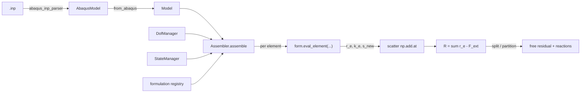

# Architecture — Formulation-Agnostic Residual Assembler

`residual_core` assembles the finite-element **residual** (and, when available,
its tangent) for a discretized solid, *outside* the original solver (Abaqus).
The design goal of the refactor is a **formulation-agnostic core**: the global
assembler contains no element mathematics and no material knowledge. It only
looks up the formulation bound to each element, calls that formulation's
`eval_element(...)`, scatters the returned element residual/tangent into the
global system, adds external loads, and splits out reactions. Swap in any
`Formulation` backend and the core is unchanged.

---

## 1. Layered design

```
residual_core/
  core/            formulation-agnostic assembler + numbering + BC/load/state/verification
    assembler.py       Assembler: gather -> eval_element -> scatter -> add loads -> split reactions
    model.py           Model (neutral mesh + bindings) and from_abaqus() adapter
    dof_manager.py     DofManager: heterogeneous global DOF numbering (per-node DOF sets)
    state_manager.py   StateManager: committed/trial per-element IP state across increments
    constraints.py     Dirichlet BC resolution + free/prescribed partition (F_constraints)
    loads.py           external_force() -> F_external (concentrated *Cload)
    registry.py        generic BackendSpec + Registry (formulations and materials)
    requirements.py    data-minimization engine (per-mode minimum inputs)
    diagnostics.py     model inspector (auto element/material support + reachable modes)
    voigt.py           neutral Voigt / isotropic_D helper (shared, no physics)
    verification.py    generic verification harness (Levels 1, 2, 4, 5 helpers)
  formulations/    element weak forms (all element/kinematics math lives here)
    base.py            Formulation ABC + eval_element contract + BackendSpec metadata
    registry.py        build_formulation_registry() / default_formulation_registry()
    c3d8_kernel.py     verified pure-numpy C3D8 B-matrix / internal force / tangent kernel
    solid_c3d8_small_strain.py   Mode 2, reference-config weak form
    solid_c3d8_finite_strain.py  Mode 2, current-config (nlgeom) weak form; home of the CP backend
    stress_driven_adapter.py     Mode 1, field supplied externally
    uel_adapter.py               Mode 3, wraps an Abaqus-UEL-like direct residual
    truss2.py                    3-DOF/node bar (proof the core is not C3D8-specific)
    beam2.py                     6-DOF/node 3D beam/frame (proof of rotational DOFs)
    shell_base.py / shell_placeholder.py   declared shell contract, not yet runnable
  materials/       constitutive backends (stress/tangent/state at a point)
    base.py            Material ABC + MaterialBinding + capability metadata
    registry.py        build_material_registry() / default_material_registry()
    elastic_adapter.py IsotropicElastic (runnable Mode-2 material)
    umat_adapter.py    UmatAdapter: generic Abaqus-UMAT bridge (python/fortran backends)
    crystal_plasticity_adapter.py  CrystalPlasticityAdapter (one example backend)
  io/              abaqus_inp_parser.py (.inp -> AbaqusModel), abaqus_odb_export.py (ODB -> fields.json),
                   neutral_model_io.py (solver-neutral JSON model save/load)
  ui/              high-level facade + CLI (no physics)
    wizard.py          ResidualProblem facade (parse -> detect -> requirements -> assemble)
    cli.py             `resasm` command line
    config.py          optional override config (YAML/JSON)
    examples.py        runnable, self-checking examples (truss/beam/mixed)
  examples/        example drivers (package placeholder)
  docs/            this documentation
```

Two more entry points live at the `residual_core/` top level and are used by the
verification tests, not by the core assembler:
`residual_core/stress_driven_residual.py` (the Mode-1 driver: parsed model +
`fields.json` -> residual vs `RF`) and
`residual_core/umat_adapter_fortran/umat_replay.py` (the standalone material-point
UMAT replay orchestrator).

### The core invariant

`core/assembler.py::Assembler.assemble` contains **no element or material logic**.
Its entire per-element body is: resolve the formulation key, gather the element's
global DOF indices/coords/DOFs/state/properties, call
`form.eval_element(...)`, and scatter:

```python
r_e, k_e, s_new, edic = form.eval_element(
    eid, el.etype, coords, u_e, ss, mat_state, props, time, dtime, fields, opts)
np.add.at(R, edofs, np.asarray(r_e, float))
if compute_tangent and k_e is not None:
    K[np.ix_(edofs, edofs)] += np.asarray(k_e, float)
```

After the element loop it adds external loads (`F_ext = loads.external_force(...)`,
`R = R - F_ext`) and offers `split(R)` to separate free residuals from reactions
via `core/constraints.partition`. It never imports a concrete formulation or
material; formulations are resolved through a `{name -> instance}` registry
(`formulations.default_formulations()`), materials through `MaterialBinding`
objects carried in the per-element `properties` slot.

---

## 2. The standard element interface

Every backend subclasses `formulations/base.py::Formulation` and implements
`eval_element`. The exact signature and return contract, quoted from
`formulations/base.py`:

```python
eval_element(self, element_id, element_type, coords, dofs,
             solution_state, material_state, properties,
             time, dtime, fields, options)
    -> (element_residual,   # (ndof,)          +F_internal contribution to R
        element_tangent,    # (ndof, ndof) or None
        updated_state,      # (n_ip, n_state) or None
        diagnostics)        # dict
```

Parameter meanings (from the docstring):

- `element_id` : int
- `element_type` : str (e.g. `"C3D8"`)
- `coords` : `(n_nodes, ndim)` reference nodal coordinates
- `dofs` : `(n_nodes*dofs_per_node,)` element solution, node-major
- `solution_state` : dict of extra solution context (e.g. `{'dofs_prev': ...}`)
- `material_state` : `(n_ip, n_state)` previous per-IP state, or None
- `properties` : per-element properties (e.g. a `MaterialBinding`), or None
- `time` : `(2,)` `[step time, total time]` at increment start
- `dtime` : float increment
- `fields` : dict of extra fields (e.g. `{'stress_ip': (n_ip,6)}`)
- `options` : dict of flags (e.g. `{'compute_tangent': True}`)

Class attributes each backend must set: `name` (registry key), `element_types`,
`dof_types`, `sign_convention` (`"residual"` = returns `+F_internal`), and
`verification_levels` (which levels of `docs/verification_strategy.md` apply).
`ElementResult` is a convenience dataclass with `.as_tuple()` for backends that
prefer to build a named object.

### The material interface

Materials answer the constitutive question only. From `materials/base.py::Material`:

```python
evaluate(self, kinematics, state_prev, binding, time, dtime, fields, options)
    -> (stress_voigt,   # (6,) Abaqus Voigt order (11,22,33,12,13,23), measure = stress_measure
        tangent,        # (6,6) or None
        state_new,      # (nstatev,)
        diagnostics)    # dict
```

A material declares `stress_measure` (`'cauchy' | 'pk2' | 'pk1'`),
`tangent_measure` (`'ddsdde' | 'material' | None`), `kinematic_input`
(`'small_strain'` needs `strain`,`dstrain`; `'deformation_gradient'` needs
`F0`,`F1`), and `n_state_vars` (mirrors Abaqus NSTATV). This is the Abaqus UMAT
contract generalized: a UMAT, a Python elastic law, or a CP return map all present
the same face to a formulation. `MaterialBinding` (material instance + `constants`
(PROPS) + `n_state_vars` + name + section) is what a formulation receives in
`properties`.

---

## 3. The generic residual equation

The framework is built around the residual (verbatim from
`formulations/base.py` and `core/assembler.py`):

```
R(y, q, a, t) = F_internal(y, q, a, t) - F_external(t) + F_constraints(y, t)
```

where
- `y` = global unknowns (`U` for solids, `T` for thermal, `[U, T, p, ...]` for
  coupled problems),
- `q` = history / internal (state) variables,
- `a` = parameters.

`eval_element` returns only the element's `F_internal` contribution (and its
tangent); the core assembler adds `-F_external` (`core/loads.py`) and
`F_constraints` is handled by the Dirichlet free/prescribed split
(`core/constraints.py`).

**Multiple DOF types by design.** `core/dof_manager.py::DofManager` is
dof-type-tagged and **heterogeneous**: each node carries its own ordered DOF set,
built as the union of the `dof_types` of the formulations touching it
(`DofManager.for_model(model, registry)`). A truss node gets `(UX,UY,UZ)`, a beam
node `(UX,UY,UZ,RX,RY,RZ)`, and both can coexist in the same model with a dense
global numbering. Uniform construction (`DofManager(nodes)`) remains the original
displacement-only behaviour for backward compatibility. This admits
rotational/temperature/pressure DOFs without touching the assembler;
`tests/framework/test_mixed_model_dispatch.py` exercises a truss + beam + solid
model with 3/6/3 DOFs per node.

### 3b. Heterogeneous DOF behaviour (the union rule)

`DofManager.for_model(model, registry)` assigns each node the **ordered union**
of the `dof_types` of every formulation bound to an element that references it.
No step assumes all nodes have the same DOFs. Global numbering is dense and
contiguous over these per-node sets (`_node_base` + per-type offset), so a mixed
model has no gaps and no overlaps. Edge cases (verified in
`tests/framework/test_dof_manager_mixed.py`):

| Node membership | Resulting DOF set | Count |
|---|---|---|
| truss only (`T3D2`) | `UX, UY, UZ` | 3 |
| beam only (`B31`) | `UX, UY, UZ, RX, RY, RZ` | 6 |
| truss **and** beam | union → `UX, UY, UZ, RX, RY, RZ` | 6 |
| beam **and** solid (`C3D8`) | union → `UX, UY, UZ, RX, RY, RZ` | 6 |
| solid only | `UX, UY, UZ` | 3 |

When the assembler gathers an element, it asks the DOF manager for **exactly that
formulation's** `dof_types` in the formulation's own order
(`element_dofs(connectivity, form.dof_types)`); on a node carrying a superset
(e.g. a beam node also touched by a truss) it selects the right subset. A truss
element on a 6-DOF node therefore still gathers only its 3 translational DOFs,
and the beam's rotational DOFs on that node are driven by the beam element. This
is what lets unrelated formulations share nodes without the core knowing any
physics. `DofManager(nodes)` (uniform, displacement-only) remains available for
backward compatibility.

---

## 4. The four backend modes

The field that enters the weak form can be obtained several ways. Each is a
`Formulation` behind the same `eval_element` contract, and each backend declares
which modes it supports via `spec.supported_modes` (see
`docs/minimal_input_contract.md`). The requirements engine and the model
inspector reason over these declarations.

### Mode 1 — stress-driven  (`formulations/stress_driven_adapter.py`)
`StressDrivenC3D8`, registry key `stress_driven_c3d8`.

- **Input:** the integration-point field is supplied *externally* in
  `fields['stress_ip'][element_id]` -> `(n_ip, 6)` Cauchy stress (Abaqus Voigt
  order), typically exported from an Abaqus ODB. `options['config']` selects
  `'finite'` (current config, nlgeom-matching) or `'small'` (reference config).
- **Behavior:** assembles `f_int,e = sum_k B^T sigma_k dv` only — no material call,
  returns `None` for the tangent, passes state through.
- **Use case:** verify the finite-element residual assembly *independently of any
  material*. If Abaqus' own exported stresses reproduce Abaqus' reactions through
  this adapter, the assembly is correct.
- **Example:** `tests/framework/test_assembler.py::test_A_stress_driven`;
  procedure in `tests/cp_c3d8_umat/stress_driven_residual/README.md`; driver
  `residual_core/stress_driven_residual.py`.

### Mode 2 — material-update-driven  (`solid_c3d8_*` + a `materials/*` backend)
`SolidC3D8SmallStrain` (`solid_c3d8_small_strain`) and `SolidC3D8FiniteStrain`
(`solid_c3d8_finite_strain`).

- **Input:** a `MaterialBinding` in `properties`. The formulation computes
  kinematics per IP (small strain: `strain = B0 @ u_e`; finite strain: `F0,F1`
  via reference-config shape-function gradients) and calls
  `material.evaluate(...)` at each of the 8 integration points to get stress +
  tangent + updated state.
- **Behavior:** assembles `f_int,e = sum_k B^T sigma_k dv` and
  `K_e = sum_k B^T D_k B dv` (+ geometric term in finite strain), all delegated
  to the verified `c3d8_kernel`.
- **Use case:** run a full constitutive + assembly pipeline offline. Fully
  runnable materials: `materials/elastic_adapter.py::IsotropicElastic`, and
  `UmatAdapter`/`CrystalPlasticityAdapter` with `backend='python'` + an injected
  mock UMAT.
- **Example:** `tests/framework/test_assembler.py::test_B_material_and_tangent`
  (assembler + `IsotropicElastic` == kernel elastic assembly; Level-4 FD tangent).
- **Note:** `materials/crystal_plasticity_adapter.py::CrystalPlasticityAdapter`
  IS present and wired into the `Assembler` as a `Material`; offline it runs only
  via `backend='python'` with a mock UMAT, and its `backend='fortran'` path needs
  the ifort+Abaqus-built `umat_driver` for genuine CP stress (see
  `docs/limitations.md`).

### Mode 3 — UEL / direct-residual  (`formulations/uel_adapter.py`)
`UelAdapter`, registry key `uel_direct`, `element_types = ("U1",)`.

- **Input:** an Abaqus-UEL-like callable
  `uel_fn(element_id, element_type, coords, dofs, svars, props, time, dtime,
  fields, options) -> (RHS, AMATRX, SVARS_new, diagnostics)`. Configured with
  `dofs_per_node`/`dof_types` and `n_node`.
- **Behavior:** the element math lives entirely inside the user callable; the
  adapter normalizes the sign (see §6) and returns the standard 4-tuple.
- **Use case:** elements that expose their element RHS/tangent directly, with no
  material update or exported IP field.
- **Example:** the self-test at the bottom of `formulations/uel_adapter.py` (a
  2-node, 1-DOF/node linear spring UEL; verifies sign conversion and FD tangent).

### Mode 4 — formulation / manufactured  (`truss2`, `beam2`, ...)
Pure formulation backends that compute the residual from geometry + section
properties alone, with no exported field and no material update.

- **Input:** section/constitutive properties (`E`, `A` for a bar; `E`, `A`, `I`,
  ... for a beam) via the element's `properties` (`MaterialBinding.section` or a
  dict).
- **Behavior:** `F_internal = K(geometry, section) · u_e` for the linear proof
  backends; the tangent is exact.
- **Use case:** prove the core is *not* C3D8/CP-specific and exercise
  heterogeneous DOFs (translations for `truss2`, translations + rotations for
  `beam2`).
- **Example:** `tests/framework/test_truss2_backend.py` (axial force `EA/L`),
  `test_beam2_backend.py` (cantilever tip `PL³/3EI`),
  `test_mixed_model_dispatch.py` (truss + beam + solid in one model).

---

## 4b. Backend registries and inspection

Formulations and materials are described by a generic `core/registry.py::
BackendSpec` (backend name, kind, supported element/DOF types, supported modes,
required/optional inputs, verification tests, limitations, notes) and held in a
`Registry`. `formulations/registry.py` and `materials/registry.py` build the
default sets. Given a model, `core/diagnostics.py::inspect_model` uses the
registry to auto-select a backend per element type and report which modes are
reachable and what is missing; `core/requirements.py` reports the *minimum* next
input for a requested mode. The `ui/` layer (`ResidualProblem`, `resasm`) is a
thin orchestration over these — it contains no physics.

## 5. How the assembler dispatches (walk-through)

Per `core/assembler.py::Assembler.assemble`, for each element:

1. `fk = self.model.element_formulation.get(eid)` — the formulation registry key
   the element is bound to (set by `model.from_abaqus` via a formulation policy;
   default `C3D8 -> solid_c3d8_finite_strain`). No binding -> element skipped
   (`diag["skipped_no_formulation"]`).
2. `form = self.formulations[fk]` — resolve the key against the registry
   (`formulations.default_formulations()`). Unregistered key -> `KeyError`.
3. Gather: `edofs = dm.element_dofs(el.connectivity)` (global DOF indices),
   `coords = model.coords_of(el.connectivity)`, `u_e = U[edofs]`,
   `mat_state = state.get(eid)`, `props = model.materials[element_material[eid]]`;
   `solution_state` carries `dofs_prev` when a previous `U_prev` is supplied.
4. `r_e, k_e, s_new, edic = form.eval_element(...)`.
5. Scatter: `np.add.at(R, edofs, r_e)`; if tangent requested,
   `K[np.ix_(edofs, edofs)] += k_e`; `state.set_trial(eid, s_new)`.
6. After the loop: `F_ext = loads.external_force(model, dm, load_factor)`;
   `R = R - F_ext`.
7. `split(R)` -> `(free_residual, prescribed_idx, reaction)` using
   `constraints.partition(model, dm)` (Dirichlet + symmetry BCs).

---

## 6. Sign convention

The framework standard is `sign_convention = "residual"`: `eval_element` returns
the element's `+F_internal` contribution to `R = F_int - F_ext`, and the
assembler subtracts `F_ext` itself. Abaqus user elements instead report
`RHS = -R = F_ext - F_int` and `AMATRX = dR/du`. `uel_adapter.py` reconciles this
with the construction flag `rhs_is_negative_residual` (default `True`):

```
element_residual = -RHS   (Abaqus default: RHS = -R  ->  R = -RHS)
element_tangent  =  AMATRX = dR/du
```

so downstream code sees a standard `+R` residual formulation. The `False` case
(`RHS = +R` already) passes the residual through unchanged. Because
`element_residual == R` and `AMATRX == dR/du`, the returned tangent is exactly
`d(element_residual)/d(dofs)` — what the Level-4 finite-difference check expects.

---

## 7. Data flow

```
 .inp --io/abaqus_inp_parser.parse_inp--> AbaqusModel
                                            |
                        core/model.from_abaqus (formulation policy: C3D8 -> solid_c3d8_finite_strain)
                                            v
                                          Model  --+
 DofManager(nodes) ------------------------------- +--> Assembler.assemble(U, ...)
 StateManager(n_ip, n_state) -------------------- +          |
 formulations.default_formulations() ------------ +          |  per element:
                                                             |   lookup fk -> form
                                                             |   gather coords/dofs/state/props
                                                             |   form.eval_element(...) -> (r_e, k_e, s_new, diag)
                                                             |   scatter r_e, k_e; state.set_trial
                                                             v
                                          R = sum(r_e) - F_external      (loads.external_force)
                                                             |
                                                   split(R) via constraints.partition
                                                             v
                                     (free_residual ~ 0,  reactions at prescribed DOFs)

 field source per mode:
   Mode 1  fields['stress_ip']  <-- io/abaqus_odb_export.py (ODB -> fields.json)
   Mode 2  material.evaluate    <-- materials/*  (IsotropicElastic today)
   Mode 3  uel_fn (RHS/AMATRX)  <-- user-supplied element routine
```



---

## 8. Proof that the core is formulation-agnostic

`tests/framework/test_assembler.py` is the evidence. It parses the real
`Compression111.inp`, builds the generic core (`Model` + `DofManager` +
`StateManager` + `Assembler` + `default_formulations()`), and shows the generic
path reproduces the already-verified `c3d8_kernel` results **to machine precision
(relative error `< 1e-12`)** in both offline modes, without the assembler knowing
any physics:

- **Test A (Mode 1, stress-driven):** `Assembler` + `StressDrivenC3D8` ==
  `c3d8_kernel.assemble_global_internal_force` for a spatially-varying stress
  field (125 elements).
- **Test B (Mode 2, material-update):** `Assembler` + `SolidC3D8SmallStrain` +
  `IsotropicElastic` == kernel small-strain assembly of the same elastic stress;
  and its Level-4 finite-difference tangent passes.
- **Test C (Level 1):** zero-field residual vanishes at `U = 0`.

Because the same `core/assembler.py` drives three unrelated formulations
(external stress, material update, direct UEL) with no code change, the "no
element/material logic in the core" invariant is demonstrated, not just asserted.
